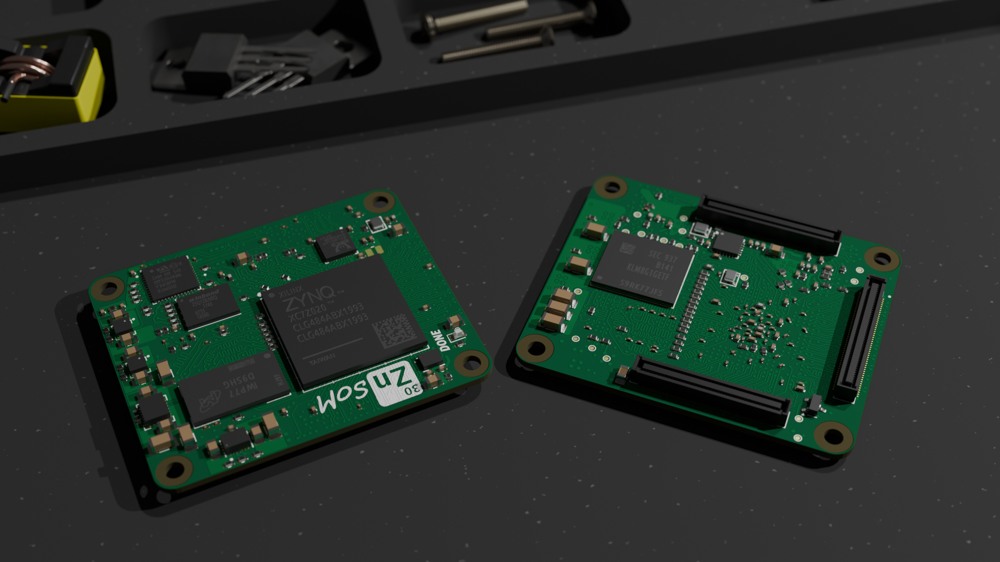

# Zynq-SoM

A Zynq-7000 system-on-module + carrier board reference design, with a
Python-driven KiCad schematic generator for the carrier.



> [!WARNING]
> First prototype is under testing. The design has not been fully verified.

## Repo layout

- `boards/som/` — hand-authored Zynq SoM (open `Zynq_SoM.kicad_pro` in KiCad 9+).
- `boards/carrier/` — generated carrier (open `carrier.kicad_pro` in KiCad 9+).
- `eda/` — the Python generator (`zynq_eda`) that emits the carrier schematics.
- `shared/` — KiCad assets shared between SoM and carrier (footprints,
  3D models, symbol libraries).
- `tools/` — ad-hoc CLI helpers (footprint die-length calculator, track delay
  calculator, KiCad pcbnew plugins, pad-renumbering utilities).
- `docs/` — block diagrams, renders, and design references.

## SoM features

Memory

- 512Mb DDR3L RAM
- 8Gb eMMC
- 16Mb Boot Flash

Connectivity

- 1x Ethernet Gigabit
- 1x USB 2.0 High Speed OTG
- 1x USB 2.0 Full speed + USB PD (STM32)
- 7x Zynq PS GPIO (3.3V)
- 6x Zynq PS GPIO (1.8V) (External SD Card)
- 48x Zynq PL differential pairs (1.2-3.3V)
- 56x Zynq PL single-ended IO (1.2-3.3V)
- 8x STM32 GPIO (3.3V)

Debug

- Zynq JTAG (3.3V)
- STM32 SWD (3.3V)

## Block diagram


## Regenerating the carrier

The carrier schematic is generated from Python — there is no hand-authored
`.kicad_sch` to edit. The generator lives in `eda/` as a standalone package
called `zynq_eda`.

### Install

From the repo root:

```bash
python3 -m venv .venv
source .venv/bin/activate
cd eda
make install        # editable install + macOS UF_HIDDEN .pth fix
make install-dev    # additionally installs pytest + ruff
make test           # run the unit tests
```

The `Makefile` wraps `pip install -e . --config-settings editable_mode=compat`
and strips the macOS `UF_HIDDEN` flag that hatchling sets on its `.pth` file
(Python 3.13+ silently refuses to load hidden `.pth` files).

Pinned runtime dependencies are declared in `eda/pyproject.toml`:
`kicad-sch-api==0.5.6` and `kicad-skip==0.2.5`.

### Run

```bash
python -m zynq_eda --board carrier --output boards/carrier
```

Useful flags:

| Flag | Effect |
|---|---|
| `--audit-only` | Run Stage 0 component-completeness audit and exit. |
| `--only BLOCK` | Generate just one block (iteration shortcut). |
| `--skip-erc` | Skip running `kicad-cli sch erc` on the generated output. |
| `--allow-incomplete` | Proceed even if the Stage 0 audit reports missing components. |
| `--version` | Print the `zynq_eda` package version. |

The default output directory is `boards/<board>/` relative to the repo root.

## Workflow

The generator runs a fixed pipeline (`zynq_eda.core.pipeline`):

| Stage | Name | What happens |
|---|---|---|
| 0 | Audit | Component-completeness check (`audit_report.md`). Fails fast unless `--allow-incomplete` is passed. |
| 1 | Catalog | Register shared symbol libraries (`shared/symbols/*.kicad_sym`). |
| 2 | Build | Declarative block builders (one per functional sub-sheet) return `Block` objects. |
| 4–6 | Layout + Emit | Per-block region packing, cluster placement, pin-aware routing, write `sheets/<block>.kicad_sch`. In-memory `page_bounds` + `overlap` validators run before each emit so a broken sheet never overwrites a known-good file. |
| 7 | Root + Project | Stitch the sub-sheets into `carrier.kicad_sch` and emit `carrier.kicad_pro`. |
| 7b | ERC | `kicad-cli sch erc` on the root (skipped with `--skip-erc`). |
| 8 | Outputs | Aggregated `validation_report.md`. (BOM + IO assignment + reference-circuits doc land here as the pipeline matures.) |

A non-zero error count at any stage causes a non-zero exit, with the
offending validators recorded in `boards/carrier/validation_report.md`.

## Opening in KiCad

Open `boards/carrier/carrier.kicad_pro` in KiCad 9+ to see the full carrier
hierarchy. The hand-authored SoM lives at `boards/som/Zynq_SoM.kicad_pro`.

Both projects pick up shared symbols and footprints from `shared/` via their
`fp-lib-table` / `sym-lib-table` files.

## Production

JLCPCB ordering information (SoM):

- Layers: 8
- PCB Thickness: 1.2 mm
- Material Type: FR-4 TG155
- Stackup: JLC08121H-1080A
- Outer Copper Weight: 1 oz
- Inner Copper Weight: 0.5 oz
- Minimum via diameter/hole-size: 0.3/0.2 mm
- Via Covering: Epoxy Filled and Capped
- Surface finish: ENIG
