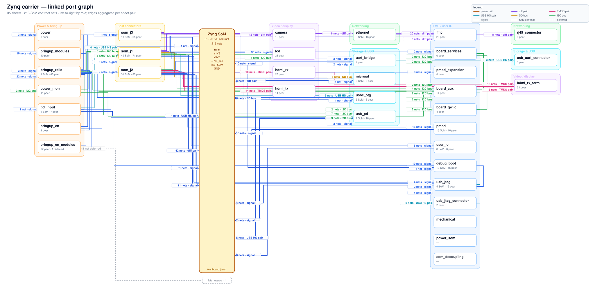

# Zynq-SoM

A Zynq-7000 system-on-module + carrier board, with `schgen` — a netlist-first
KiCad schematic generator that produces electrically-proven, hand-drawn-quality
schematics from Python subsystem definitions.

## The three layers

1. **`parts/`** — one folder per physical part, named by MPN, GENERATED from
   LCSC/EasyEDA (`schgen part add C…`): pin table, symbol, footprint, 3D.
   See `parts/README.md`.
2. **`carrier/subsystems/`** — one Python netlist per subsystem, composed
   FROM parts (`use_part`, named pins, the `carrier/nets.py` contract).
   The netlist is the only hand-written layer. See
   `carrier/subsystems/README.md`.
3. **The board** — `schgen` derives ALL geometry from netlist topology,
   proves it (netlist-equivalence + ERC + zero-overlap visual gates) and
   links the sheets into one KiCad project.

Plus `som/` — the hand-authored Zynq SoM KiCad project (open
`som/Zynq_SoM.kicad_pro`, KiCad 9+; its custom libs live in `som/lib/`).
The SoM↔carrier contract `carrier/som_interface.json` is extracted
programmatically (`schgen som-interface`), never hand-edited.

## Generate everything

```bash
pip install pymupdf pillow                    # kicad-cli must be on PATH
PYTHONPATH=. python -m schgen board           # EVERY sheet + link + project
```

`schgen build <name>` gates a single sheet (preview into a tempdir, nothing
committed). `schgen board` regenerates the committed outputs in place:
`carrier/Zynq_Carrier.kicad_pro` (open in KiCad), `schematic/`, `renders/`
(golden-snapshot drift detection, `--bless` to accept), `reports/`,
`manufacturing/` (JLC BOM + layout constraints), and
`fpga/Zynq_Carrier_pins.xdc` — Vivado PACKAGE_PIN + IOSTANDARD for every
carrier port on a Zynq PL ball, ball map live-extracted from the SoM and
cross-checked against `som_interface.json` (also standalone: `schgen xdc`).

## The gate model

Every build fails unless ALL three gates pass: **netlist** (KiCad's
extracted netlist == the declared netlist, pin for pin), **ERC** (zero
errors), **visual** (zero overlap, zero crossings, fits the page). The
gates are judges, not knobs. Architecture + gate definitions:
`schgen/DESIGN.md`.

There is no CI, so `schgen selftest` mutation-tests the gates themselves:
it injects one defect per class (pin swap, deleted wire, relabel, stray
no-connect, foreign-net junction short) and proves a gate kills each, then
builds twice and byte-compares for determinism.

```bash
PYTHONPATH=. python -m schgen selftest
```

<!-- schgen:gallery -->
<!-- GENERATED by `schgen gallery` — edits between these markers are overwritten -->
## Generated schematics

`schgen board` regenerates the block diagram and all 30 carrier sheets,
each passing the netlist, ERC and visual gates.



See **[carrier/README.md](carrier/README.md#generated-schematics)** for the full sheet gallery (thumbnails + descriptions).
<!-- /schgen:gallery -->
