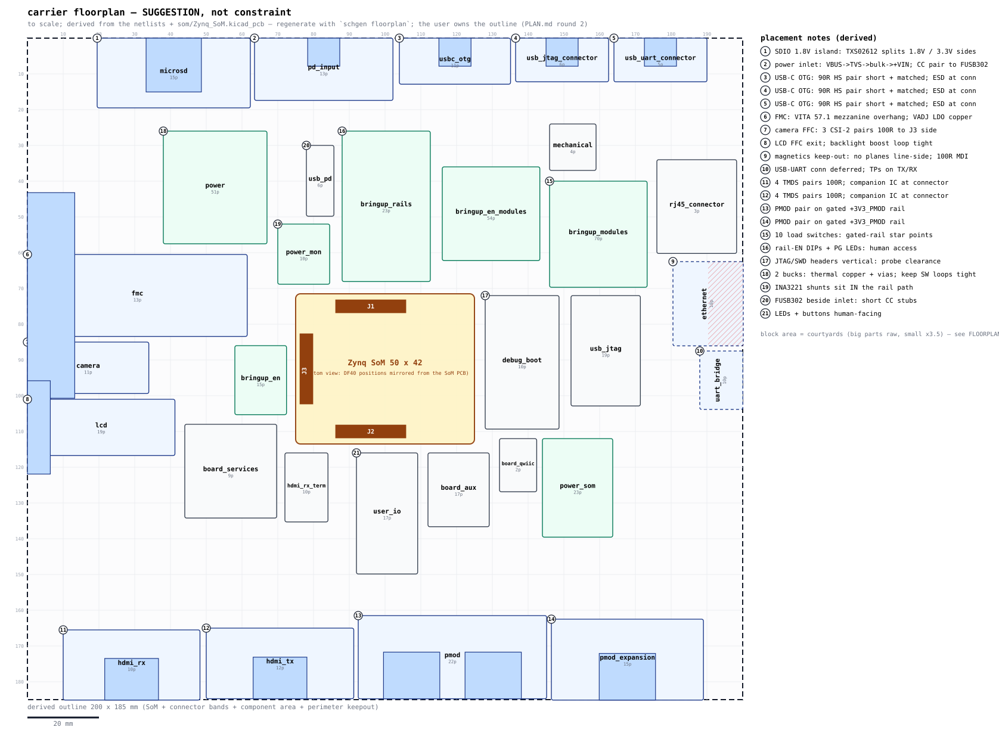

# Carrier floorplan — SUGGESTION, not constraint

Generated by `schgen floorplan` (also by `schgen board`). **The user owns the outline and the placement** — PLAN.md round 2 leaves the form factor free ("connector-driven ~120x100 class expected"). This document is one self-consistent, to-scale starting point whose every number is derived from the design data, so each suggestion can be kept or overruled deliberately. Shuffle blocks freely; the WHY notes say what each move costs.

## Sources (everything derived, nothing invented)

- SoM outline + DF40 positions: `som/Zynq_SoM.kicad_pcb` (Edge.Cuts bbox + J1/J2/J3 footprints, parsed live)
- block sizes: per-part courtyards (`parts/<MPN>/<MPN>.kicad_mod` F.CrtYd; KiCad-standard footprints from the dims in their names), big parts raw + small parts x1.83 routing factor
- edge pinning + zones: connector parts in each sheet netlist + linker J1/J2/J3 bindings (incl. `expect=` deferrals)
- electrical notes: `schgen/constraints.py` (JLC04161H-7628), `schgen/powertree.py` analysis, typed ports (1.8V SDIO)

## Extracted SoM geometry

SoM outline: **50 x 42 mm**. The DF40 mezzanine connectors sit on the SoM's bottom copper; the carrier-top view below mirrors their X coordinate (bottom view). Verify mate orientation against the DF40 datasheet before committing footprints.

| conn | SoM PCB `(at)` | carrier-top view (SoM-rel) | pad extent |
|---|---|---|---|
| J1 | (136.5, 94.5) rot 180 | (21, 3.5) | 19.8 x 3.78 mm |
| J2 | (136.5, 129.5) rot 180 | (21, 38.5) | 19.8 x 3.78 mm |
| J3 | (154.5, 112) rot 90 | (3, 21) | 3.78 x 19.8 mm |

Suggested board: **120 x 100 mm**; SoM origin at **(35, 29)** (centered). All coordinates below are board-frame mm, origin top-left, +y down (KiCad convention).

## Edge connectors (pinned to edges by their mating direction)

| edge | sheet | block (x, y, w x h) | connector(s) | notes |
|---|---|---|---|---|
| N | ethernet | (10.5, 0, 12 x 16.5) | RESERVED: rj45_connector (deferred) | (1) |
| N | microsd | (29, 0, 18.5 x 18) | TF-01A (microSD push-pull) | (2) |
| N | pd_input | (54, 0, 12 x 17.5) | TYPE-C-31-M-12 (USB-C receptacle) | (3) |
| N | uart_bridge | (73, 0, 12 x 4.5) | RESERVED: usb_uart_connector (deferred) | (4) |
| N | usbc_otg | (91.5, 0, 12 x 11) | TYPE-C-31-M-12 (USB-C receptacle) | (5) |
| W | fmc | (0, 5.5, 16 x 60.5) | ASP-134603-01 (FMC LPC (VITA 57.1)) | (6) |
| W | lcd | (0, 67.5, 9.5 x 29) | AFC07-S40FCA-00 (FFC 40-pin 0.5mm (LCD)) | (7) |
| S | camera | (6, 90.5, 24 x 9.5) | SFW15R-1STE1LF (FFC 15-pin 1mm (camera)) | (8) |
| S | hdmi_rx | (32.5, 85.5, 18 x 14.5) | HDMI-019S (HDMI receptacle) | (9) |
| S | hdmi_tx | (52.5, 85.5, 18 x 14.5) | HDMI-019S (HDMI receptacle) | (10) |
| S | pmod | (73, 84, 36.5 x 16) | DS1024-2x6R2 (PMOD 2x6 socket), DS1024-2x6R2 (PMOD 2x6 socket) | (11) |

Edge spills (preferred edge full — honest, not hidden):
- camera: W edge full -> S

## Interior blocks (zone = dominant SoM connector side, or the power cluster)

| sheet | anchor | block (x, y, w x h) | parts | est mm2 | notes |
|---|---|---|---|---|---|
| bringup_en | E | (80, 74, 9.5 x 8) | 15 | 77.9 |  |
| bringup_en_modules | E | (74, 6, 13.5 x 21) | 54 | 283.2 |  |
| bringup_modules | E | (92, 60, 22 x 14) | 70 | 309.7 | (12) |
| bringup_rails | E | (90, 42, 25.5 x 16.5) | 24 | 424.6 | (13) |
| debug_boot | N | (20, 20, 13.5 x 21) | 10 | 282.4 | (14) |
| power | E | (90, 24, 26 x 16) | 51 | 415.9 | (15) |
| power_mon | E | (96, 14, 14 x 8.5) | 10 | 121.1 | (16) |
| usb_pd | @pd_input | (106, 4, 8 x 8) | 6 | 23.1 | (17) |
| user_io | S | (18, 68, 12.5 x 19.5) | 17 | 246.6 | (18) |

## Routing constraint classes (JLC04161H-7628 — from constraints.py)

| class | nets | geometry (track/gap mm) | match budget |
|---|---|---|---|
| DP100_DIFF | 50 | 0.2052 / 0.2032 | intra-pair <= 1.27 mm |
| DP100_TMDS | 16 | 0.2052 / 0.2032 | intra-pair <= 0.15 mm; inter-pair <= 5 mm (policy) |
| DP90_USB | 6 | 0.2611 / 0.2032 | intra-pair <= 1.27 mm |
| I2C | 8 | - | - |
| SD_1V8 | 6 | - | bus to CLK <= 2.5 mm |

Full per-net table: `carrier/manufacturing/layout_constraints.csv` (+ the `.kicad_dru` rules).

## Power and thermal (worst-case declared draws — powertree analysis)

| regulator | sheet | rail | I out (A) | est dissipation |
|---|---|---|---|---|
| SY6280AAC (U1) | bringup_modules | +3V3 -> +3V3_HDMI_TX | 0.006 | negligible |
| SY6280AAC (U10) | bringup_modules | +5V -> +5V_LCD | 0.453 | negligible |
| SY6280AAC (U2) | bringup_modules | +3V3 -> +3V3_HDMI_RX | 0.005 | negligible |
| SY6280AAC (U3) | bringup_modules | +3V3 -> +3V3_LCD | 0.104 | negligible |
| SY6280AAC (U4) | bringup_modules | +3V3 -> +3V3_CAM | 0.304 | negligible |
| SY6280AAC (U5) | bringup_modules | +3V3 -> +3V3_SD | 0.254 | negligible |
| SY6280AAC (U6) | bringup_modules | +5V -> +5V_USB | 0.503 | negligible |
| SY6280AAC (U7) | bringup_modules | +3V3 -> +3V3_PMOD | 0.204 | negligible |
| SY6280AAC (U8) | bringup_modules | +3V3 -> +3V3_USER_LED | 0.010 | negligible |
| SY6280AAC (U9) | bringup_modules | +5V -> +5V_HDMI_TX | 0.058 | negligible |
| TLV75725PDBVR (U1) | fmc | +3V3 -> +2V5_VADJ | 0.350 | ~0.28 W |
| TPS26631PWPR (U1) | pd_input | +VBUS_IN -> +VIN | 1.302 | negligible |
| TPS54302DDCR (U1) | power | +VIN -> +5V | 2.684 | ~1.49 W |
| TPS54302DDCR (U2) | power | +5V -> +3V3 | 2.272 | ~0.83 W |
| AP2112K-1.8 (U3) | power | +3V3 -> +1V8 | 0.006 | negligible |
| TPS54302DDCR (U4) | power | +VIN -> +5V_SOM | 2.004 | ~1.11 W |

Numbers are the power-tree gate's worst-case declared draws (`carrier/reports/power_tree.txt`); regulators above ~0.3 W want copper pours + stitching vias.

## Placement notes (the WHYs)

- **(1) ethernet**: Magnetics isolation: void ALL planes under the HX5008 line side + Bob-Smith network (CHASSIS_GND moat to the RJ45); MDI pairs are 100R differential. RJ45 itself is an author-declared deferral (expect rj45_connector) — the dashed reservation is its landing zone.
- **(2) microsd**: microSD: SDIO runs at 1.8 V on the SoM side (typed sd_bus level in the netlist) — keep the TXS02612 translator mid-block: 1.8V side faces the SoM, 3.3V card side faces the slot; bus length match <= 2.5 mm to CLK.
- **(3) pd_input**: PD power inlet: keep the VBUS path (receptacle -> TVS -> bulk -> +VIN) in one corner so the +VIN plane spreads from a single point; CC1/CC2 route to the FUSB302 (usb_pd block, anchored next to this inlet). PLAN.md round 5: a TPS25940-class eFuse lands between receptacle and bulk — reserve space for it here.
- **(4) uart_bridge**: CP2102N UART bridge: its USB connector is an author-declared deferral (expect usb_uart_connector) — the block reserves edge space for it; TX/RX test points stay probe-able.
- **(5) usbc_otg**: USB-C OTG: the 90R D+/D- pair wants the shortest matched run to its SoM pins; USBLC6-2SC6 ESD array within ~10 mm of the receptacle; VBUS source switch beside the connector.
- **(6) fmc**: FMC LPC: a VITA 57.1 mezzanine overhangs the board edge — keep tall parts out of the overhang strip behind the connector. TLV75725PDBVR VADJ LDO dissipates ~0.28 W at the declared 0.35 A — give it copper.
- **(7) lcd**: 40-pin LCD FFC: cable exits over the board edge; keep the SY7201ABC backlight boost loop (L/D/C) tight and away from the FFC signal rows; RGB888 bus is single-ended bank-34 3V3 — bus-route together.
- **(8) camera**: RPi camera FFC: 3 MIPI CSI-2 pairs at 100R differential to the J3 side of the SoM (bank 35, 2.5 V VCCO per the expect= notes) — keep the run to the J3 strip short.
- **(9) hdmi_rx**: 4 TMDS pairs at 100R differential, intra-pair skew <= 0.15 mm (constraints.py); place M24C02-WMN6TP directly behind the receptacle so all pairs pass straight through.
- **(10) hdmi_tx**: 4 TMDS pairs at 100R differential, intra-pair skew <= 0.15 mm (constraints.py); place TPD12S016PWR directly behind the receptacle so all pairs pass straight through.
- **(11) pmod**: Two PMOD sockets side by side; both fed from the gated +3V3_PMOD rail (SY6280 cell in bringup_modules) — route the gated rail once, star at the sockets.
- **(12) bringup_modules**: 10 SY6280 load-switch cells; each gated rail (+3V3_CAM, +3V3_HDMI_RX, +3V3_HDMI_TX, +3V3_LCD, +3V3_PMOD, +3V3_SD, +3V3_USER_LED, +5V_HDMI_TX, +5V_LCD, +5V_USB) stars from its switch — place this block centrally so every gated rail leaves toward its module without crossing the others.
- **(13) bringup_rails**: Rail-enable DIP switches + power-good LEDs: face them where fingers and eyes reach them with the mezzanine mounted — keep clear of the SoM shadow.
- **(14) debug_boot**: JTAG (2x7 2 mm) + SWD (2x5 1.27 mm) headers mate vertically — any top-side spot works; keep cable/probe clearance and the boot DIP reachable.
- **(15) power**: Buck thermal (worst-case declared draws): TPS54302DDCR +5V ~1.49 W; TPS54302DDCR +3V3 ~0.83 W; TPS54302DDCR +5V_SOM ~1.11 W. Pour copper on the SW/PGND side, stitch vias under the packages, keep each SW node loop minimal.
- **(16) power_mon**: Power monitor: the shunt resistors are in series with the rails — the rails must physically route through this block; place it between the regulators and the loads, Kelvin-connect the sense pairs.
- **(17) usb_pd**: FUSB302 PD controller: anchored beside the pd_input receptacle so CC1/CC2 stay short stubs; I2C runs to the SoM J1 side.
- **(18) user_io**: User LEDs + buttons: human-facing — keep at the accessible S side, clear of the PMOD cable shadow.
- **(board)**: 49 test points board-wide (test-point gate): spread them with probe clearance as the blocks settle; none may end up under the SoM.

## Honest limits

- Block rectangles are AREA estimates (courtyards + routing factor), not layouts; their order along an edge is alphabetical, not optimized — shuffle freely.
- The outline is the PLAN's ~120x100 class, drawn dashed in the SVG because the user owns it.
- The mirror convention (bottom view) must be checked against the DF40 mating datasheet before any footprint is placed.
- som_j1/j2/j3 sheets are not blocks: they ARE the three DF40 strips drawn inside the SoM footprint.
