# Assembly order — carrier

Board 172 x 163 mm. 564 placed parts (424 top / 140 bottom); 5 fiducials are bare-copper marks, excluded from every phase and step.
Section A is the staged hand-assembly + bring-up order; section B is the PCBA process order. Every part appears in exactly one phase and exactly one step.

## A. Incremental bring-up order

| phase | section | parts | checkpoint |
|---|---|---|---|
| 1 | power entry (pd_input, usb_pd) | 19 | verify +VBUS_IN at TP17001; verify +VIN at TP17002 |
| 2 | power_mon | 10 | — |
| 3 | power | 51 | verify +5V at TP20001; verify +3V3 at TP20002; verify +1V8 at TP20003 |
| 4 | power_som | 23 | verify +5V_SOM at TP22001 |
| 5 | fmc | 8 | verify +2V5_VADJ at TP11001 |
| 6 | SoM interface (som_decoupling, som_j1, som_j2, som_j3) | 21 | — |
| 7 | SoM module mate | 0 | boot/debug via debug_boot: J9001 (JTAG), J9002 (SWD), SW9001 (BOOT: DFU BSEL BSEL), SW9002 (RST) |
| 8 | board_aux | 18 | verify +3V3_AUX at TP1001 |
| 9 | bringup_en | 15 | — |
| 10 | bringup_en_modules | 54 | — |
| 11 | bringup_modules | 71 | verify +5V_HDMI_TX at TP6009; verify +5V_LCD at TP6010; verify +5V_USB at TP6006; verify +3V3_CAM at TP6004; verify +3V3_HDMI_RX at TP6002; verify +3V3_HDMI_TX at TP6001; verify +3V3_LCD at TP6003; verify +3V3_PMOD at TP6007; verify +3V3_SD at TP6005; verify +3V3_USER_LED at TP6008 |
| 12 | bringup_rails | 23 | — |
| 13 | debug_boot | 10 | — |
| 14 | ethernet | 10 | — |
| 15 | hdmi_rx_term | 10 | — |
| 16 | motor_pwm | 13 | verify +5V_MOTOR_IO at TP36001 |
| 17 | motor_sense | 10 | — |
| 18 | pmod_expansion | 15 | verify +3V3_PMODX at TP19001 |
| 19 | rj45_connector | 3 | — |
| 20 | uart_bridge | 10 | — |
| 21 | usb_jtag_connector | 6 | verify +5V_DBG at TP29001 |
| 22 | usb_uart_connector | 5 | — |
| 23 | board_qwiic | 2 | — |
| 24 | board_services | 9 | — |
| 25 | camera | 13 | — |
| 26 | hdmi_rx | 10 | — |
| 27 | hdmi_tx | 12 | — |
| 28 | lcd | 20 | — |
| 29 | microsd | 15 | — |
| 30 | pmod | 26 | — |
| 31 | usb_jtag | 19 | verify +3V3_DBG at TP28001 |
| 32 | usbc_otg | 12 | — |
| 33 | user_io | 17 | — |
| 34 | mechanical hardware (mechanical) | 4 | — |

### Phase 1 — power entry (pd_input, usb_pd)

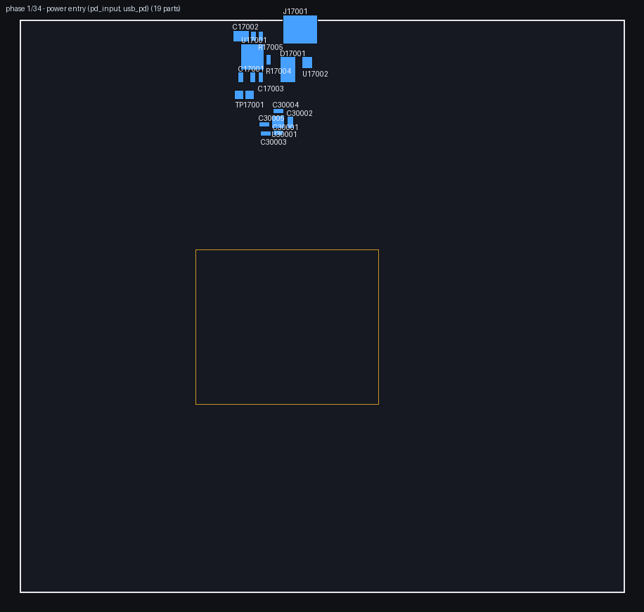

19 parts (19 top / 0 bottom)

| ref | value | package | sheet |
|---|---|---|---|
| C17001 | 100n | C_0603_1608Metric | pd_input |
| C17002 | 10u | C_1210_3225Metric | pd_input |
| C17003 | 47n | C_0603_1608Metric | pd_input |
| C30001 | 100n | C_0603_1608Metric | usb_pd |
| C30002 | 10u | C_0805_2012Metric | usb_pd |
| C30003 | 100n | C_0603_1608Metric | usb_pd |
| C30004 | 200p | C_0603_1608Metric | usb_pd |
| C30005 | 200p | C_0603_1608Metric | usb_pd |
| D17001 | SMBJ22A | D_SMB | pd_input |
| J17001 | TYPE-C-31-M-12 | TYPE-C-31-M-12 | pd_input |
| R17003 | 100k | R_0603_1608Metric | pd_input |
| R17004 | 5.49k | R_0603_1608Metric | pd_input |
| R17005 | 5.1k | R_0603_1608Metric | pd_input |
| R17006 | 100k | R_0603_1608Metric | pd_input |
| TP17001 | +VBUS_IN | TestPoint_Pad_D1.5mm | pd_input |
| TP17002 | +VIN | TestPoint_Pad_D1.5mm | pd_input |
| U17001 | TPS26631PWPR | TPS26631PWPR | pd_input |
| U17002 | USBLC6-2SC6 | USBLC6-2SC6 | pd_input |
| U30001 | FUSB302BMPX | WQFN-14-1EP_2.5x2.5mm_P0.5mm_EP1.45x1.45mm | usb_pd |

CHECKPOINT: verify +VBUS_IN at TP17001
CHECKPOINT: verify +VIN at TP17002

### Phase 2 — power_mon

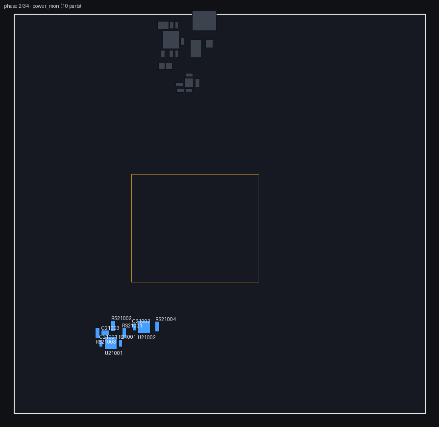

10 parts (10 top / 0 bottom)

| ref | value | package | sheet |
|---|---|---|---|
| C21001 | 100n | C_0603_1608Metric | power_mon |
| C21002 | 100n | C_0603_1608Metric | power_mon |
| C21003 | 10u | C_0805_2012Metric | power_mon |
| R21001 | 10k | R_0603_1608Metric | power_mon |
| RS21001 | 10mR | RLM12FTCMR010 | power_mon |
| RS21002 | 10mR | RLM12FTCMR010 | power_mon |
| RS21003 | 10mR | RLM12FTCMR010 | power_mon |
| RS21004 | 20mR | RLM12FTCMR020 | power_mon |
| U21001 | INA3221AIRGVR | INA3221AIRGVR | power_mon |
| U21002 | INA3221AIRGVR | INA3221AIRGVR | power_mon |

### Phase 3 — power

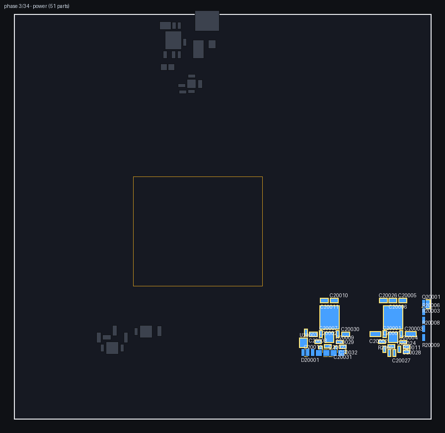

51 parts (46 top / 5 bottom)

| ref | value | package | sheet |
|---|---|---|---|
| C20001 | 100n | C_0603_1608Metric | power |
| C20002 | 10u | C_1206_3216Metric | power |
| C20003 | 10u | C_1206_3216Metric | power |
| C20004 | 100n | C_0603_1608Metric | power |
| C20005 | 22u | C_0805_2012Metric | power |
| C20006 | 22u | C_0805_2012Metric | power |
| C20007 | 100n | C_0603_1608Metric | power |
| C20008 | 22u | C_0805_2012Metric | power |
| C20009 | 100n | C_0603_1608Metric | power |
| C20010 | 22u | C_0805_2012Metric | power |
| C20011 | 22u | C_0805_2012Metric | power |
| C20012 | 1u | C_0603_1608Metric | power |
| C20013 | 1u | C_0603_1608Metric | power |
| C20023 | 22p | C_0603_1608Metric | power |
| C20024 | 1u | C_0603_1608Metric | power |
| C20025 | 100n | C_0603_1608Metric | power |
| C20026 | 22u | C_0805_2012Metric | power |
| C20027 | 22p | C_0603_1608Metric | power |
| C20028 | 1u | C_0603_1608Metric | power |
| C20029 | 100n | C_0603_1608Metric | power |
| C20030 | 22u | C_0805_2012Metric | power |
| C20031 | 1u | C_0603_1608Metric | power |
| C20032 | 1u | C_0603_1608Metric | power |
| D20001 | red | LED_0603_1608Metric | power |
| D20002 | red | LED_0603_1608Metric | power |
| D20003 | red | LED_0603_1608Metric | power |
| L20001 | 10uH | SWPA8040S100MT | power |
| L20002 | 10uH | SWPA8040S100MT | power |
| Q20001 | AO3400A | SOT-23 | power |
| R20001 | 40.2k | R_0603_1608Metric | power |
| R20002 | 10k | R_0603_1608Metric | power |
| R20003 | 1k | R_0603_1608Metric | power |
| R20004 | 23.2k | R_0603_1608Metric | power |
| R20005 | 10k | R_0603_1608Metric | power |
| R20006 | 330R | R_0603_1608Metric | power |
| R20007 | 1k | R_0603_1608Metric | power |
| R20008 | 100k | R_0603_1608Metric | power |
| R20009 | 330R | R_0603_1608Metric | power |
| R20010 | 22k | R_0603_1608Metric | power |
| R20011 | 10R | R_0603_1608Metric | power |
| R20012 | 1k | R_0603_1608Metric | power |
| R20013 | 10R | R_0603_1608Metric | power |
| R20014 | 22k | R_0603_1608Metric | power |
| R20015 | 1k | R_0603_1608Metric | power |
| TP20001 | +5V | TestPoint_Pad_D1.5mm | power |
| TP20002 | +3V3 | TestPoint_Pad_D1.5mm | power |
| TP20003 | +1V8 | TestPoint_Pad_D1.5mm | power |
| TP20004 | GND | TestPoint_Pad_D1.5mm | power |
| U20001 | LM61460AANRJRR | LM61460AANRJRR | power |
| U20002 | LM61460AANRJRR | LM61460AANRJRR | power |
| U20003 | AP2112K-1.8 | SOT-23-5 | power |

CHECKPOINT: verify +5V at TP20001
CHECKPOINT: verify +3V3 at TP20002
CHECKPOINT: verify +1V8 at TP20003

### Phase 4 — power_som

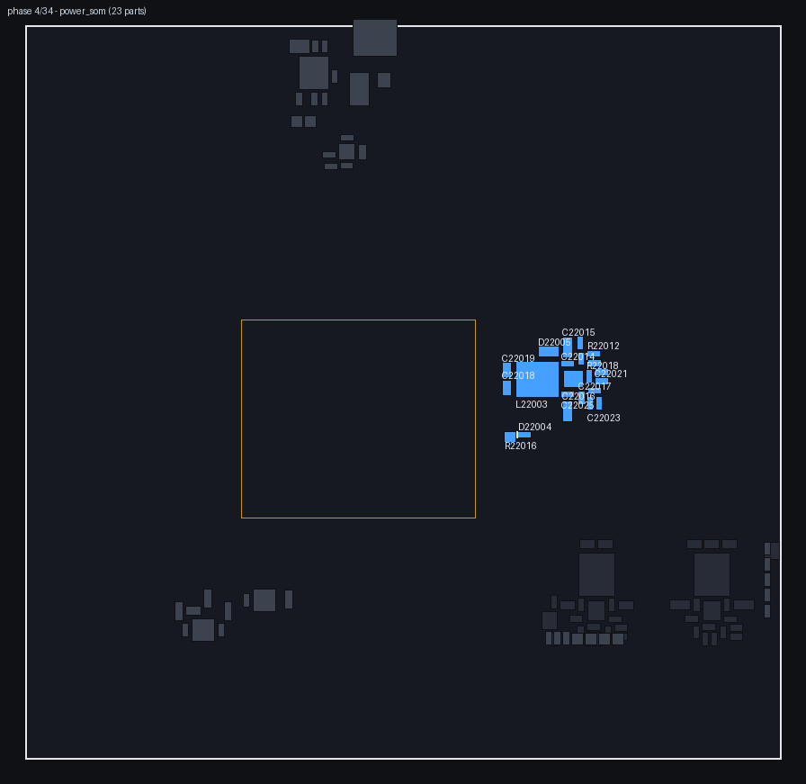

23 parts (22 top / 1 bottom)

| ref | value | package | sheet |
|---|---|---|---|
| C22014 | 100n | C_0603_1608Metric | power_som |
| C22015 | 10u | C_1206_3216Metric | power_som |
| C22016 | 10u | C_1206_3216Metric | power_som |
| C22017 | 100n | C_0603_1608Metric | power_som |
| C22018 | 22u | C_0805_2012Metric | power_som |
| C22019 | 22u | C_0805_2012Metric | power_som |
| C22020 | 100n | C_0603_1608Metric | power_som |
| C22021 | 22p | C_0603_1608Metric | power_som |
| C22022 | 1u | C_0603_1608Metric | power_som |
| C22023 | 1u | C_0603_1608Metric | power_som |
| C22025 | 100n | C_0603_1608Metric | power_som |
| D22004 | red | LED_0603_1608Metric | power_som |
| D22005 | MMSZ5231B | D_SOD-123 | power_som |
| L22003 | 10uH | SWPA8040S100MT | power_som |
| R22012 | 10k | R_0603_1608Metric | power_som |
| R22014 | 47.5k | R_0603_1608Metric | power_som |
| R22015 | 13k | R_0603_1608Metric | power_som |
| R22016 | 1k | R_0603_1608Metric | power_som |
| R22017 | 10R | R_0603_1608Metric | power_som |
| R22018 | 22k | R_0603_1608Metric | power_som |
| R22019 | 1k | R_0603_1608Metric | power_som |
| TP22001 | +5V_SOM | TestPoint_Pad_D1.5mm | power_som |
| U22004 | LM61460AANRJRR | LM61460AANRJRR | power_som |

CHECKPOINT: verify +5V_SOM at TP22001

### Phase 5 — fmc

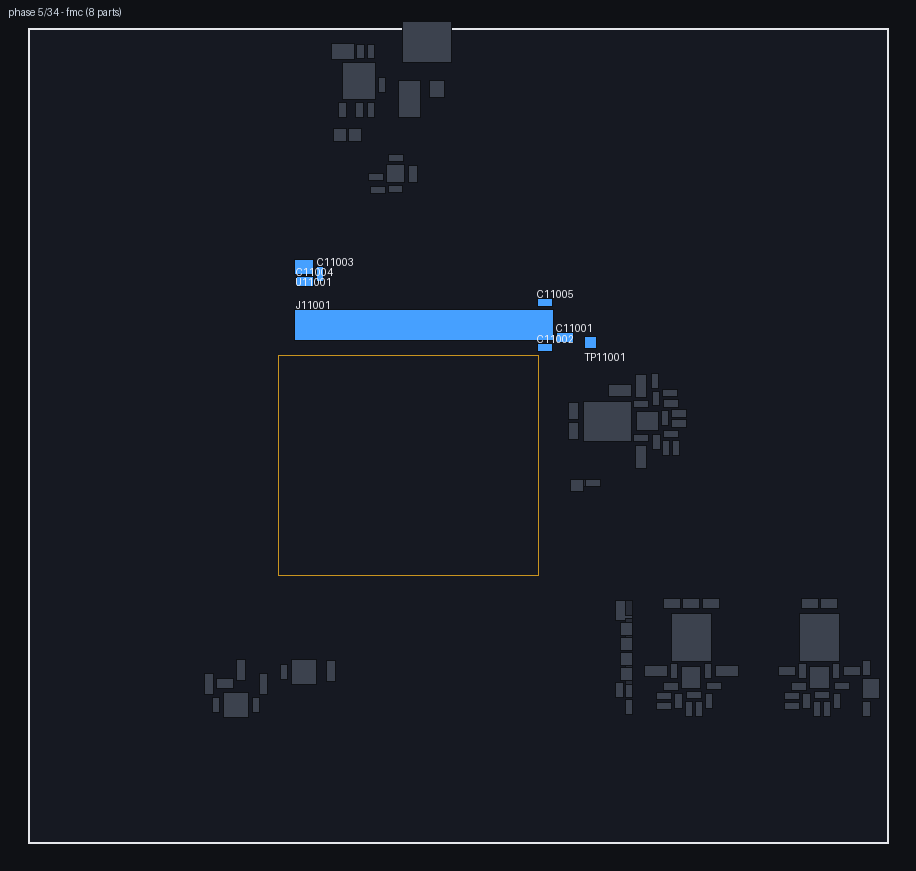

8 parts (8 top / 0 bottom)

| ref | value | package | sheet |
|---|---|---|---|
| C11001 | 10u | C_0805_2012Metric | fmc |
| C11002 | 100n | C_0603_1608Metric | fmc |
| C11003 | 1u | C_0603_1608Metric | fmc |
| C11004 | 10u | C_0805_2012Metric | fmc |
| C11005 | 100n | C_0603_1608Metric | fmc |
| J11001 | Header_2x20_2.54mm | PinHeader_2x20_P2.54mm_Vertical | fmc |
| TP11001 | +2V5_VADJ | TestPoint_Pad_D1.5mm | fmc |
| U11001 | TLV75725PDYDR | TLV75725PDYDR | fmc |

CHECKPOINT: verify +2V5_VADJ at TP11001

### Phase 6 — SoM interface (som_decoupling, som_j1, som_j2, som_j3)

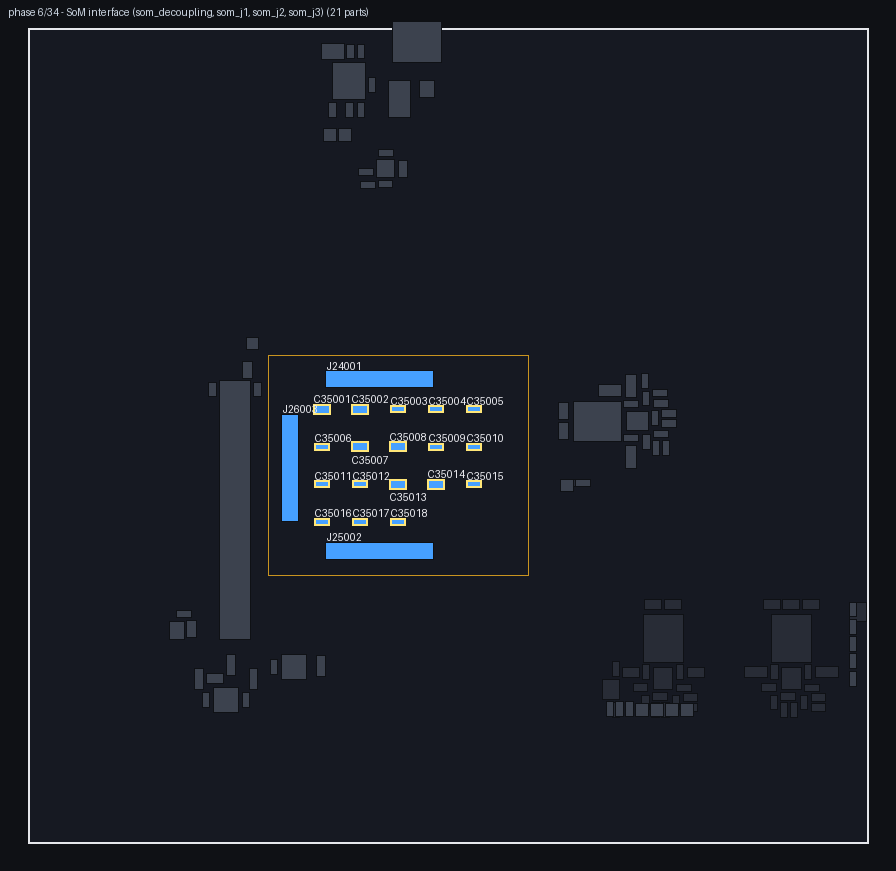

21 parts (3 top / 18 bottom)

| ref | value | package | sheet |
|---|---|---|---|
| C35001 | 22u | C_0805_2012Metric | som_decoupling |
| C35002 | 22u | C_0805_2012Metric | som_decoupling |
| C35003 | 100n | C_0603_1608Metric | som_decoupling |
| C35004 | 100n | C_0603_1608Metric | som_decoupling |
| C35005 | 100n | C_0603_1608Metric | som_decoupling |
| C35006 | 100n | C_0603_1608Metric | som_decoupling |
| C35007 | 22u | C_0805_2012Metric | som_decoupling |
| C35008 | 22u | C_0805_2012Metric | som_decoupling |
| C35009 | 100n | C_0603_1608Metric | som_decoupling |
| C35010 | 100n | C_0603_1608Metric | som_decoupling |
| C35011 | 100n | C_0603_1608Metric | som_decoupling |
| C35012 | 100n | C_0603_1608Metric | som_decoupling |
| C35013 | 22u | C_0805_2012Metric | som_decoupling |
| C35014 | 22u | C_0805_2012Metric | som_decoupling |
| C35015 | 100n | C_0603_1608Metric | som_decoupling |
| C35016 | 100n | C_0603_1608Metric | som_decoupling |
| C35017 | 100n | C_0603_1608Metric | som_decoupling |
| C35018 | 100n | C_0603_1608Metric | som_decoupling |
| J24001 | DF40C-100DP-0.4V(51) | DF40C-100DP-0.4V_51 | som_j1 |
| J25002 | DF40C-100DP-0.4V(51) | DF40C-100DP-0.4V_51 | som_j2 |
| J26003 | DF40C-100DP-0.4V(51) | DF40C-100DP-0.4V_51 | som_j3 |

### Phase 7 — SoM module mate

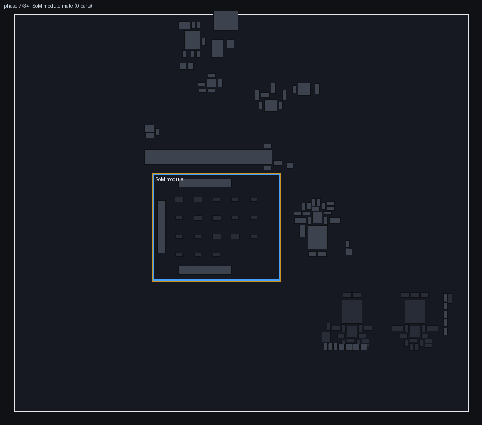

No solder parts. Mate the SoM module onto J24001, J25002, J26003 after the rail checkpoints above.

CHECKPOINT: boot/debug via debug_boot: J9001 (JTAG), J9002 (SWD), SW9001 (BOOT: DFU BSEL BSEL), SW9002 (RST)

### Phase 8 — board_aux

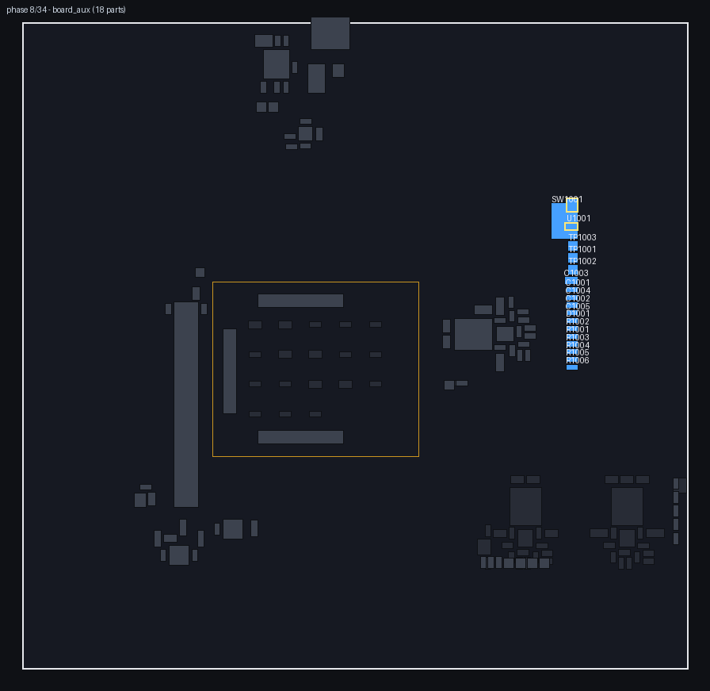

18 parts (7 top / 11 bottom)

| ref | value | package | sheet |
|---|---|---|---|
| C1001 | 100n | C_0603_1608Metric | board_aux |
| C1002 | 100n | C_0603_1608Metric | board_aux |
| C1003 | 10u | C_0805_2012Metric | board_aux |
| C1004 | 100n | C_0603_1608Metric | board_aux |
| C1005 | 100n | C_0603_1608Metric | board_aux |
| D1001 | red | LED_0603_1608Metric | board_aux |
| R1001 | 13k | R_0603_1608Metric | board_aux |
| R1002 | 100k | R_0603_1608Metric | board_aux |
| R1003 | 330R | R_0603_1608Metric | board_aux |
| R1004 | 100k | R_0603_1608Metric | board_aux |
| R1005 | 4k7 | R_0603_1608Metric | board_aux |
| R1006 | 4k7 | R_0603_1608Metric | board_aux |
| SW1001 | DSHP04TSGER | DSHP04TSGER | board_aux |
| TP1001 | +3V3_AUX | TestPoint_Pad_D1.5mm | board_aux |
| TP1002 | AUX_I2C_SCL | TestPoint_Pad_D1.5mm | board_aux |
| TP1003 | AUX_I2C_SDA | TestPoint_Pad_D1.5mm | board_aux |
| U1001 | SY6280AAC | SY6280AAC | board_aux |
| U1002 | PCA9306DCUR | PCA9306DCUR | board_aux |

CHECKPOINT: verify +3V3_AUX at TP1001

### Phase 9 — bringup_en

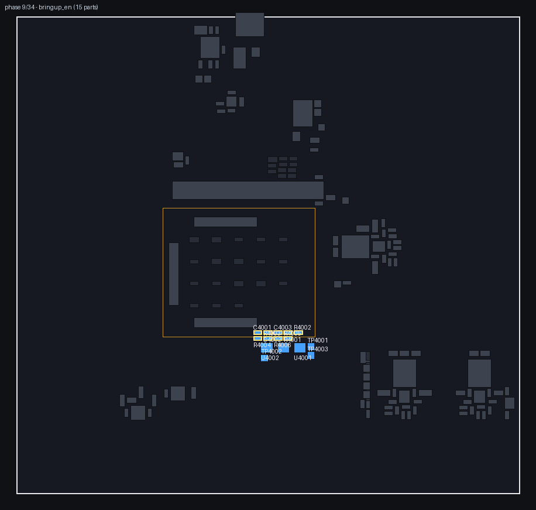

15 parts (6 top / 9 bottom)

| ref | value | package | sheet |
|---|---|---|---|
| C4001 | 100n | C_0603_1608Metric | bringup_en |
| C4002 | 100n | C_0603_1608Metric | bringup_en |
| C4003 | 100n | C_0603_1608Metric | bringup_en |
| R4001 | 100k | R_0603_1608Metric | bringup_en |
| R4002 | 100k | R_0603_1608Metric | bringup_en |
| R4003 | 100k | R_0603_1608Metric | bringup_en |
| R4004 | 100k | R_0603_1608Metric | bringup_en |
| R4005 | 100k | R_0603_1608Metric | bringup_en |
| R4006 | 100k | R_0603_1608Metric | bringup_en |
| TP4001 | EN_5V0 | TestPoint_Pad_D1.5mm | bringup_en |
| TP4002 | EN_3V3 | TestPoint_Pad_D1.5mm | bringup_en |
| TP4003 | EN_1V8 | TestPoint_Pad_D1.5mm | bringup_en |
| U4001 | SN74LVC1G08 | SOT-23-5 | bringup_en |
| U4002 | SN74LVC1G08 | SOT-23-5 | bringup_en |
| U4003 | SN74LVC1G08 | SOT-23-5 | bringup_en |

### Phase 10 — bringup_en_modules

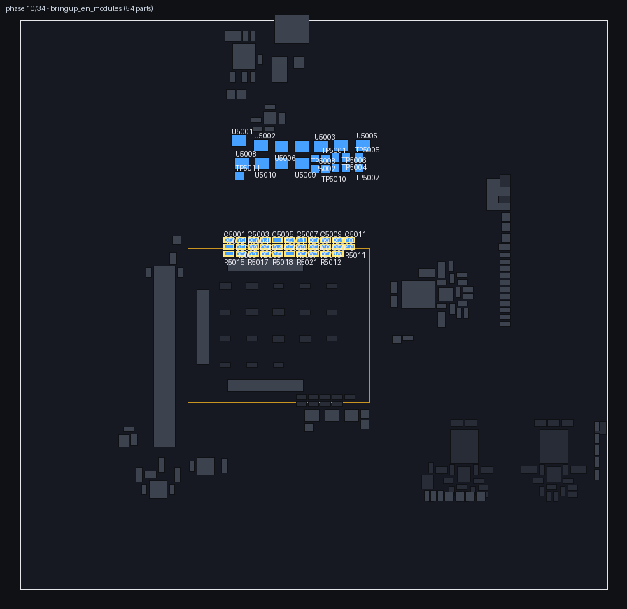

54 parts (22 top / 32 bottom)

| ref | value | package | sheet |
|---|---|---|---|
| C5001 | 100n | C_0603_1608Metric | bringup_en_modules |
| C5002 | 100n | C_0603_1608Metric | bringup_en_modules |
| C5003 | 100n | C_0603_1608Metric | bringup_en_modules |
| C5004 | 100n | C_0603_1608Metric | bringup_en_modules |
| C5005 | 100n | C_0603_1608Metric | bringup_en_modules |
| C5006 | 100n | C_0603_1608Metric | bringup_en_modules |
| C5007 | 100n | C_0603_1608Metric | bringup_en_modules |
| C5008 | 100n | C_0603_1608Metric | bringup_en_modules |
| C5009 | 100n | C_0603_1608Metric | bringup_en_modules |
| C5010 | 100n | C_0603_1608Metric | bringup_en_modules |
| C5011 | 100n | C_0603_1608Metric | bringup_en_modules |
| R5001 | 100k | R_0603_1608Metric | bringup_en_modules |
| R5002 | 100k | R_0603_1608Metric | bringup_en_modules |
| R5003 | 100k | R_0603_1608Metric | bringup_en_modules |
| R5004 | 100k | R_0603_1608Metric | bringup_en_modules |
| R5005 | 100k | R_0603_1608Metric | bringup_en_modules |
| R5006 | 100k | R_0603_1608Metric | bringup_en_modules |
| R5007 | 100k | R_0603_1608Metric | bringup_en_modules |
| R5008 | 100k | R_0603_1608Metric | bringup_en_modules |
| R5009 | 100k | R_0603_1608Metric | bringup_en_modules |
| R5010 | 100k | R_0603_1608Metric | bringup_en_modules |
| R5011 | 100k | R_0603_1608Metric | bringup_en_modules |
| R5012 | 100k | R_0603_1608Metric | bringup_en_modules |
| R5013 | 100k | R_0603_1608Metric | bringup_en_modules |
| R5014 | 100k | R_0603_1608Metric | bringup_en_modules |
| R5015 | 100k | R_0603_1608Metric | bringup_en_modules |
| R5016 | 100k | R_0603_1608Metric | bringup_en_modules |
| R5017 | 100k | R_0603_1608Metric | bringup_en_modules |
| R5018 | 100k | R_0603_1608Metric | bringup_en_modules |
| R5019 | 100k | R_0603_1608Metric | bringup_en_modules |
| R5020 | 100k | R_0603_1608Metric | bringup_en_modules |
| R5021 | 100k | R_0603_1608Metric | bringup_en_modules |
| TP5001 | EN_HDMI_TX | TestPoint_Pad_D1.5mm | bringup_en_modules |
| TP5002 | EN_HDMI_RX | TestPoint_Pad_D1.5mm | bringup_en_modules |
| TP5003 | EN_LCD | TestPoint_Pad_D1.5mm | bringup_en_modules |
| TP5004 | EN_CAM | TestPoint_Pad_D1.5mm | bringup_en_modules |
| TP5005 | EN_SD | TestPoint_Pad_D1.5mm | bringup_en_modules |
| TP5006 | EN_USB | TestPoint_Pad_D1.5mm | bringup_en_modules |
| TP5007 | EN_PMOD | TestPoint_Pad_D1.5mm | bringup_en_modules |
| TP5008 | EN_USER_LED | TestPoint_Pad_D1.5mm | bringup_en_modules |
| TP5009 | EN_LCD_BL | TestPoint_Pad_D1.5mm | bringup_en_modules |
| TP5010 | EN_HDMI_TX_5V | TestPoint_Pad_D1.5mm | bringup_en_modules |
| TP5011 | EN_LCD_5V | TestPoint_Pad_D1.5mm | bringup_en_modules |
| U5001 | SN74LVC1G08 | SOT-23-5 | bringup_en_modules |
| U5002 | SN74LVC1G08 | SOT-23-5 | bringup_en_modules |
| U5003 | SN74LVC1G08 | SOT-23-5 | bringup_en_modules |
| U5004 | SN74LVC1G08 | SOT-23-5 | bringup_en_modules |
| U5005 | SN74LVC1G08 | SOT-23-5 | bringup_en_modules |
| U5006 | SN74LVC1G08 | SOT-23-5 | bringup_en_modules |
| U5007 | SN74LVC1G08 | SOT-23-5 | bringup_en_modules |
| U5008 | SN74LVC1G08 | SOT-23-5 | bringup_en_modules |
| U5009 | SN74LVC1G08 | SOT-23-5 | bringup_en_modules |
| U5010 | SN74LVC1G08 | SOT-23-5 | bringup_en_modules |
| U5011 | SN74LVC1G08 | SOT-23-5 | bringup_en_modules |

### Phase 11 — bringup_modules

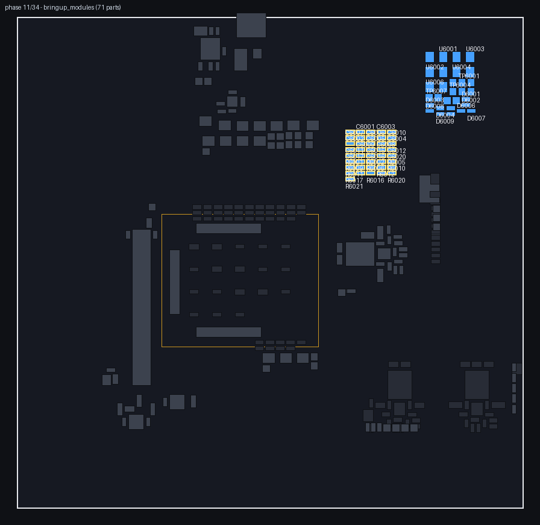

71 parts (30 top / 41 bottom)

| ref | value | package | sheet |
|---|---|---|---|
| C6001 | 100n | C_0603_1608Metric | bringup_modules |
| C6002 | 100n | C_0603_1608Metric | bringup_modules |
| C6003 | 100n | C_0603_1608Metric | bringup_modules |
| C6004 | 100n | C_0603_1608Metric | bringup_modules |
| C6005 | 100n | C_0603_1608Metric | bringup_modules |
| C6006 | 100n | C_0603_1608Metric | bringup_modules |
| C6007 | 100n | C_0603_1608Metric | bringup_modules |
| C6008 | 100n | C_0603_1608Metric | bringup_modules |
| C6009 | 100n | C_0603_1608Metric | bringup_modules |
| C6010 | 100n | C_0603_1608Metric | bringup_modules |
| C6011 | 100n | C_0603_1608Metric | bringup_modules |
| C6012 | 100n | C_0603_1608Metric | bringup_modules |
| C6013 | 100n | C_0603_1608Metric | bringup_modules |
| C6014 | 100n | C_0603_1608Metric | bringup_modules |
| C6015 | 100n | C_0603_1608Metric | bringup_modules |
| C6016 | 100n | C_0603_1608Metric | bringup_modules |
| C6017 | 100n | C_0603_1608Metric | bringup_modules |
| C6018 | 100n | C_0603_1608Metric | bringup_modules |
| C6019 | 100n | C_0603_1608Metric | bringup_modules |
| C6020 | 100n | C_0603_1608Metric | bringup_modules |
| D6001 | red | LED_0603_1608Metric | bringup_modules |
| D6002 | red | LED_0603_1608Metric | bringup_modules |
| D6003 | red | LED_0603_1608Metric | bringup_modules |
| D6004 | red | LED_0603_1608Metric | bringup_modules |
| D6005 | red | LED_0603_1608Metric | bringup_modules |
| D6006 | red | LED_0603_1608Metric | bringup_modules |
| D6007 | red | LED_0603_1608Metric | bringup_modules |
| D6008 | red | LED_0603_1608Metric | bringup_modules |
| D6009 | red | LED_0603_1608Metric | bringup_modules |
| D6010 | red | LED_0603_1608Metric | bringup_modules |
| R6001 | 13k | R_0603_1608Metric | bringup_modules |
| R6002 | 330R | R_0603_1608Metric | bringup_modules |
| R6003 | 13k | R_0603_1608Metric | bringup_modules |
| R6004 | 330R | R_0603_1608Metric | bringup_modules |
| R6005 | 6.8k | R_0603_1608Metric | bringup_modules |
| R6006 | 330R | R_0603_1608Metric | bringup_modules |
| R6007 | 13k | R_0603_1608Metric | bringup_modules |
| R6008 | 330R | R_0603_1608Metric | bringup_modules |
| R6009 | 6.8k | R_0603_1608Metric | bringup_modules |
| R6010 | 330R | R_0603_1608Metric | bringup_modules |
| R6011 | 6.8k | R_0603_1608Metric | bringup_modules |
| R6012 | 1k | R_0603_1608Metric | bringup_modules |
| R6013 | 13k | R_0603_1608Metric | bringup_modules |
| R6014 | 330R | R_0603_1608Metric | bringup_modules |
| R6015 | 13k | R_0603_1608Metric | bringup_modules |
| R6016 | 330R | R_0603_1608Metric | bringup_modules |
| R6017 | 13k | R_0603_1608Metric | bringup_modules |
| R6018 | 1k | R_0603_1608Metric | bringup_modules |
| R6019 | 6.8k | R_0603_1608Metric | bringup_modules |
| R6020 | 1k | R_0603_1608Metric | bringup_modules |
| R6021 | 10k | R_0603_1608Metric | bringup_modules |
| TP6001 | +3V3_HDMI_TX | TestPoint_Pad_D1.5mm | bringup_modules |
| TP6002 | +3V3_HDMI_RX | TestPoint_Pad_D1.5mm | bringup_modules |
| TP6003 | +3V3_LCD | TestPoint_Pad_D1.5mm | bringup_modules |
| TP6004 | +3V3_CAM | TestPoint_Pad_D1.5mm | bringup_modules |
| TP6005 | +3V3_SD | TestPoint_Pad_D1.5mm | bringup_modules |
| TP6006 | +5V_USB | TestPoint_Pad_D1.5mm | bringup_modules |
| TP6007 | +3V3_PMOD | TestPoint_Pad_D1.5mm | bringup_modules |
| TP6008 | +3V3_USER_LED | TestPoint_Pad_D1.5mm | bringup_modules |
| TP6009 | +5V_HDMI_TX | TestPoint_Pad_D1.5mm | bringup_modules |
| TP6010 | +5V_LCD | TestPoint_Pad_D1.5mm | bringup_modules |
| U6001 | SY6280AAC | SY6280AAC | bringup_modules |
| U6002 | SY6280AAC | SY6280AAC | bringup_modules |
| U6003 | SY6280AAC | SY6280AAC | bringup_modules |
| U6004 | SY6280AAC | SY6280AAC | bringup_modules |
| U6005 | SY6280AAC | SY6280AAC | bringup_modules |
| U6006 | SY6280AAC | SY6280AAC | bringup_modules |
| U6007 | SY6280AAC | SY6280AAC | bringup_modules |
| U6008 | SY6280AAC | SY6280AAC | bringup_modules |
| U6009 | SY6280AAC | SY6280AAC | bringup_modules |
| U6010 | SY6280AAC | SY6280AAC | bringup_modules |

CHECKPOINT: verify +5V_HDMI_TX at TP6009
CHECKPOINT: verify +5V_LCD at TP6010
CHECKPOINT: verify +5V_USB at TP6006
CHECKPOINT: verify +3V3_CAM at TP6004
CHECKPOINT: verify +3V3_HDMI_RX at TP6002
CHECKPOINT: verify +3V3_HDMI_TX at TP6001
CHECKPOINT: verify +3V3_LCD at TP6003
CHECKPOINT: verify +3V3_PMOD at TP6007
CHECKPOINT: verify +3V3_SD at TP6005
CHECKPOINT: verify +3V3_USER_LED at TP6008

### Phase 12 — bringup_rails

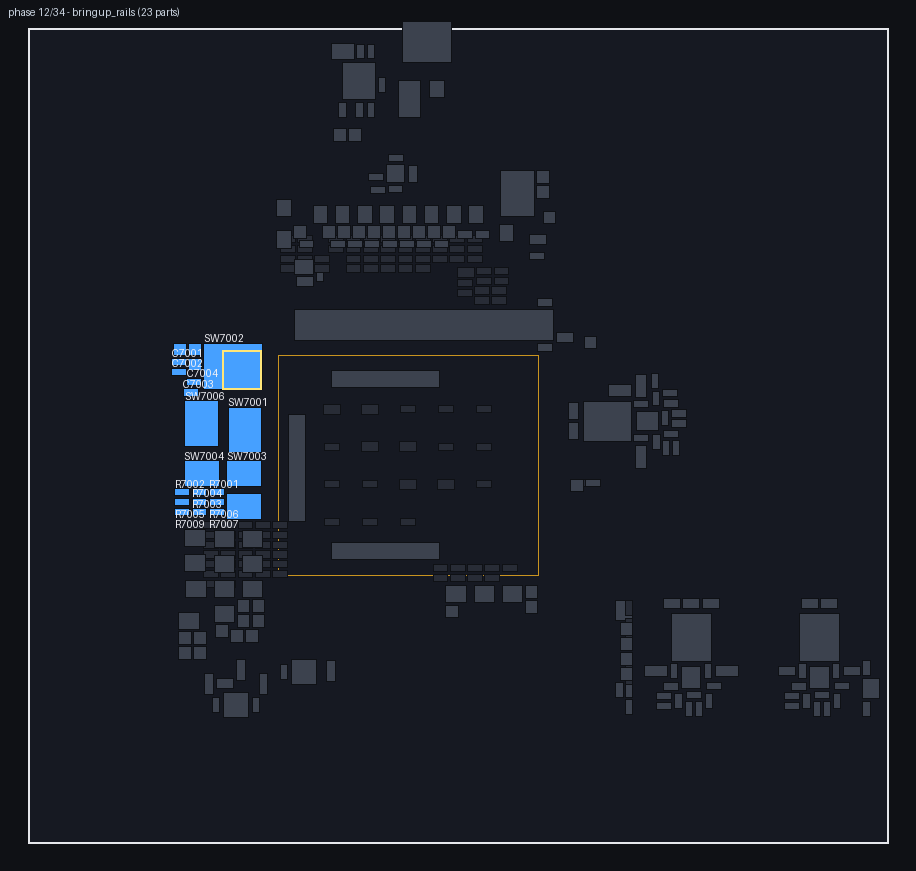

23 parts (22 top / 1 bottom)

| ref | value | package | sheet |
|---|---|---|---|
| C7001 | 100n | C_0603_1608Metric | bringup_rails |
| C7002 | 100n | C_0603_1608Metric | bringup_rails |
| C7003 | 100n | C_0603_1608Metric | bringup_rails |
| C7004 | 100n | C_0603_1608Metric | bringup_rails |
| R7001 | 100k | R_0603_1608Metric | bringup_rails |
| R7002 | 100k | R_0603_1608Metric | bringup_rails |
| R7003 | 100k | R_0603_1608Metric | bringup_rails |
| R7004 | 4k7 | R_0603_1608Metric | bringup_rails |
| R7005 | 4k7 | R_0603_1608Metric | bringup_rails |
| R7006 | 10k | R_0603_1608Metric | bringup_rails |
| R7007 | 10k | R_0603_1608Metric | bringup_rails |
| R7008 | 10k | R_0603_1608Metric | bringup_rails |
| R7009 | 10k | R_0603_1608Metric | bringup_rails |
| SW7001 | DSHP04TSGER | DSHP04TSGER | bringup_rails |
| SW7002 | DSHP08TSGER | DSHP08TSGER | bringup_rails |
| SW7003 | TS-1187A-B-A-B | TS-1187A-B-A-B | bringup_rails |
| SW7004 | TS-1187A-B-A-B | TS-1187A-B-A-B | bringup_rails |
| SW7005 | TS-1187A-B-A-B | TS-1187A-B-A-B | bringup_rails |
| SW7006 | DSHP04TSGER | DSHP04TSGER | bringup_rails |
| TP7001 | +3V3_SC | TestPoint_Pad_D1.5mm | bringup_rails |
| TP7002 | STM32_I2C2_SDA | TestPoint_Pad_D1.5mm | bringup_rails |
| TP7003 | STM32_I2C2_SCL | TestPoint_Pad_D1.5mm | bringup_rails |
| U7001 | TCA9535PWR | TCA9535PWR | bringup_rails |

### Phase 13 — debug_boot

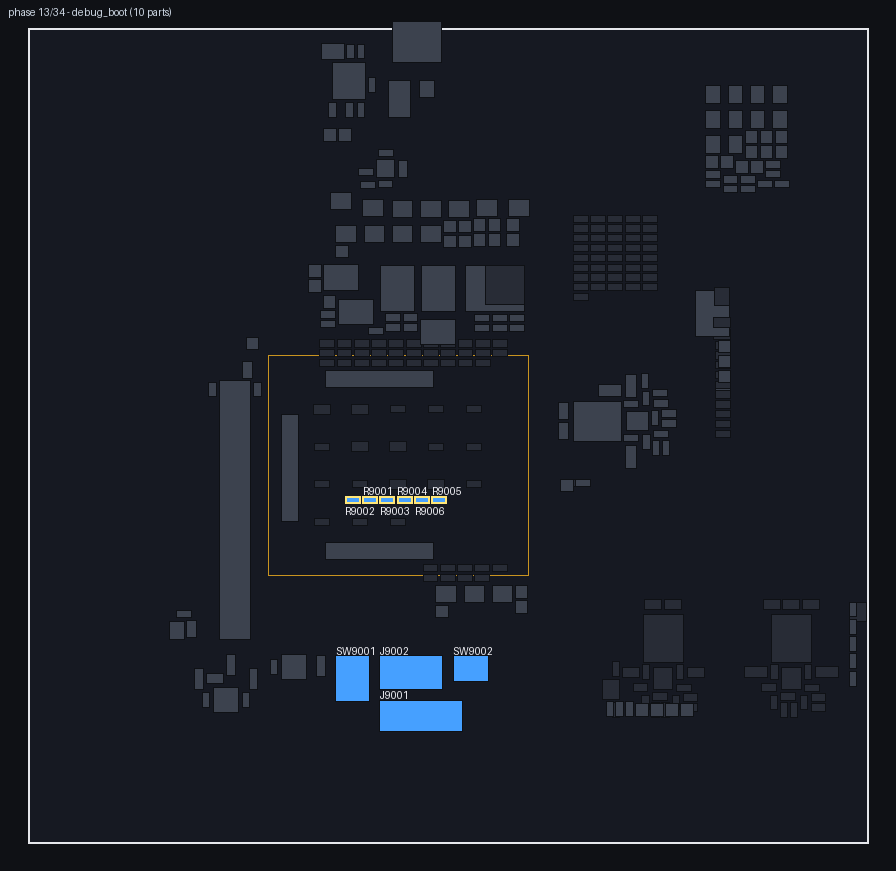

10 parts (4 top / 6 bottom)

| ref | value | package | sheet |
|---|---|---|---|
| J9001 | 878311420 | 878311420 | debug_boot |
| J9002 | HX_JN1.27-2x5 | HX_JN1.27-2x5_TP_H4.9 | debug_boot |
| R9001 | 4k7 | R_0603_1608Metric | debug_boot |
| R9002 | 4k7 | R_0603_1608Metric | debug_boot |
| R9003 | 100R | R_0603_1608Metric | debug_boot |
| R9004 | 10k | R_0603_1608Metric | debug_boot |
| R9005 | 10k | R_0603_1608Metric | debug_boot |
| R9006 | 10k | R_0603_1608Metric | debug_boot |
| SW9001 | DIP-4 | DSHP04TSGER | debug_boot |
| SW9002 | RESET | TS-1187A-B-A-B | debug_boot |

### Phase 14 — ethernet

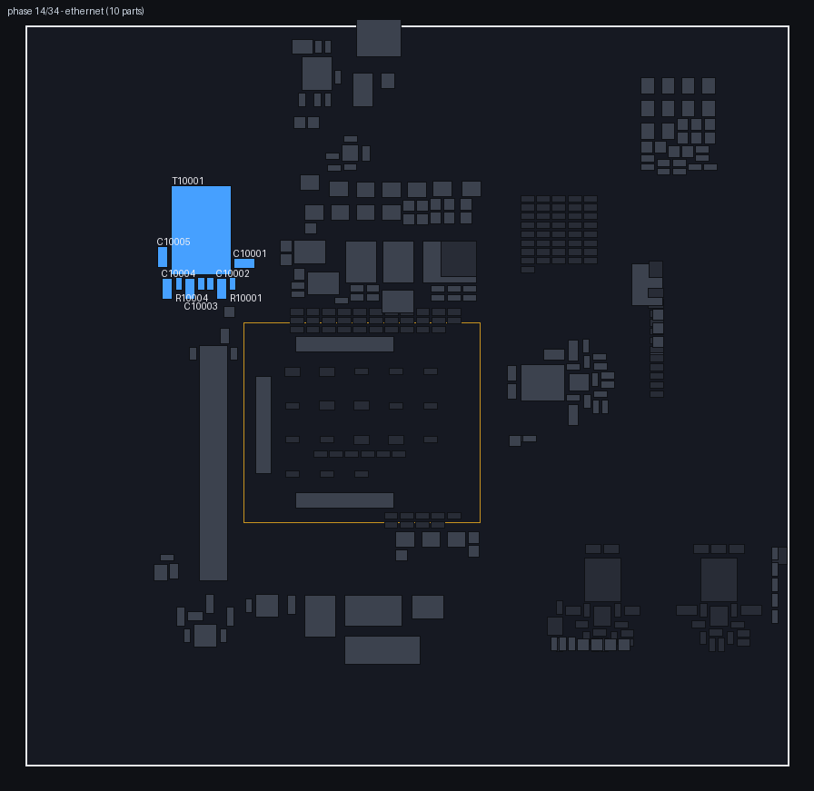

10 parts (10 top / 0 bottom)

| ref | value | package | sheet |
|---|---|---|---|
| C10001 | 1n | C_1206_3225Metric | ethernet |
| C10002 | 1n | C_1206_3225Metric | ethernet |
| C10003 | 1n | C_1206_3225Metric | ethernet |
| C10004 | 1n | C_1206_3225Metric | ethernet |
| C10005 | 1n | C_1206_3225Metric | ethernet |
| R10001 | 75R | R_0603_1608Metric | ethernet |
| R10002 | 75R | R_0603_1608Metric | ethernet |
| R10003 | 75R | R_0603_1608Metric | ethernet |
| R10004 | 75R | R_0603_1608Metric | ethernet |
| T10001 | HX5008NLT | HX5008NLT | ethernet |

### Phase 15 — hdmi_rx_term

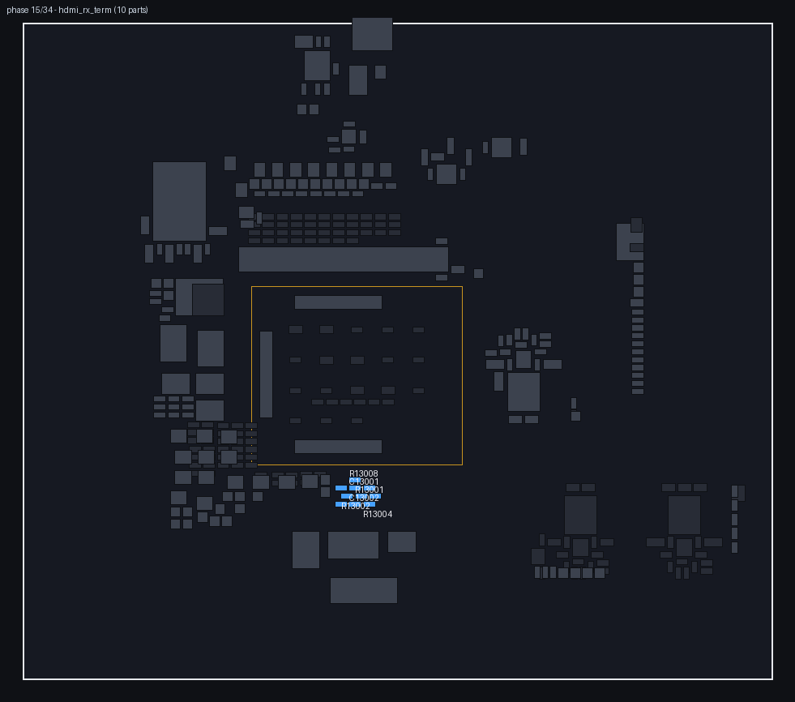

10 parts (10 top / 0 bottom)

| ref | value | package | sheet |
|---|---|---|---|
| C13001 | 100n | C_0603_1608Metric | hdmi_rx_term |
| C13002 | 1u | C_0603_1608Metric | hdmi_rx_term |
| R13001 | 49.9R | R_0603_1608Metric | hdmi_rx_term |
| R13002 | 49.9R | R_0603_1608Metric | hdmi_rx_term |
| R13003 | 49.9R | R_0603_1608Metric | hdmi_rx_term |
| R13004 | 49.9R | R_0603_1608Metric | hdmi_rx_term |
| R13005 | 49.9R | R_0603_1608Metric | hdmi_rx_term |
| R13006 | 49.9R | R_0603_1608Metric | hdmi_rx_term |
| R13007 | 49.9R | R_0603_1608Metric | hdmi_rx_term |
| R13008 | 49.9R | R_0603_1608Metric | hdmi_rx_term |

### Phase 16 — motor_pwm

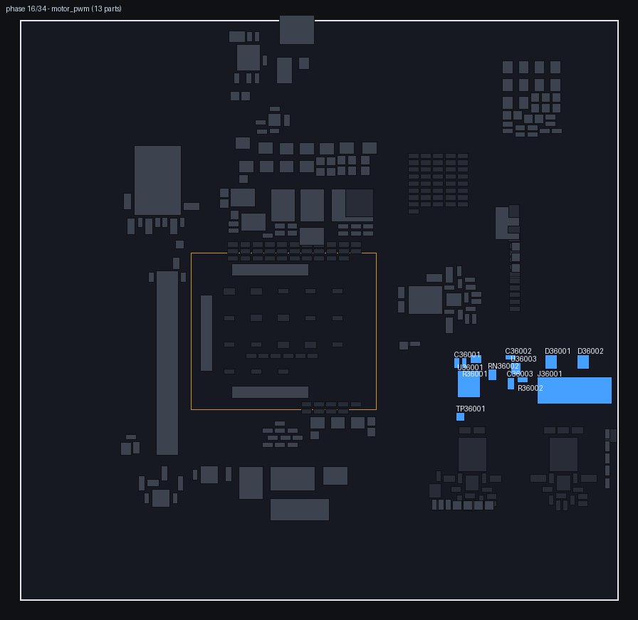

13 parts (13 top / 0 bottom)

| ref | value | package | sheet |
|---|---|---|---|
| C36001 | 100n | C_0603_1608Metric | motor_pwm |
| C36002 | 100n | C_0603_1608Metric | motor_pwm |
| C36003 | 10u | C_0805_2012Metric | motor_pwm |
| D36001 | SRV05-4 | SOT-23-6 | motor_pwm |
| D36002 | SRV05-4 | SOT-23-6 | motor_pwm |
| J36001 | HX PZ2.54-3x8P ZZ | HX_PZ2.54-3x8P_ZZ | motor_pwm |
| R36001 | 10k | R_0603_1608Metric | motor_pwm |
| R36002 | 13k | R_0603_1608Metric | motor_pwm |
| RN36001 | 4D03WGJ0330T5E | 4D03WGJ0330T5E | motor_pwm |
| RN36002 | 4D03WGJ0330T5E | 4D03WGJ0330T5E | motor_pwm |
| TP36001 | +5V_MOTOR_IO | TestPoint_Pad_D1.5mm | motor_pwm |
| U36001 | SN74HCT245PWR | SN74HCT245PWR | motor_pwm |
| U36003 | SY6280AAC | SY6280AAC | motor_pwm |

CHECKPOINT: verify +5V_MOTOR_IO at TP36001

### Phase 17 — motor_sense

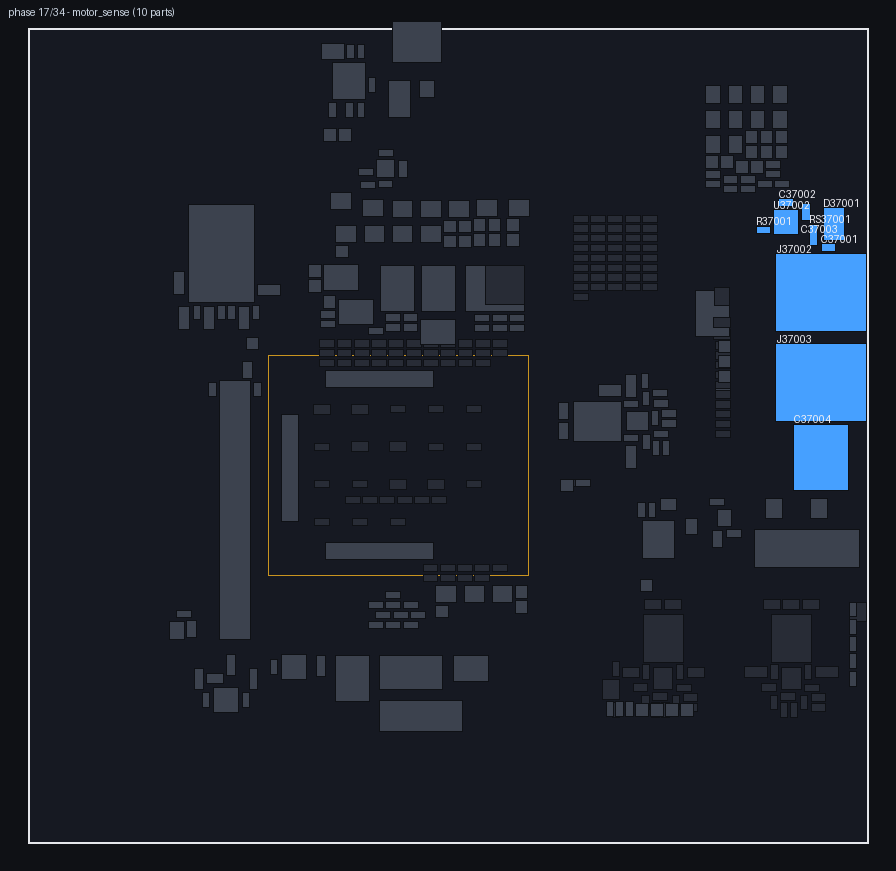

10 parts (10 top / 0 bottom)

| ref | value | package | sheet |
|---|---|---|---|
| C37001 | 100n | C_0603_1608Metric | motor_sense |
| C37002 | 100n | C_0603_1608Metric | motor_sense |
| C37003 | 10u | C_0805_2012Metric | motor_sense |
| C37004 | 470uF/35V | CP_Elec_10x10.5 | motor_sense |
| D37001 | SMBJ28A | SMBJ28A | motor_sense |
| J37002 | XT60PW-M | XT60PW-M | motor_sense |
| J37003 | XT60PW-M | XT60PW-M | motor_sense |
| R37001 | 10k | R_0603_1608Metric | motor_sense |
| RS37001 | 10mR | RLM12FTCMR010 | motor_sense |
| U37002 | INA3221AIRGVR | INA3221AIRGVR | motor_sense |

### Phase 18 — pmod_expansion

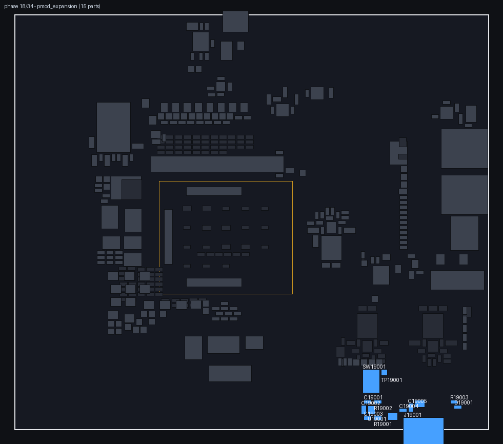

15 parts (15 top / 0 bottom)

| ref | value | package | sheet |
|---|---|---|---|
| C19001 | 100n | C_0603_1608Metric | pmod_expansion |
| C19002 | 10u | C_0805_2012Metric | pmod_expansion |
| C19003 | 100n | C_0603_1608Metric | pmod_expansion |
| C19004 | 100n | C_0603_1608Metric | pmod_expansion |
| C19005 | 10u | C_0805_2012Metric | pmod_expansion |
| D19001 | red | LED_0603_1608Metric | pmod_expansion |
| J19001 | DS1024-2x6R2 | DS1024-2x6R2 | pmod_expansion |
| R19001 | 13k | R_0603_1608Metric | pmod_expansion |
| R19002 | 100k | R_0603_1608Metric | pmod_expansion |
| R19003 | 330R | R_0603_1608Metric | pmod_expansion |
| SW19001 | DSHP04TSGER | DSHP04TSGER | pmod_expansion |
| TP19001 | +3V3_PMODX | TestPoint_Pad_D1.5mm | pmod_expansion |
| U19001 | SY6280AAC | SY6280AAC | pmod_expansion |
| U19002 | TPD4E1U06 | TPD4E1U06DBVR | pmod_expansion |
| U19003 | TPD4E1U06 | TPD4E1U06DBVR | pmod_expansion |

CHECKPOINT: verify +3V3_PMODX at TP19001

### Phase 19 — rj45_connector

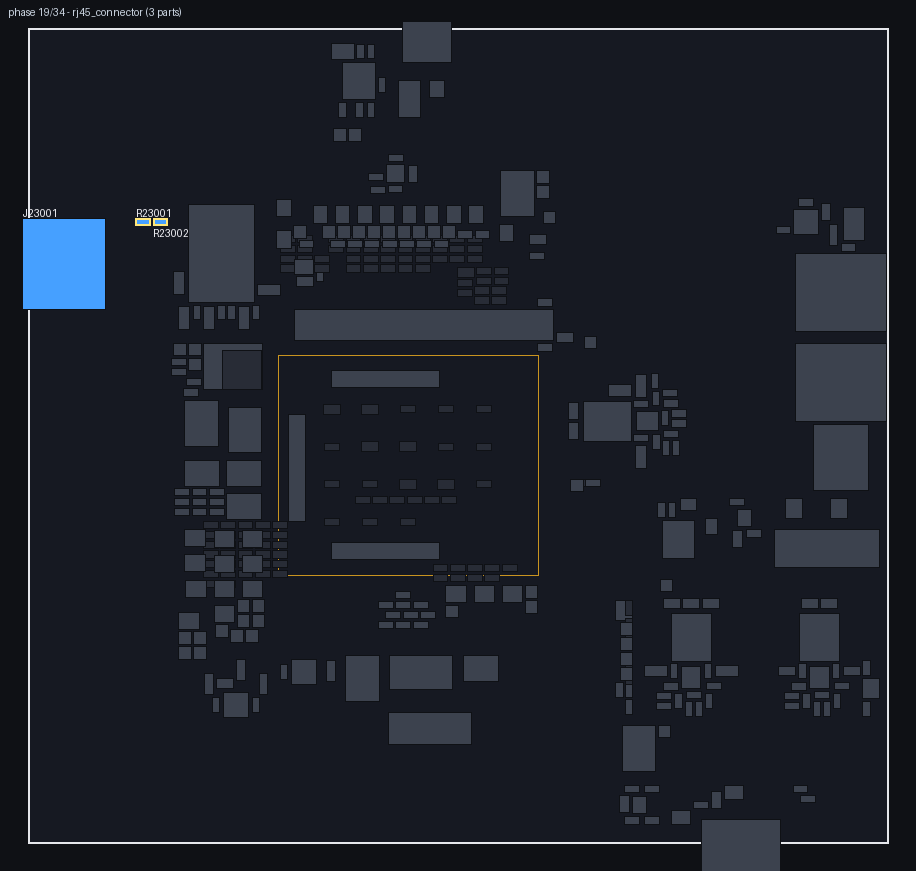

3 parts (1 top / 2 bottom)

| ref | value | package | sheet |
|---|---|---|---|
| J23001 | KH-5224-8P8C-D | KH-5224-8P8C-D | rj45_connector |
| R23001 | 330R | R_0603_1608Metric | rj45_connector |
| R23002 | 330R | R_0603_1608Metric | rj45_connector |

### Phase 20 — uart_bridge

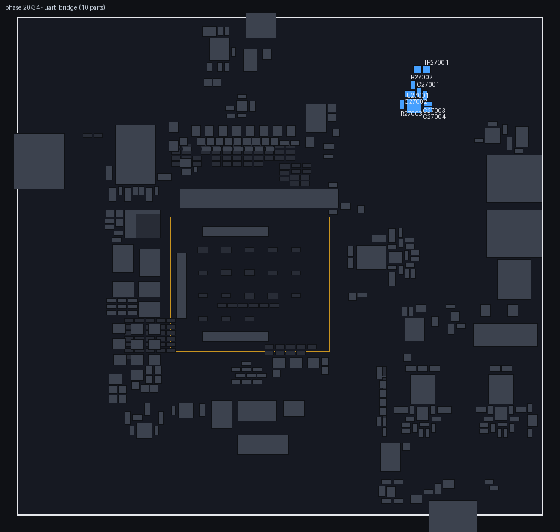

10 parts (10 top / 0 bottom)

| ref | value | package | sheet |
|---|---|---|---|
| C27001 | 100n | C_0603_1608Metric | uart_bridge |
| C27002 | 10u | C_0805_2012Metric | uart_bridge |
| C27003 | 100n | C_0603_1608Metric | uart_bridge |
| C27004 | 100n | C_0603_1608Metric | uart_bridge |
| R27001 | 1k | R_0603_1608Metric | uart_bridge |
| R27002 | 22k1 | R_0603_1608Metric | uart_bridge |
| R27003 | 47k5 | R_0603_1608Metric | uart_bridge |
| TP27001 | ZYNQ_PS_UART0_TXD | TestPoint_Pad_D1.5mm | uart_bridge |
| TP27002 | ZYNQ_PS_UART0_RXD | TestPoint_Pad_D1.5mm | uart_bridge |
| U27001 | CP2102N-A02 | CP2102N-A02-GQFN24R | uart_bridge |

### Phase 21 — usb_jtag_connector

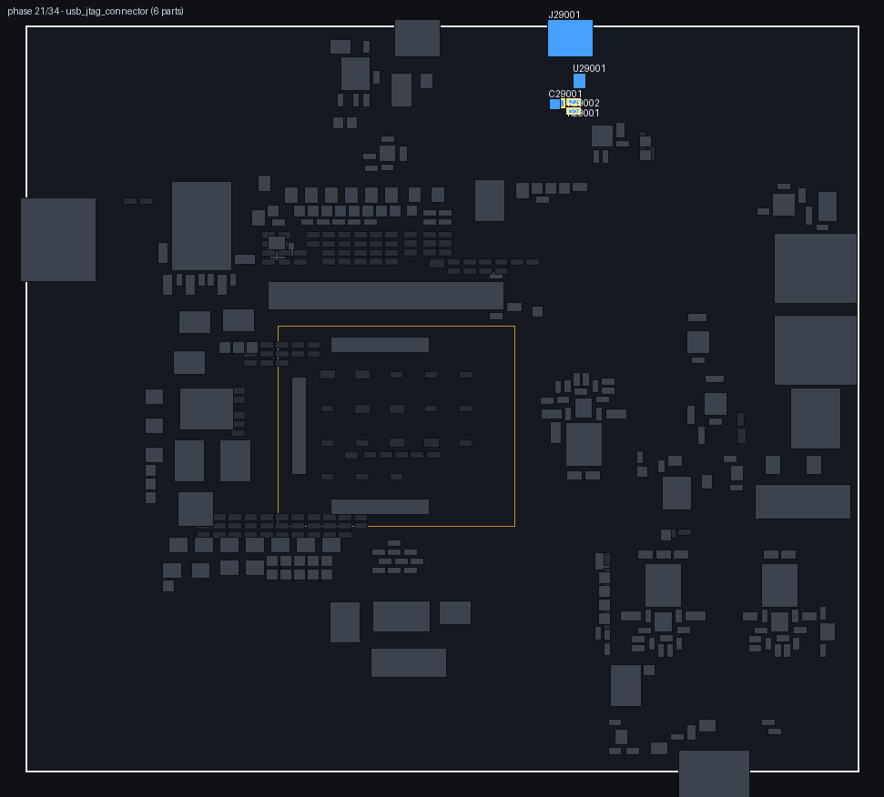

6 parts (6 top / 0 bottom)

| ref | value | package | sheet |
|---|---|---|---|
| C29001 | 10u | C_0805_2012Metric | usb_jtag_connector |
| J29001 | TYPE-C-31-M-12 | TYPE-C-31-M-12 | usb_jtag_connector |
| R29001 | 5.1k | R_0603_1608Metric | usb_jtag_connector |
| R29002 | 5.1k | R_0603_1608Metric | usb_jtag_connector |
| TP29001 | +5V_DBG | TestPoint_Pad_D1.5mm | usb_jtag_connector |
| U29001 | USBLC6-2SC6 | USBLC6-2SC6 | usb_jtag_connector |

CHECKPOINT: verify +5V_DBG at TP29001

### Phase 22 — usb_uart_connector

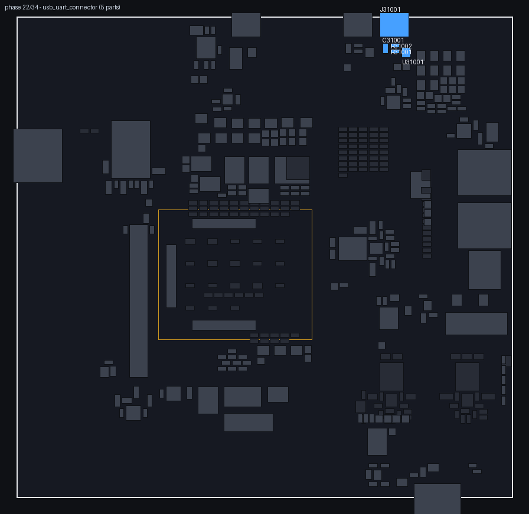

5 parts (5 top / 0 bottom)

| ref | value | package | sheet |
|---|---|---|---|
| C31001 | 10u | C_0805_2012Metric | usb_uart_connector |
| J31001 | TYPE-C-31-M-12 | TYPE-C-31-M-12 | usb_uart_connector |
| R31001 | 5.1k | R_0603_1608Metric | usb_uart_connector |
| R31002 | 5.1k | R_0603_1608Metric | usb_uart_connector |
| U31001 | USBLC6-2SC6 | USBLC6-2SC6 | usb_uart_connector |

### Phase 23 — board_qwiic

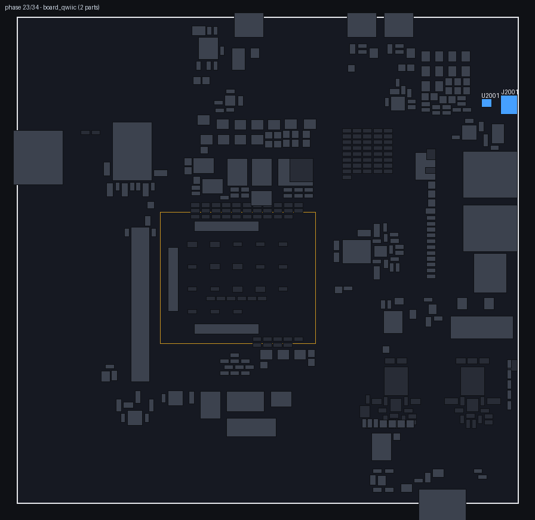

2 parts (2 top / 0 bottom)

| ref | value | package | sheet |
|---|---|---|---|
| J2001 | ZX-SH1.0-4PWT | ZX-SH1.0-4PWT | board_qwiic |
| U2001 | USBLC6-2SC6 | USBLC6-2SC6 | board_qwiic |

### Phase 24 — board_services

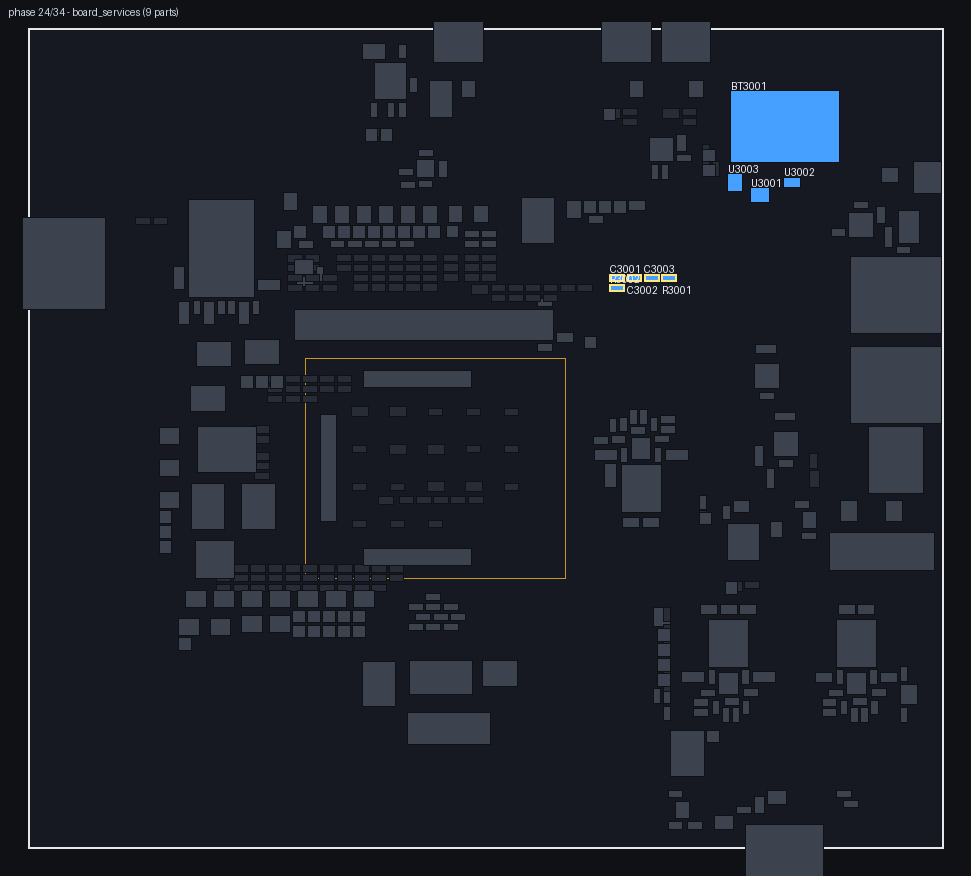

9 parts (4 top / 5 bottom)

| ref | value | package | sheet |
|---|---|---|---|
| BT3001 | KH-CR1220-2 | KH-CR1220-2 | board_services |
| C3001 | 100n | C_0603_1608Metric | board_services |
| C3002 | 100n | C_0603_1608Metric | board_services |
| C3003 | 100n | C_0603_1608Metric | board_services |
| R3001 | 10k | R_0603_1608Metric | board_services |
| R3002 | 1k | R_0603_1608Metric | board_services |
| U3001 | 24AA025E48T-I/OT | 24AA025E48T-I_OT | board_services |
| U3002 | RV-3028-C7-32.768kHz-1ppm-TA-QC | RV-3028-C7-32.768kHz-1ppm-TA-QC | board_services |
| U3003 | TPS3823-33DBVR | TPS3823-33DBVR | board_services |

### Phase 25 — camera

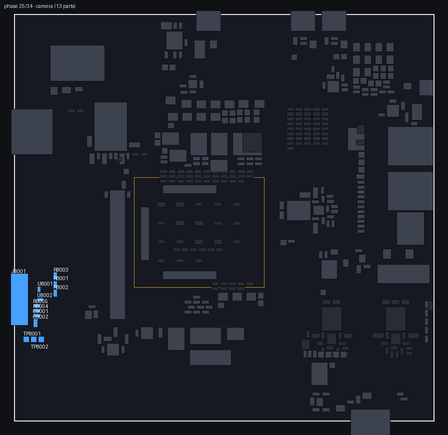

13 parts (13 top / 0 bottom)

| ref | value | package | sheet |
|---|---|---|---|
| C8001 | 100n | C_0603_1608Metric | camera |
| C8002 | 10u | C_0805_2012Metric | camera |
| J8001 | SFW15R-1STE1LF | SFW15R-1STE1LF | camera |
| R8001 | 100R | R_0603_1608Metric | camera |
| R8002 | 100R | R_0603_1608Metric | camera |
| R8003 | 100R | R_0603_1608Metric | camera |
| R8004 | 4k7 | R_0603_1608Metric | camera |
| R8005 | 4k7 | R_0603_1608Metric | camera |
| TP8001 | CAM_SCL | TestPoint_Pad_D1.5mm | camera |
| TP8002 | CAM_SDA | TestPoint_Pad_D1.5mm | camera |
| TP8003 | CAM_EN | TestPoint_Pad_D1.5mm | camera |
| U8001 | TPD4E02B04DQAR | TPD4E02B04DQAR | camera |
| U8002 | TPD4E02B04DQAR | TPD4E02B04DQAR | camera |

### Phase 26 — hdmi_rx

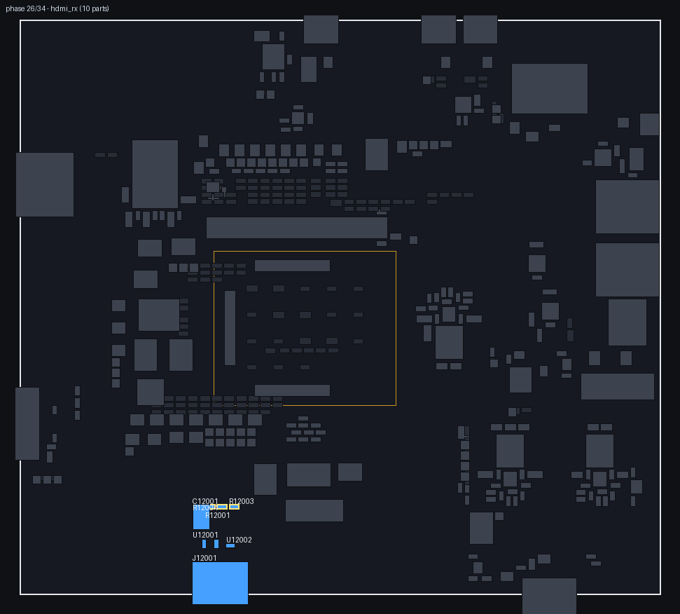

10 parts (10 top / 0 bottom)

| ref | value | package | sheet |
|---|---|---|---|
| C12001 | 100n | C_0603_1608Metric | hdmi_rx |
| J12001 | HDMI-019S | HDMI-019S | hdmi_rx |
| R12001 | 1k | R_0603_1608Metric | hdmi_rx |
| R12002 | 27k | R_0603_1608Metric | hdmi_rx |
| R12003 | 10k | R_0603_1608Metric | hdmi_rx |
| R12004 | 15k | R_0603_1608Metric | hdmi_rx |
| U12001 | M24C02-WMN6TP | M24C02-WMN6TP | hdmi_rx |
| U12002 | TPD4E02B04DQAR | TPD4E02B04DQAR | hdmi_rx |
| U12003 | TPD4E02B04DQAR | TPD4E02B04DQAR | hdmi_rx |
| U12004 | TPD4E05U06DQAR | TPD4E05U06DQAR | hdmi_rx |

### Phase 27 — hdmi_tx

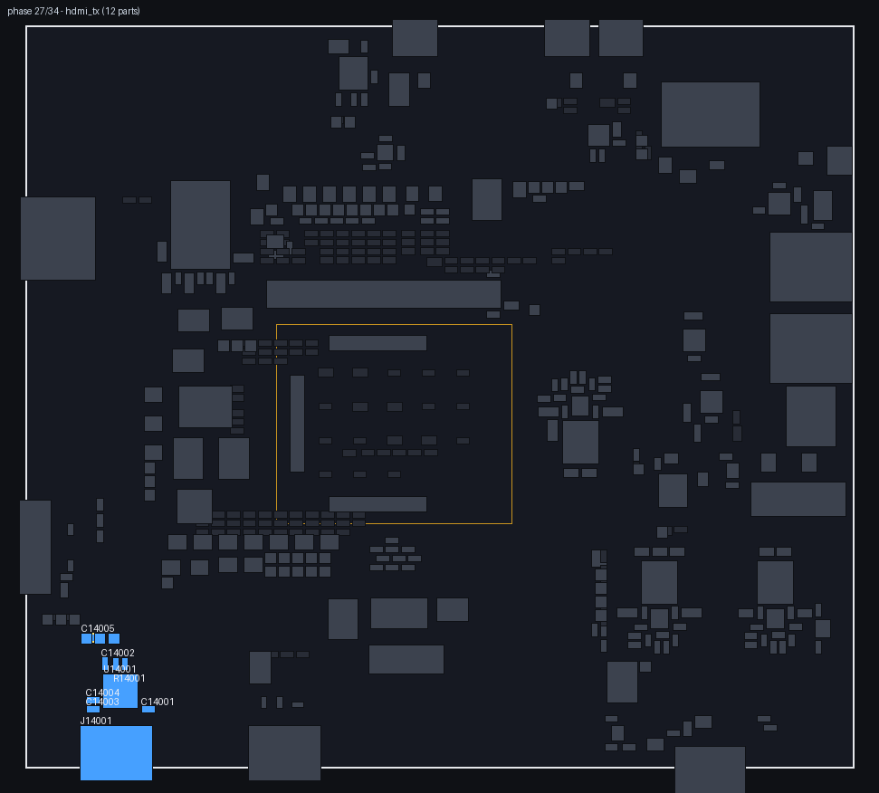

12 parts (12 top / 0 bottom)

| ref | value | package | sheet |
|---|---|---|---|
| C14001 | 100n | C_0603_1608Metric | hdmi_tx |
| C14002 | 100n | C_0603_1608Metric | hdmi_tx |
| C14003 | 100n | C_0603_1608Metric | hdmi_tx |
| C14004 | 1u | C_0603_1608Metric | hdmi_tx |
| C14005 | 10u | C_0805_2012Metric | hdmi_tx |
| J14001 | HDMI-019S | HDMI-019S | hdmi_tx |
| R14001 | 10k | R_0603_1608Metric | hdmi_tx |
| R14002 | 10k | R_0603_1608Metric | hdmi_tx |
| TP14001 | +5V_HDMI_TX | TestPoint_Pad_D1.5mm | hdmi_tx |
| TP14002 | ZYNQ_HDMI_TX_SCL | TestPoint_Pad_D1.5mm | hdmi_tx |
| TP14003 | ZYNQ_HDMI_TX_SDA | TestPoint_Pad_D1.5mm | hdmi_tx |
| U14001 | TPD12S016PWR | TPD12S016PWR | hdmi_tx |

### Phase 28 — lcd

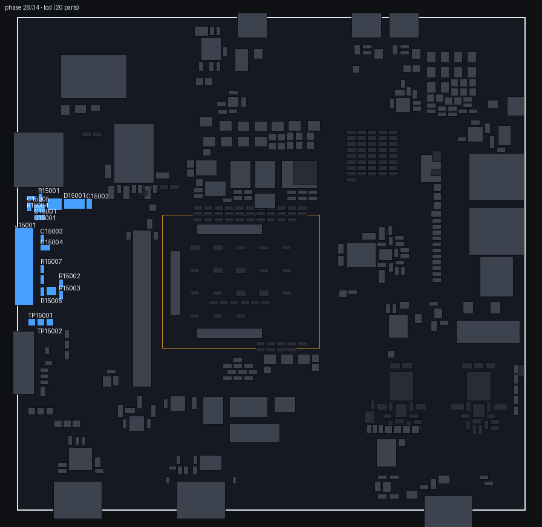

20 parts (20 top / 0 bottom)

| ref | value | package | sheet |
|---|---|---|---|
| C15001 | 10u | C_0805_2012Metric | lcd |
| C15002 | 2.2u | C_0805_2012Metric | lcd |
| C15003 | 100n | C_0603_1608Metric | lcd |
| C15004 | 10u | C_0805_2012Metric | lcd |
| C15005 | 1u | C_0603_1608Metric | lcd |
| D15001 | SS34 | D_SMA | lcd |
| J15001 | AFC07-S40FCA-00 | AFC07-S40FCA-00 | lcd |
| L15001 | 10uH | SWPA4030S100MT | lcd |
| R15001 | 1.5R | R_0603_1608Metric | lcd |
| R15002 | 4k7 | R_0603_1608Metric | lcd |
| R15003 | 4k7 | R_0603_1608Metric | lcd |
| R15004 | 100k | R_0603_1608Metric | lcd |
| R15005 | 100k | R_0603_1608Metric | lcd |
| R15006 | 10k | R_0603_1608Metric | lcd |
| R15007 | 22R | R_0603_1608Metric | lcd |
| TP15001 | +5V_LCD | TestPoint_Pad_D1.5mm | lcd |
| TP15002 | LCD_CTP_SDA | TestPoint_Pad_D1.5mm | lcd |
| TP15003 | LCD_CTP_SCL | TestPoint_Pad_D1.5mm | lcd |
| U15001 | SY7201ABC | SY7201ABC | lcd |
| U15002 | USBLC6-2SC6 | USBLC6-2SC6 | lcd |

### Phase 29 — microsd

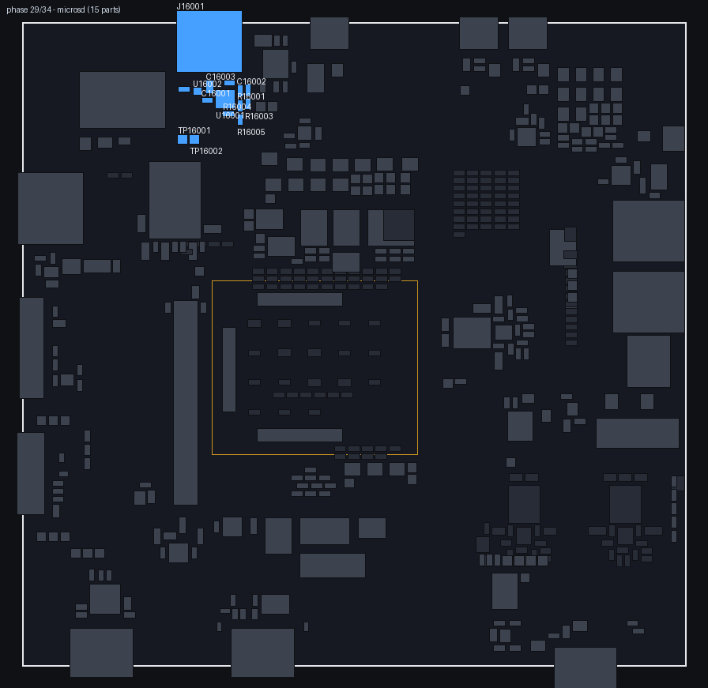

15 parts (15 top / 0 bottom)

| ref | value | package | sheet |
|---|---|---|---|
| C16001 | 100n | C_0603_1608Metric | microsd |
| C16002 | 100n | C_0603_1608Metric | microsd |
| C16003 | 22u | C_0805_2012Metric | microsd |
| C16004 | 100n | C_0603_1608Metric | microsd |
| J16001 | TF-01A | TF-01A | microsd |
| R16001 | 100k | R_0603_1608Metric | microsd |
| R16002 | 100k | R_0603_1608Metric | microsd |
| R16003 | 100k | R_0603_1608Metric | microsd |
| R16004 | 100k | R_0603_1608Metric | microsd |
| R16005 | 100k | R_0603_1608Metric | microsd |
| R16006 | 10k | R_0603_1608Metric | microsd |
| TP16001 | SDIO_CMD | TestPoint_Pad_D1.5mm | microsd |
| TP16002 | SDIO_CLK | TestPoint_Pad_D1.5mm | microsd |
| U16001 | TXS02612RTWR | TXS02612RTWR | microsd |
| U16002 | TPD6E001RSER | TPD6E001RSER | microsd |

### Phase 30 — pmod

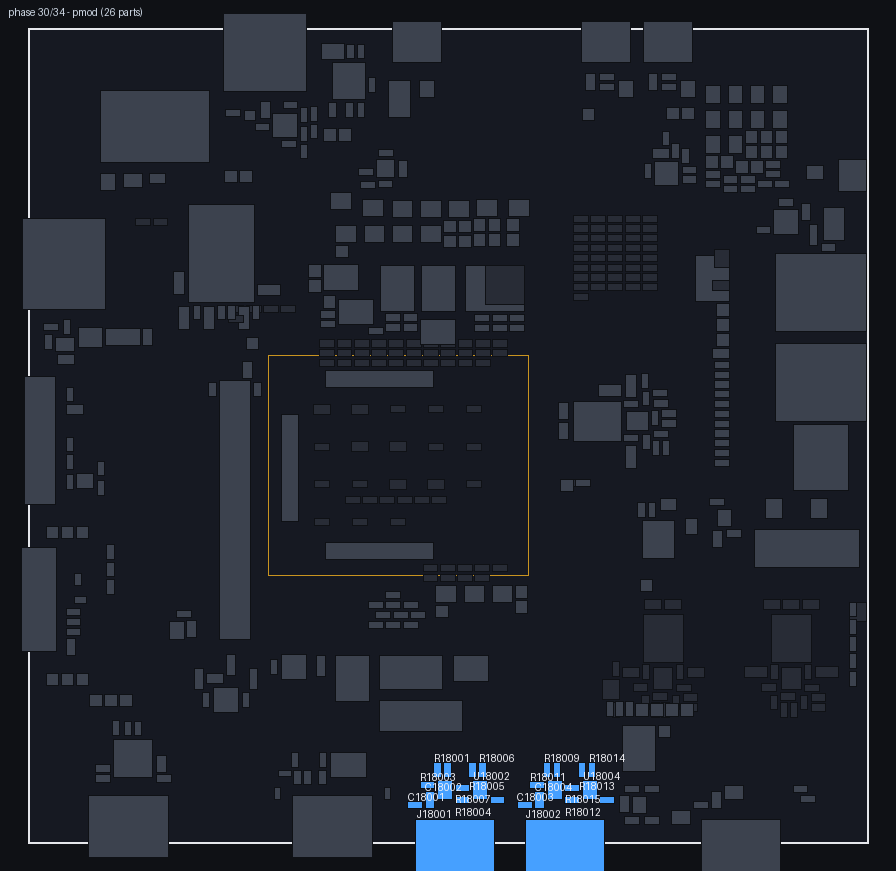

26 parts (26 top / 0 bottom)

| ref | value | package | sheet |
|---|---|---|---|
| C18001 | 100n | C_0603_1608Metric | pmod |
| C18002 | 10u | C_0805_2012Metric | pmod |
| C18003 | 100n | C_0603_1608Metric | pmod |
| C18004 | 10u | C_0805_2012Metric | pmod |
| J18001 | DS1024-2x6R2 | DS1024-2x6R2 | pmod |
| J18002 | DS1024-2x6R2 | DS1024-2x6R2 | pmod |
| R18001 | 200R | R_0603_1608Metric | pmod |
| R18002 | 200R | R_0603_1608Metric | pmod |
| R18003 | 200R | R_0603_1608Metric | pmod |
| R18004 | 200R | R_0603_1608Metric | pmod |
| R18005 | 200R | R_0603_1608Metric | pmod |
| R18006 | 200R | R_0603_1608Metric | pmod |
| R18007 | 200R | R_0603_1608Metric | pmod |
| R18008 | 200R | R_0603_1608Metric | pmod |
| R18009 | 200R | R_0603_1608Metric | pmod |
| R18010 | 200R | R_0603_1608Metric | pmod |
| R18011 | 200R | R_0603_1608Metric | pmod |
| R18012 | 200R | R_0603_1608Metric | pmod |
| R18013 | 200R | R_0603_1608Metric | pmod |
| R18014 | 200R | R_0603_1608Metric | pmod |
| R18015 | 200R | R_0603_1608Metric | pmod |
| R18016 | 200R | R_0603_1608Metric | pmod |
| U18001 | TPD4E1U06 | TPD4E1U06DBVR | pmod |
| U18002 | TPD4E1U06 | TPD4E1U06DBVR | pmod |
| U18003 | TPD4E1U06 | TPD4E1U06DBVR | pmod |
| U18004 | TPD4E1U06 | TPD4E1U06DBVR | pmod |

### Phase 31 — usb_jtag

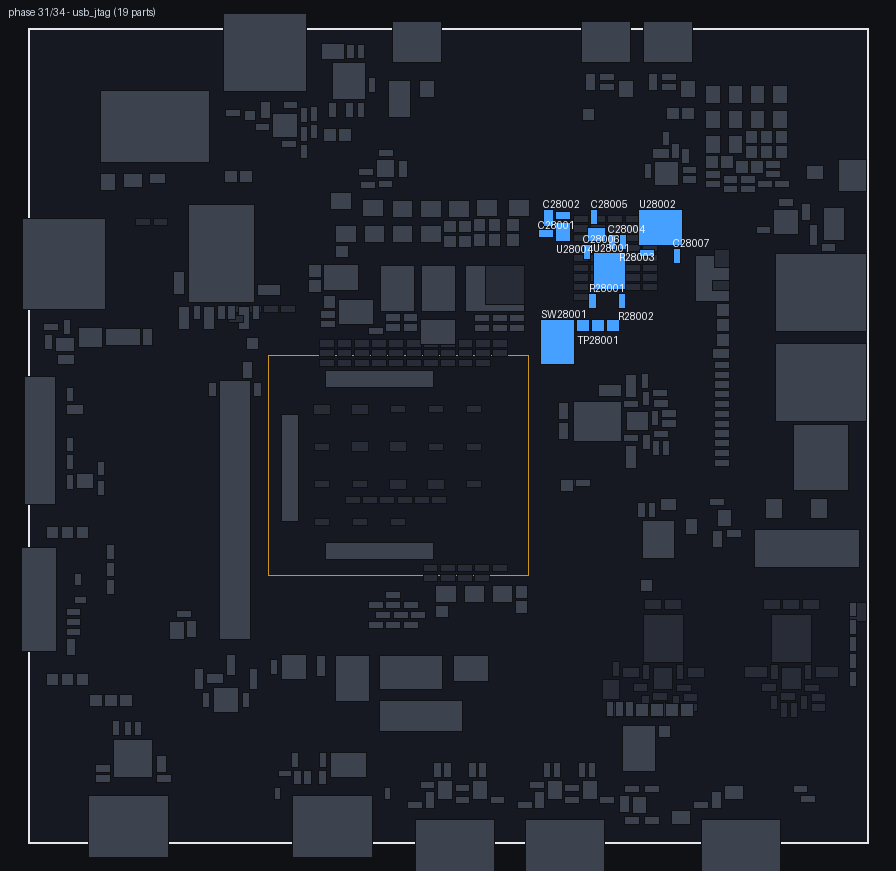

19 parts (19 top / 0 bottom)

| ref | value | package | sheet |
|---|---|---|---|
| C28001 | 1u | C_0603_1608Metric | usb_jtag |
| C28002 | 10u | C_0805_2012Metric | usb_jtag |
| C28003 | 100n | C_0603_1608Metric | usb_jtag |
| C28004 | 100n | C_0603_1608Metric | usb_jtag |
| C28005 | 16p | C_0603_1608Metric | usb_jtag |
| C28006 | 16p | C_0603_1608Metric | usb_jtag |
| C28007 | 100n | C_0603_1608Metric | usb_jtag |
| R28001 | 10k | R_0603_1608Metric | usb_jtag |
| R28002 | 10k | R_0603_1608Metric | usb_jtag |
| R28003 | 10k | R_0603_1608Metric | usb_jtag |
| R28004 | 100k | R_0603_1608Metric | usb_jtag |
| SW28001 | DSHP04TSGER | DSHP04TSGER | usb_jtag |
| TP28001 | +3V3_DBG | TestPoint_Pad_D1.5mm | usb_jtag |
| TP28002 | DBG_UART_TXD | TestPoint_Pad_D1.5mm | usb_jtag |
| TP28003 | DBG_UART_RXD | TestPoint_Pad_D1.5mm | usb_jtag |
| U28001 | CH347T | CH347T | usb_jtag |
| U28002 | SN74LVC125ADR | SN74LVC125ADR | usb_jtag |
| U28004 | AP2112K-3.3TRG1 | AP2112K-3.3TRG1 | usb_jtag |
| Y28001 | 8MHz | 1C208000BC0R | usb_jtag |

CHECKPOINT: verify +3V3_DBG at TP28001

### Phase 32 — usbc_otg

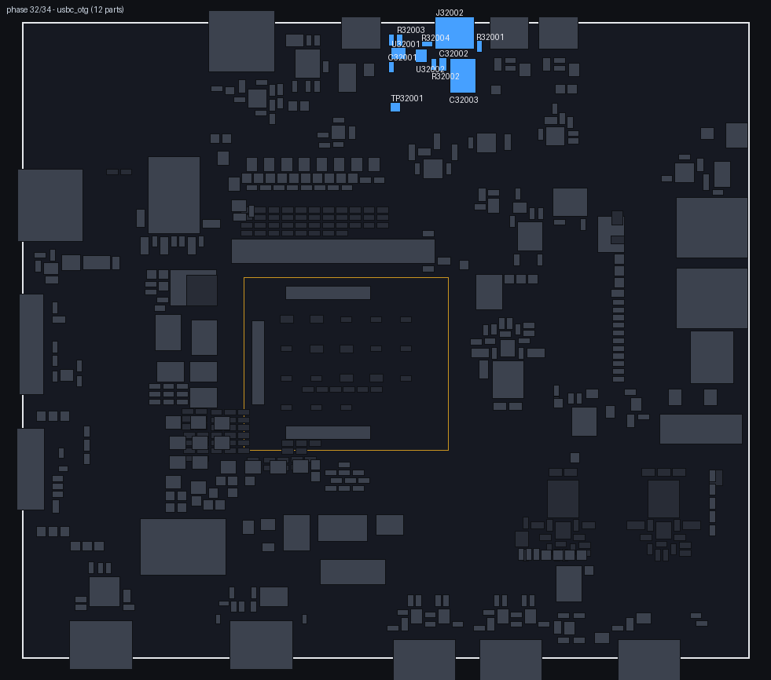

12 parts (12 top / 0 bottom)

| ref | value | package | sheet |
|---|---|---|---|
| C32001 | 100n | C_0603_1608Metric | usbc_otg |
| C32002 | 22u | C_0805_2012Metric | usbc_otg |
| C32003 | 100u | RVT1C101M0605_100UF_16V | usbc_otg |
| J32002 | TYPE-C-31-M-12 | TYPE-C-31-M-12 | usbc_otg |
| R32001 | 56k | R_0603_1608Metric | usbc_otg |
| R32002 | 56k | R_0603_1608Metric | usbc_otg |
| R32003 | 100k | R_0603_1608Metric | usbc_otg |
| R32004 | 1k | R_0603_1608Metric | usbc_otg |
| R32005 | 100k | R_0603_1608Metric | usbc_otg |
| TP32001 | VBUS_OUT_EN | TestPoint_Pad_D1.5mm | usbc_otg |
| U32001 | TPS2051CDBVR | TPS2051CDBVR | usbc_otg |
| U32002 | USBLC6-2SC6 | USBLC6-2SC6 | usbc_otg |

### Phase 33 — user_io

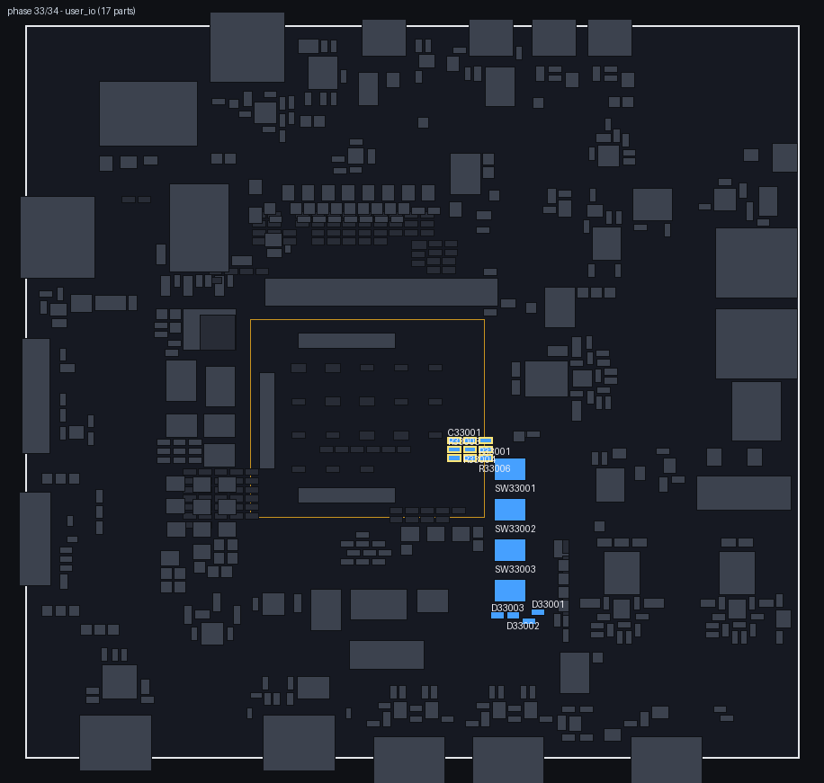

17 parts (8 top / 9 bottom)

| ref | value | package | sheet |
|---|---|---|---|
| C33001 | 100n | C_0603_1608Metric | user_io |
| D33001 | red | LED_0603_1608Metric | user_io |
| D33002 | green | LED_0603_1608Metric | user_io |
| D33003 | blue | LED_0603_1608Metric | user_io |
| D33004 | white | LED_0603_1608Metric | user_io |
| R33001 | 1k | R_0603_1608Metric | user_io |
| R33002 | 200R | R_0603_1608Metric | user_io |
| R33003 | 200R | R_0603_1608Metric | user_io |
| R33004 | 200R | R_0603_1608Metric | user_io |
| R33005 | 10k | R_0603_1608Metric | user_io |
| R33006 | 10k | R_0603_1608Metric | user_io |
| R33007 | 10k | R_0603_1608Metric | user_io |
| R33008 | 10k | R_0603_1608Metric | user_io |
| SW33001 | USER | TS-1187A-B-A-B | user_io |
| SW33002 | USER | TS-1187A-B-A-B | user_io |
| SW33003 | USER | TS-1187A-B-A-B | user_io |
| SW33004 | USER | TS-1187A-B-A-B | user_io |

### Phase 34 — mechanical hardware (mechanical)

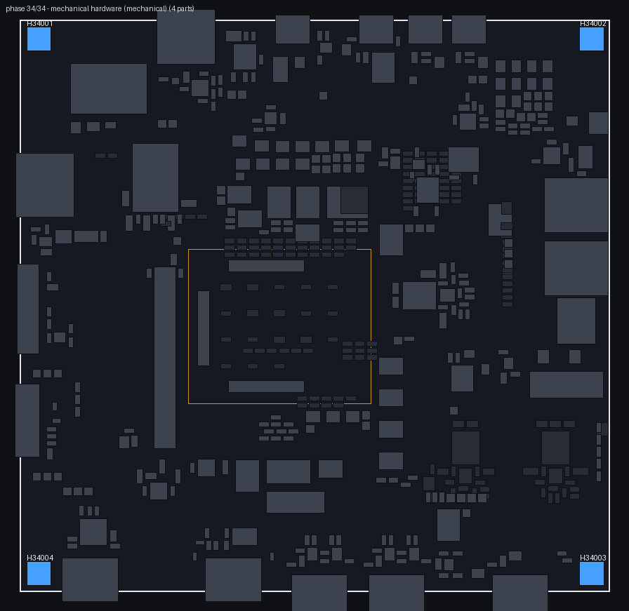

4 parts (4 top / 0 bottom)

| ref | value | package | sheet |
|---|---|---|---|
| H34001 | MountingHole_M3 | MountingHole_3.2mm_M3_Pad | mechanical |
| H34002 | MountingHole_M3 | MountingHole_3.2mm_M3_Pad | mechanical |
| H34003 | MountingHole_M3 | MountingHole_3.2mm_M3_Pad | mechanical |
| H34004 | MountingHole_M3 | MountingHole_3.2mm_M3_Pad | mechanical |

## B. Production process order

### Step 1 — Bottom-side SMD (paste + reflow)

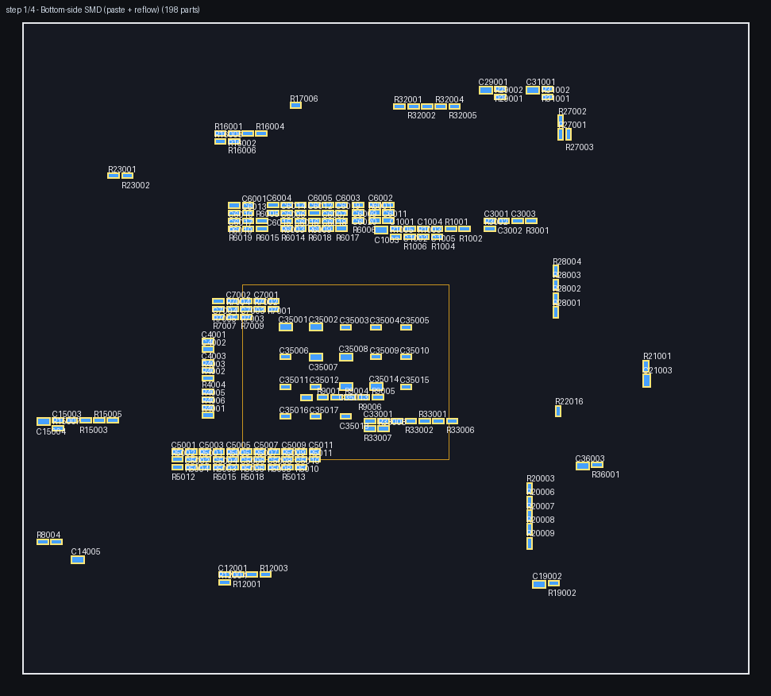

140 parts (0 top / 140 bottom)

| ref | value | package | sheet |
|---|---|---|---|
| C1001 | 100n | C_0603_1608Metric | board_aux |
| C1002 | 100n | C_0603_1608Metric | board_aux |
| C1003 | 10u | C_0805_2012Metric | board_aux |
| C1004 | 100n | C_0603_1608Metric | board_aux |
| C1005 | 100n | C_0603_1608Metric | board_aux |
| C3001 | 100n | C_0603_1608Metric | board_services |
| C3002 | 100n | C_0603_1608Metric | board_services |
| C3003 | 100n | C_0603_1608Metric | board_services |
| C4001 | 100n | C_0603_1608Metric | bringup_en |
| C4002 | 100n | C_0603_1608Metric | bringup_en |
| C4003 | 100n | C_0603_1608Metric | bringup_en |
| C5001 | 100n | C_0603_1608Metric | bringup_en_modules |
| C5002 | 100n | C_0603_1608Metric | bringup_en_modules |
| C5003 | 100n | C_0603_1608Metric | bringup_en_modules |
| C5004 | 100n | C_0603_1608Metric | bringup_en_modules |
| C5005 | 100n | C_0603_1608Metric | bringup_en_modules |
| C5006 | 100n | C_0603_1608Metric | bringup_en_modules |
| C5007 | 100n | C_0603_1608Metric | bringup_en_modules |
| C5008 | 100n | C_0603_1608Metric | bringup_en_modules |
| C5009 | 100n | C_0603_1608Metric | bringup_en_modules |
| C5010 | 100n | C_0603_1608Metric | bringup_en_modules |
| C5011 | 100n | C_0603_1608Metric | bringup_en_modules |
| C6001 | 100n | C_0603_1608Metric | bringup_modules |
| C6002 | 100n | C_0603_1608Metric | bringup_modules |
| C6003 | 100n | C_0603_1608Metric | bringup_modules |
| C6004 | 100n | C_0603_1608Metric | bringup_modules |
| C6005 | 100n | C_0603_1608Metric | bringup_modules |
| C6006 | 100n | C_0603_1608Metric | bringup_modules |
| C6007 | 100n | C_0603_1608Metric | bringup_modules |
| C6008 | 100n | C_0603_1608Metric | bringup_modules |
| C6009 | 100n | C_0603_1608Metric | bringup_modules |
| C6010 | 100n | C_0603_1608Metric | bringup_modules |
| C6011 | 100n | C_0603_1608Metric | bringup_modules |
| C6012 | 100n | C_0603_1608Metric | bringup_modules |
| C6013 | 100n | C_0603_1608Metric | bringup_modules |
| C6014 | 100n | C_0603_1608Metric | bringup_modules |
| C6015 | 100n | C_0603_1608Metric | bringup_modules |
| C6016 | 100n | C_0603_1608Metric | bringup_modules |
| C6017 | 100n | C_0603_1608Metric | bringup_modules |
| C6018 | 100n | C_0603_1608Metric | bringup_modules |
| C6019 | 100n | C_0603_1608Metric | bringup_modules |
| C6020 | 100n | C_0603_1608Metric | bringup_modules |
| C33001 | 100n | C_0603_1608Metric | user_io |
| C35001 | 22u | C_0805_2012Metric | som_decoupling |
| C35002 | 22u | C_0805_2012Metric | som_decoupling |
| C35003 | 100n | C_0603_1608Metric | som_decoupling |
| C35004 | 100n | C_0603_1608Metric | som_decoupling |
| C35005 | 100n | C_0603_1608Metric | som_decoupling |
| C35006 | 100n | C_0603_1608Metric | som_decoupling |
| C35007 | 22u | C_0805_2012Metric | som_decoupling |
| C35008 | 22u | C_0805_2012Metric | som_decoupling |
| C35009 | 100n | C_0603_1608Metric | som_decoupling |
| C35010 | 100n | C_0603_1608Metric | som_decoupling |
| C35011 | 100n | C_0603_1608Metric | som_decoupling |
| C35012 | 100n | C_0603_1608Metric | som_decoupling |
| C35013 | 22u | C_0805_2012Metric | som_decoupling |
| C35014 | 22u | C_0805_2012Metric | som_decoupling |
| C35015 | 100n | C_0603_1608Metric | som_decoupling |
| C35016 | 100n | C_0603_1608Metric | som_decoupling |
| C35017 | 100n | C_0603_1608Metric | som_decoupling |
| C35018 | 100n | C_0603_1608Metric | som_decoupling |
| R1001 | 13k | R_0603_1608Metric | board_aux |
| R1002 | 100k | R_0603_1608Metric | board_aux |
| R1003 | 330R | R_0603_1608Metric | board_aux |
| R1004 | 100k | R_0603_1608Metric | board_aux |
| R1005 | 4k7 | R_0603_1608Metric | board_aux |
| R1006 | 4k7 | R_0603_1608Metric | board_aux |
| R3001 | 10k | R_0603_1608Metric | board_services |
| R3002 | 1k | R_0603_1608Metric | board_services |
| R4001 | 100k | R_0603_1608Metric | bringup_en |
| R4002 | 100k | R_0603_1608Metric | bringup_en |
| R4003 | 100k | R_0603_1608Metric | bringup_en |
| R4004 | 100k | R_0603_1608Metric | bringup_en |
| R4005 | 100k | R_0603_1608Metric | bringup_en |
| R4006 | 100k | R_0603_1608Metric | bringup_en |
| R5001 | 100k | R_0603_1608Metric | bringup_en_modules |
| R5002 | 100k | R_0603_1608Metric | bringup_en_modules |
| R5003 | 100k | R_0603_1608Metric | bringup_en_modules |
| R5004 | 100k | R_0603_1608Metric | bringup_en_modules |
| R5005 | 100k | R_0603_1608Metric | bringup_en_modules |
| R5006 | 100k | R_0603_1608Metric | bringup_en_modules |
| R5007 | 100k | R_0603_1608Metric | bringup_en_modules |
| R5008 | 100k | R_0603_1608Metric | bringup_en_modules |
| R5009 | 100k | R_0603_1608Metric | bringup_en_modules |
| R5010 | 100k | R_0603_1608Metric | bringup_en_modules |
| R5011 | 100k | R_0603_1608Metric | bringup_en_modules |
| R5012 | 100k | R_0603_1608Metric | bringup_en_modules |
| R5013 | 100k | R_0603_1608Metric | bringup_en_modules |
| R5014 | 100k | R_0603_1608Metric | bringup_en_modules |
| R5015 | 100k | R_0603_1608Metric | bringup_en_modules |
| R5016 | 100k | R_0603_1608Metric | bringup_en_modules |
| R5017 | 100k | R_0603_1608Metric | bringup_en_modules |
| R5018 | 100k | R_0603_1608Metric | bringup_en_modules |
| R5019 | 100k | R_0603_1608Metric | bringup_en_modules |
| R5020 | 100k | R_0603_1608Metric | bringup_en_modules |
| R5021 | 100k | R_0603_1608Metric | bringup_en_modules |
| R6001 | 13k | R_0603_1608Metric | bringup_modules |
| R6002 | 330R | R_0603_1608Metric | bringup_modules |
| R6003 | 13k | R_0603_1608Metric | bringup_modules |
| R6004 | 330R | R_0603_1608Metric | bringup_modules |
| R6005 | 6.8k | R_0603_1608Metric | bringup_modules |
| R6006 | 330R | R_0603_1608Metric | bringup_modules |
| R6007 | 13k | R_0603_1608Metric | bringup_modules |
| R6008 | 330R | R_0603_1608Metric | bringup_modules |
| R6009 | 6.8k | R_0603_1608Metric | bringup_modules |
| R6010 | 330R | R_0603_1608Metric | bringup_modules |
| R6011 | 6.8k | R_0603_1608Metric | bringup_modules |
| R6012 | 1k | R_0603_1608Metric | bringup_modules |
| R6013 | 13k | R_0603_1608Metric | bringup_modules |
| R6014 | 330R | R_0603_1608Metric | bringup_modules |
| R6015 | 13k | R_0603_1608Metric | bringup_modules |
| R6016 | 330R | R_0603_1608Metric | bringup_modules |
| R6017 | 13k | R_0603_1608Metric | bringup_modules |
| R6018 | 1k | R_0603_1608Metric | bringup_modules |
| R6019 | 6.8k | R_0603_1608Metric | bringup_modules |
| R6020 | 1k | R_0603_1608Metric | bringup_modules |
| R6021 | 10k | R_0603_1608Metric | bringup_modules |
| R9001 | 4k7 | R_0603_1608Metric | debug_boot |
| R9002 | 4k7 | R_0603_1608Metric | debug_boot |
| R9003 | 100R | R_0603_1608Metric | debug_boot |
| R9004 | 10k | R_0603_1608Metric | debug_boot |
| R9005 | 10k | R_0603_1608Metric | debug_boot |
| R9006 | 10k | R_0603_1608Metric | debug_boot |
| R20003 | 1k | R_0603_1608Metric | power |
| R20006 | 330R | R_0603_1608Metric | power |
| R20007 | 1k | R_0603_1608Metric | power |
| R20008 | 100k | R_0603_1608Metric | power |
| R20009 | 330R | R_0603_1608Metric | power |
| R22016 | 1k | R_0603_1608Metric | power_som |
| R23001 | 330R | R_0603_1608Metric | rj45_connector |
| R23002 | 330R | R_0603_1608Metric | rj45_connector |
| R33001 | 1k | R_0603_1608Metric | user_io |
| R33002 | 200R | R_0603_1608Metric | user_io |
| R33003 | 200R | R_0603_1608Metric | user_io |
| R33004 | 200R | R_0603_1608Metric | user_io |
| R33005 | 10k | R_0603_1608Metric | user_io |
| R33006 | 10k | R_0603_1608Metric | user_io |
| R33007 | 10k | R_0603_1608Metric | user_io |
| R33008 | 10k | R_0603_1608Metric | user_io |
| U7001 | TCA9535PWR | TCA9535PWR | bringup_rails |

NOTES: pin-1 orientation (U7001): dot per silkscreen

### Step 2 — Top-side SMD (paste + reflow)

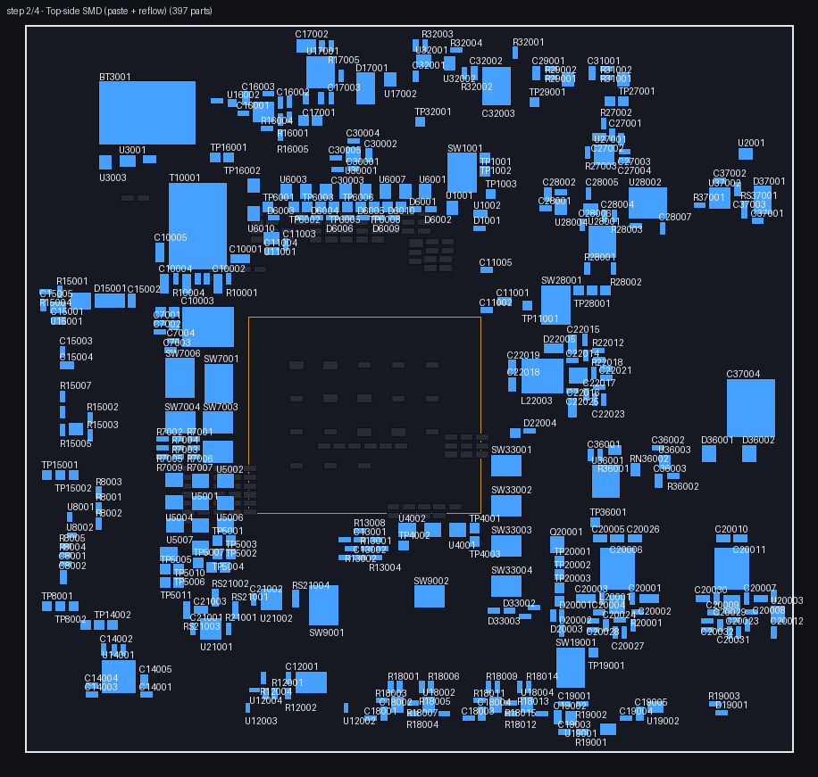

397 parts (397 top / 0 bottom)

| ref | value | package | sheet |
|---|---|---|---|
| BT3001 | KH-CR1220-2 | KH-CR1220-2 | board_services |
| C7001 | 100n | C_0603_1608Metric | bringup_rails |
| C7002 | 100n | C_0603_1608Metric | bringup_rails |
| C7003 | 100n | C_0603_1608Metric | bringup_rails |
| C7004 | 100n | C_0603_1608Metric | bringup_rails |
| C8001 | 100n | C_0603_1608Metric | camera |
| C8002 | 10u | C_0805_2012Metric | camera |
| C10001 | 1n | C_1206_3225Metric | ethernet |
| C10002 | 1n | C_1206_3225Metric | ethernet |
| C10003 | 1n | C_1206_3225Metric | ethernet |
| C10004 | 1n | C_1206_3225Metric | ethernet |
| C10005 | 1n | C_1206_3225Metric | ethernet |
| C11001 | 10u | C_0805_2012Metric | fmc |
| C11002 | 100n | C_0603_1608Metric | fmc |
| C11003 | 1u | C_0603_1608Metric | fmc |
| C11004 | 10u | C_0805_2012Metric | fmc |
| C11005 | 100n | C_0603_1608Metric | fmc |
| C12001 | 100n | C_0603_1608Metric | hdmi_rx |
| C13001 | 100n | C_0603_1608Metric | hdmi_rx_term |
| C13002 | 1u | C_0603_1608Metric | hdmi_rx_term |
| C14001 | 100n | C_0603_1608Metric | hdmi_tx |
| C14002 | 100n | C_0603_1608Metric | hdmi_tx |
| C14003 | 100n | C_0603_1608Metric | hdmi_tx |
| C14004 | 1u | C_0603_1608Metric | hdmi_tx |
| C14005 | 10u | C_0805_2012Metric | hdmi_tx |
| C15001 | 10u | C_0805_2012Metric | lcd |
| C15002 | 2.2u | C_0805_2012Metric | lcd |
| C15003 | 100n | C_0603_1608Metric | lcd |
| C15004 | 10u | C_0805_2012Metric | lcd |
| C15005 | 1u | C_0603_1608Metric | lcd |
| C16001 | 100n | C_0603_1608Metric | microsd |
| C16002 | 100n | C_0603_1608Metric | microsd |
| C16003 | 22u | C_0805_2012Metric | microsd |
| C16004 | 100n | C_0603_1608Metric | microsd |
| C17001 | 100n | C_0603_1608Metric | pd_input |
| C17002 | 10u | C_1210_3225Metric | pd_input |
| C17003 | 47n | C_0603_1608Metric | pd_input |
| C18001 | 100n | C_0603_1608Metric | pmod |
| C18002 | 10u | C_0805_2012Metric | pmod |
| C18003 | 100n | C_0603_1608Metric | pmod |
| C18004 | 10u | C_0805_2012Metric | pmod |
| C19001 | 100n | C_0603_1608Metric | pmod_expansion |
| C19002 | 10u | C_0805_2012Metric | pmod_expansion |
| C19003 | 100n | C_0603_1608Metric | pmod_expansion |
| C19004 | 100n | C_0603_1608Metric | pmod_expansion |
| C19005 | 10u | C_0805_2012Metric | pmod_expansion |
| C20001 | 100n | C_0603_1608Metric | power |
| C20002 | 10u | C_1206_3216Metric | power |
| C20003 | 10u | C_1206_3216Metric | power |
| C20004 | 100n | C_0603_1608Metric | power |
| C20005 | 22u | C_0805_2012Metric | power |
| C20006 | 22u | C_0805_2012Metric | power |
| C20007 | 100n | C_0603_1608Metric | power |
| C20008 | 22u | C_0805_2012Metric | power |
| C20009 | 100n | C_0603_1608Metric | power |
| C20010 | 22u | C_0805_2012Metric | power |
| C20011 | 22u | C_0805_2012Metric | power |
| C20012 | 1u | C_0603_1608Metric | power |
| C20013 | 1u | C_0603_1608Metric | power |
| C20023 | 22p | C_0603_1608Metric | power |
| C20024 | 1u | C_0603_1608Metric | power |
| C20025 | 100n | C_0603_1608Metric | power |
| C20026 | 22u | C_0805_2012Metric | power |
| C20027 | 22p | C_0603_1608Metric | power |
| C20028 | 1u | C_0603_1608Metric | power |
| C20029 | 100n | C_0603_1608Metric | power |
| C20030 | 22u | C_0805_2012Metric | power |
| C20031 | 1u | C_0603_1608Metric | power |
| C20032 | 1u | C_0603_1608Metric | power |
| C21001 | 100n | C_0603_1608Metric | power_mon |
| C21002 | 100n | C_0603_1608Metric | power_mon |
| C21003 | 10u | C_0805_2012Metric | power_mon |
| C22014 | 100n | C_0603_1608Metric | power_som |
| C22015 | 10u | C_1206_3216Metric | power_som |
| C22016 | 10u | C_1206_3216Metric | power_som |
| C22017 | 100n | C_0603_1608Metric | power_som |
| C22018 | 22u | C_0805_2012Metric | power_som |
| C22019 | 22u | C_0805_2012Metric | power_som |
| C22020 | 100n | C_0603_1608Metric | power_som |
| C22021 | 22p | C_0603_1608Metric | power_som |
| C22022 | 1u | C_0603_1608Metric | power_som |
| C22023 | 1u | C_0603_1608Metric | power_som |
| C22025 | 100n | C_0603_1608Metric | power_som |
| C27001 | 100n | C_0603_1608Metric | uart_bridge |
| C27002 | 10u | C_0805_2012Metric | uart_bridge |
| C27003 | 100n | C_0603_1608Metric | uart_bridge |
| C27004 | 100n | C_0603_1608Metric | uart_bridge |
| C28001 | 1u | C_0603_1608Metric | usb_jtag |
| C28002 | 10u | C_0805_2012Metric | usb_jtag |
| C28003 | 100n | C_0603_1608Metric | usb_jtag |
| C28004 | 100n | C_0603_1608Metric | usb_jtag |
| C28005 | 16p | C_0603_1608Metric | usb_jtag |
| C28006 | 16p | C_0603_1608Metric | usb_jtag |
| C28007 | 100n | C_0603_1608Metric | usb_jtag |
| C29001 | 10u | C_0805_2012Metric | usb_jtag_connector |
| C30001 | 100n | C_0603_1608Metric | usb_pd |
| C30002 | 10u | C_0805_2012Metric | usb_pd |
| C30003 | 100n | C_0603_1608Metric | usb_pd |
| C30004 | 200p | C_0603_1608Metric | usb_pd |
| C30005 | 200p | C_0603_1608Metric | usb_pd |
| C31001 | 10u | C_0805_2012Metric | usb_uart_connector |
| C32001 | 100n | C_0603_1608Metric | usbc_otg |
| C32002 | 22u | C_0805_2012Metric | usbc_otg |
| C32003 | 100u | RVT1C101M0605_100UF_16V | usbc_otg |
| C36001 | 100n | C_0603_1608Metric | motor_pwm |
| C36002 | 100n | C_0603_1608Metric | motor_pwm |
| C36003 | 10u | C_0805_2012Metric | motor_pwm |
| C37001 | 100n | C_0603_1608Metric | motor_sense |
| C37002 | 100n | C_0603_1608Metric | motor_sense |
| C37003 | 10u | C_0805_2012Metric | motor_sense |
| C37004 | 470uF/35V | CP_Elec_10x10.5 | motor_sense |
| D1001 | red | LED_0603_1608Metric | board_aux |
| D6001 | red | LED_0603_1608Metric | bringup_modules |
| D6002 | red | LED_0603_1608Metric | bringup_modules |
| D6003 | red | LED_0603_1608Metric | bringup_modules |
| D6004 | red | LED_0603_1608Metric | bringup_modules |
| D6005 | red | LED_0603_1608Metric | bringup_modules |
| D6006 | red | LED_0603_1608Metric | bringup_modules |
| D6007 | red | LED_0603_1608Metric | bringup_modules |
| D6008 | red | LED_0603_1608Metric | bringup_modules |
| D6009 | red | LED_0603_1608Metric | bringup_modules |
| D6010 | red | LED_0603_1608Metric | bringup_modules |
| D15001 | SS34 | D_SMA | lcd |
| D17001 | SMBJ22A | D_SMB | pd_input |
| D19001 | red | LED_0603_1608Metric | pmod_expansion |
| D20001 | red | LED_0603_1608Metric | power |
| D20002 | red | LED_0603_1608Metric | power |
| D20003 | red | LED_0603_1608Metric | power |
| D22004 | red | LED_0603_1608Metric | power_som |
| D22005 | MMSZ5231B | D_SOD-123 | power_som |
| D33001 | red | LED_0603_1608Metric | user_io |
| D33002 | green | LED_0603_1608Metric | user_io |
| D33003 | blue | LED_0603_1608Metric | user_io |
| D33004 | white | LED_0603_1608Metric | user_io |
| D36001 | SRV05-4 | SOT-23-6 | motor_pwm |
| D36002 | SRV05-4 | SOT-23-6 | motor_pwm |
| D37001 | SMBJ28A | SMBJ28A | motor_sense |
| L15001 | 10uH | SWPA4030S100MT | lcd |
| L20001 | 10uH | SWPA8040S100MT | power |
| L20002 | 10uH | SWPA8040S100MT | power |
| L22003 | 10uH | SWPA8040S100MT | power_som |
| Q20001 | AO3400A | SOT-23 | power |
| R7001 | 100k | R_0603_1608Metric | bringup_rails |
| R7002 | 100k | R_0603_1608Metric | bringup_rails |
| R7003 | 100k | R_0603_1608Metric | bringup_rails |
| R7004 | 4k7 | R_0603_1608Metric | bringup_rails |
| R7005 | 4k7 | R_0603_1608Metric | bringup_rails |
| R7006 | 10k | R_0603_1608Metric | bringup_rails |
| R7007 | 10k | R_0603_1608Metric | bringup_rails |
| R7008 | 10k | R_0603_1608Metric | bringup_rails |
| R7009 | 10k | R_0603_1608Metric | bringup_rails |
| R8001 | 100R | R_0603_1608Metric | camera |
| R8002 | 100R | R_0603_1608Metric | camera |
| R8003 | 100R | R_0603_1608Metric | camera |
| R8004 | 4k7 | R_0603_1608Metric | camera |
| R8005 | 4k7 | R_0603_1608Metric | camera |
| R10001 | 75R | R_0603_1608Metric | ethernet |
| R10002 | 75R | R_0603_1608Metric | ethernet |
| R10003 | 75R | R_0603_1608Metric | ethernet |
| R10004 | 75R | R_0603_1608Metric | ethernet |
| R12001 | 1k | R_0603_1608Metric | hdmi_rx |
| R12002 | 27k | R_0603_1608Metric | hdmi_rx |
| R12003 | 10k | R_0603_1608Metric | hdmi_rx |
| R12004 | 15k | R_0603_1608Metric | hdmi_rx |
| R13001 | 49.9R | R_0603_1608Metric | hdmi_rx_term |
| R13002 | 49.9R | R_0603_1608Metric | hdmi_rx_term |
| R13003 | 49.9R | R_0603_1608Metric | hdmi_rx_term |
| R13004 | 49.9R | R_0603_1608Metric | hdmi_rx_term |
| R13005 | 49.9R | R_0603_1608Metric | hdmi_rx_term |
| R13006 | 49.9R | R_0603_1608Metric | hdmi_rx_term |
| R13007 | 49.9R | R_0603_1608Metric | hdmi_rx_term |
| R13008 | 49.9R | R_0603_1608Metric | hdmi_rx_term |
| R14001 | 10k | R_0603_1608Metric | hdmi_tx |
| R14002 | 10k | R_0603_1608Metric | hdmi_tx |
| R15001 | 1.5R | R_0603_1608Metric | lcd |
| R15002 | 4k7 | R_0603_1608Metric | lcd |
| R15003 | 4k7 | R_0603_1608Metric | lcd |
| R15004 | 100k | R_0603_1608Metric | lcd |
| R15005 | 100k | R_0603_1608Metric | lcd |
| R15006 | 10k | R_0603_1608Metric | lcd |
| R15007 | 22R | R_0603_1608Metric | lcd |
| R16001 | 100k | R_0603_1608Metric | microsd |
| R16002 | 100k | R_0603_1608Metric | microsd |
| R16003 | 100k | R_0603_1608Metric | microsd |
| R16004 | 100k | R_0603_1608Metric | microsd |
| R16005 | 100k | R_0603_1608Metric | microsd |
| R16006 | 10k | R_0603_1608Metric | microsd |
| R17003 | 100k | R_0603_1608Metric | pd_input |
| R17004 | 5.49k | R_0603_1608Metric | pd_input |
| R17005 | 5.1k | R_0603_1608Metric | pd_input |
| R17006 | 100k | R_0603_1608Metric | pd_input |
| R18001 | 200R | R_0603_1608Metric | pmod |
| R18002 | 200R | R_0603_1608Metric | pmod |
| R18003 | 200R | R_0603_1608Metric | pmod |
| R18004 | 200R | R_0603_1608Metric | pmod |
| R18005 | 200R | R_0603_1608Metric | pmod |
| R18006 | 200R | R_0603_1608Metric | pmod |
| R18007 | 200R | R_0603_1608Metric | pmod |
| R18008 | 200R | R_0603_1608Metric | pmod |
| R18009 | 200R | R_0603_1608Metric | pmod |
| R18010 | 200R | R_0603_1608Metric | pmod |
| R18011 | 200R | R_0603_1608Metric | pmod |
| R18012 | 200R | R_0603_1608Metric | pmod |
| R18013 | 200R | R_0603_1608Metric | pmod |
| R18014 | 200R | R_0603_1608Metric | pmod |
| R18015 | 200R | R_0603_1608Metric | pmod |
| R18016 | 200R | R_0603_1608Metric | pmod |
| R19001 | 13k | R_0603_1608Metric | pmod_expansion |
| R19002 | 100k | R_0603_1608Metric | pmod_expansion |
| R19003 | 330R | R_0603_1608Metric | pmod_expansion |
| R20001 | 40.2k | R_0603_1608Metric | power |
| R20002 | 10k | R_0603_1608Metric | power |
| R20004 | 23.2k | R_0603_1608Metric | power |
| R20005 | 10k | R_0603_1608Metric | power |
| R20010 | 22k | R_0603_1608Metric | power |
| R20011 | 10R | R_0603_1608Metric | power |
| R20012 | 1k | R_0603_1608Metric | power |
| R20013 | 10R | R_0603_1608Metric | power |
| R20014 | 22k | R_0603_1608Metric | power |
| R20015 | 1k | R_0603_1608Metric | power |
| R21001 | 10k | R_0603_1608Metric | power_mon |
| R22012 | 10k | R_0603_1608Metric | power_som |
| R22014 | 47.5k | R_0603_1608Metric | power_som |
| R22015 | 13k | R_0603_1608Metric | power_som |
| R22017 | 10R | R_0603_1608Metric | power_som |
| R22018 | 22k | R_0603_1608Metric | power_som |
| R22019 | 1k | R_0603_1608Metric | power_som |
| R27001 | 1k | R_0603_1608Metric | uart_bridge |
| R27002 | 22k1 | R_0603_1608Metric | uart_bridge |
| R27003 | 47k5 | R_0603_1608Metric | uart_bridge |
| R28001 | 10k | R_0603_1608Metric | usb_jtag |
| R28002 | 10k | R_0603_1608Metric | usb_jtag |
| R28003 | 10k | R_0603_1608Metric | usb_jtag |
| R28004 | 100k | R_0603_1608Metric | usb_jtag |
| R29001 | 5.1k | R_0603_1608Metric | usb_jtag_connector |
| R29002 | 5.1k | R_0603_1608Metric | usb_jtag_connector |
| R31001 | 5.1k | R_0603_1608Metric | usb_uart_connector |
| R31002 | 5.1k | R_0603_1608Metric | usb_uart_connector |
| R32001 | 56k | R_0603_1608Metric | usbc_otg |
| R32002 | 56k | R_0603_1608Metric | usbc_otg |
| R32003 | 100k | R_0603_1608Metric | usbc_otg |
| R32004 | 1k | R_0603_1608Metric | usbc_otg |
| R32005 | 100k | R_0603_1608Metric | usbc_otg |
| R36001 | 10k | R_0603_1608Metric | motor_pwm |
| R36002 | 13k | R_0603_1608Metric | motor_pwm |
| R37001 | 10k | R_0603_1608Metric | motor_sense |
| RN36001 | 4D03WGJ0330T5E | 4D03WGJ0330T5E | motor_pwm |
| RN36002 | 4D03WGJ0330T5E | 4D03WGJ0330T5E | motor_pwm |
| RS21001 | 10mR | RLM12FTCMR010 | power_mon |
| RS21002 | 10mR | RLM12FTCMR010 | power_mon |
| RS21003 | 10mR | RLM12FTCMR010 | power_mon |
| RS21004 | 20mR | RLM12FTCMR020 | power_mon |
| RS37001 | 10mR | RLM12FTCMR010 | motor_sense |
| SW1001 | DSHP04TSGER | DSHP04TSGER | board_aux |
| SW7001 | DSHP04TSGER | DSHP04TSGER | bringup_rails |
| SW7002 | DSHP08TSGER | DSHP08TSGER | bringup_rails |
| SW7003 | TS-1187A-B-A-B | TS-1187A-B-A-B | bringup_rails |
| SW7004 | TS-1187A-B-A-B | TS-1187A-B-A-B | bringup_rails |
| SW7005 | TS-1187A-B-A-B | TS-1187A-B-A-B | bringup_rails |
| SW7006 | DSHP04TSGER | DSHP04TSGER | bringup_rails |
| SW9001 | DIP-4 | DSHP04TSGER | debug_boot |
| SW9002 | RESET | TS-1187A-B-A-B | debug_boot |
| SW19001 | DSHP04TSGER | DSHP04TSGER | pmod_expansion |
| SW28001 | DSHP04TSGER | DSHP04TSGER | usb_jtag |
| SW33001 | USER | TS-1187A-B-A-B | user_io |
| SW33002 | USER | TS-1187A-B-A-B | user_io |
| SW33003 | USER | TS-1187A-B-A-B | user_io |
| SW33004 | USER | TS-1187A-B-A-B | user_io |
| T10001 | HX5008NLT | HX5008NLT | ethernet |
| TP1001 | +3V3_AUX | TestPoint_Pad_D1.5mm | board_aux |
| TP1002 | AUX_I2C_SCL | TestPoint_Pad_D1.5mm | board_aux |
| TP1003 | AUX_I2C_SDA | TestPoint_Pad_D1.5mm | board_aux |
| TP4001 | EN_5V0 | TestPoint_Pad_D1.5mm | bringup_en |
| TP4002 | EN_3V3 | TestPoint_Pad_D1.5mm | bringup_en |
| TP4003 | EN_1V8 | TestPoint_Pad_D1.5mm | bringup_en |
| TP5001 | EN_HDMI_TX | TestPoint_Pad_D1.5mm | bringup_en_modules |
| TP5002 | EN_HDMI_RX | TestPoint_Pad_D1.5mm | bringup_en_modules |
| TP5003 | EN_LCD | TestPoint_Pad_D1.5mm | bringup_en_modules |
| TP5004 | EN_CAM | TestPoint_Pad_D1.5mm | bringup_en_modules |
| TP5005 | EN_SD | TestPoint_Pad_D1.5mm | bringup_en_modules |
| TP5006 | EN_USB | TestPoint_Pad_D1.5mm | bringup_en_modules |
| TP5007 | EN_PMOD | TestPoint_Pad_D1.5mm | bringup_en_modules |
| TP5008 | EN_USER_LED | TestPoint_Pad_D1.5mm | bringup_en_modules |
| TP5009 | EN_LCD_BL | TestPoint_Pad_D1.5mm | bringup_en_modules |
| TP5010 | EN_HDMI_TX_5V | TestPoint_Pad_D1.5mm | bringup_en_modules |
| TP5011 | EN_LCD_5V | TestPoint_Pad_D1.5mm | bringup_en_modules |
| TP6001 | +3V3_HDMI_TX | TestPoint_Pad_D1.5mm | bringup_modules |
| TP6002 | +3V3_HDMI_RX | TestPoint_Pad_D1.5mm | bringup_modules |
| TP6003 | +3V3_LCD | TestPoint_Pad_D1.5mm | bringup_modules |
| TP6004 | +3V3_CAM | TestPoint_Pad_D1.5mm | bringup_modules |
| TP6005 | +3V3_SD | TestPoint_Pad_D1.5mm | bringup_modules |
| TP6006 | +5V_USB | TestPoint_Pad_D1.5mm | bringup_modules |
| TP6007 | +3V3_PMOD | TestPoint_Pad_D1.5mm | bringup_modules |
| TP6008 | +3V3_USER_LED | TestPoint_Pad_D1.5mm | bringup_modules |
| TP6009 | +5V_HDMI_TX | TestPoint_Pad_D1.5mm | bringup_modules |
| TP6010 | +5V_LCD | TestPoint_Pad_D1.5mm | bringup_modules |
| TP7001 | +3V3_SC | TestPoint_Pad_D1.5mm | bringup_rails |
| TP7002 | STM32_I2C2_SDA | TestPoint_Pad_D1.5mm | bringup_rails |
| TP7003 | STM32_I2C2_SCL | TestPoint_Pad_D1.5mm | bringup_rails |
| TP8001 | CAM_SCL | TestPoint_Pad_D1.5mm | camera |
| TP8002 | CAM_SDA | TestPoint_Pad_D1.5mm | camera |
| TP8003 | CAM_EN | TestPoint_Pad_D1.5mm | camera |
| TP11001 | +2V5_VADJ | TestPoint_Pad_D1.5mm | fmc |
| TP14001 | +5V_HDMI_TX | TestPoint_Pad_D1.5mm | hdmi_tx |
| TP14002 | ZYNQ_HDMI_TX_SCL | TestPoint_Pad_D1.5mm | hdmi_tx |
| TP14003 | ZYNQ_HDMI_TX_SDA | TestPoint_Pad_D1.5mm | hdmi_tx |
| TP15001 | +5V_LCD | TestPoint_Pad_D1.5mm | lcd |
| TP15002 | LCD_CTP_SDA | TestPoint_Pad_D1.5mm | lcd |
| TP15003 | LCD_CTP_SCL | TestPoint_Pad_D1.5mm | lcd |
| TP16001 | SDIO_CMD | TestPoint_Pad_D1.5mm | microsd |
| TP16002 | SDIO_CLK | TestPoint_Pad_D1.5mm | microsd |
| TP17001 | +VBUS_IN | TestPoint_Pad_D1.5mm | pd_input |
| TP17002 | +VIN | TestPoint_Pad_D1.5mm | pd_input |
| TP19001 | +3V3_PMODX | TestPoint_Pad_D1.5mm | pmod_expansion |
| TP20001 | +5V | TestPoint_Pad_D1.5mm | power |
| TP20002 | +3V3 | TestPoint_Pad_D1.5mm | power |
| TP20003 | +1V8 | TestPoint_Pad_D1.5mm | power |
| TP20004 | GND | TestPoint_Pad_D1.5mm | power |
| TP22001 | +5V_SOM | TestPoint_Pad_D1.5mm | power_som |
| TP27001 | ZYNQ_PS_UART0_TXD | TestPoint_Pad_D1.5mm | uart_bridge |
| TP27002 | ZYNQ_PS_UART0_RXD | TestPoint_Pad_D1.5mm | uart_bridge |
| TP28001 | +3V3_DBG | TestPoint_Pad_D1.5mm | usb_jtag |
| TP28002 | DBG_UART_TXD | TestPoint_Pad_D1.5mm | usb_jtag |
| TP28003 | DBG_UART_RXD | TestPoint_Pad_D1.5mm | usb_jtag |
| TP29001 | +5V_DBG | TestPoint_Pad_D1.5mm | usb_jtag_connector |
| TP32001 | VBUS_OUT_EN | TestPoint_Pad_D1.5mm | usbc_otg |
| TP36001 | +5V_MOTOR_IO | TestPoint_Pad_D1.5mm | motor_pwm |
| U1001 | SY6280AAC | SY6280AAC | board_aux |
| U1002 | PCA9306DCUR | PCA9306DCUR | board_aux |
| U2001 | USBLC6-2SC6 | USBLC6-2SC6 | board_qwiic |
| U3001 | 24AA025E48T-I/OT | 24AA025E48T-I_OT | board_services |
| U3002 | RV-3028-C7-32.768kHz-1ppm-TA-QC | RV-3028-C7-32.768kHz-1ppm-TA-QC | board_services |
| U3003 | TPS3823-33DBVR | TPS3823-33DBVR | board_services |
| U4001 | SN74LVC1G08 | SOT-23-5 | bringup_en |
| U4002 | SN74LVC1G08 | SOT-23-5 | bringup_en |
| U4003 | SN74LVC1G08 | SOT-23-5 | bringup_en |
| U5001 | SN74LVC1G08 | SOT-23-5 | bringup_en_modules |
| U5002 | SN74LVC1G08 | SOT-23-5 | bringup_en_modules |
| U5003 | SN74LVC1G08 | SOT-23-5 | bringup_en_modules |
| U5004 | SN74LVC1G08 | SOT-23-5 | bringup_en_modules |
| U5005 | SN74LVC1G08 | SOT-23-5 | bringup_en_modules |
| U5006 | SN74LVC1G08 | SOT-23-5 | bringup_en_modules |
| U5007 | SN74LVC1G08 | SOT-23-5 | bringup_en_modules |
| U5008 | SN74LVC1G08 | SOT-23-5 | bringup_en_modules |
| U5009 | SN74LVC1G08 | SOT-23-5 | bringup_en_modules |
| U5010 | SN74LVC1G08 | SOT-23-5 | bringup_en_modules |
| U5011 | SN74LVC1G08 | SOT-23-5 | bringup_en_modules |
| U6001 | SY6280AAC | SY6280AAC | bringup_modules |
| U6002 | SY6280AAC | SY6280AAC | bringup_modules |
| U6003 | SY6280AAC | SY6280AAC | bringup_modules |
| U6004 | SY6280AAC | SY6280AAC | bringup_modules |
| U6005 | SY6280AAC | SY6280AAC | bringup_modules |
| U6006 | SY6280AAC | SY6280AAC | bringup_modules |
| U6007 | SY6280AAC | SY6280AAC | bringup_modules |
| U6008 | SY6280AAC | SY6280AAC | bringup_modules |
| U6009 | SY6280AAC | SY6280AAC | bringup_modules |
| U6010 | SY6280AAC | SY6280AAC | bringup_modules |
| U8001 | TPD4E02B04DQAR | TPD4E02B04DQAR | camera |
| U8002 | TPD4E02B04DQAR | TPD4E02B04DQAR | camera |
| U11001 | TLV75725PDYDR | TLV75725PDYDR | fmc |
| U12001 | M24C02-WMN6TP | M24C02-WMN6TP | hdmi_rx |
| U12002 | TPD4E02B04DQAR | TPD4E02B04DQAR | hdmi_rx |
| U12003 | TPD4E02B04DQAR | TPD4E02B04DQAR | hdmi_rx |
| U12004 | TPD4E05U06DQAR | TPD4E05U06DQAR | hdmi_rx |
| U14001 | TPD12S016PWR | TPD12S016PWR | hdmi_tx |
| U15001 | SY7201ABC | SY7201ABC | lcd |
| U15002 | USBLC6-2SC6 | USBLC6-2SC6 | lcd |
| U16001 | TXS02612RTWR | TXS02612RTWR | microsd |
| U16002 | TPD6E001RSER | TPD6E001RSER | microsd |
| U17001 | TPS26631PWPR | TPS26631PWPR | pd_input |
| U17002 | USBLC6-2SC6 | USBLC6-2SC6 | pd_input |
| U18001 | TPD4E1U06 | TPD4E1U06DBVR | pmod |
| U18002 | TPD4E1U06 | TPD4E1U06DBVR | pmod |
| U18003 | TPD4E1U06 | TPD4E1U06DBVR | pmod |
| U18004 | TPD4E1U06 | TPD4E1U06DBVR | pmod |
| U19001 | SY6280AAC | SY6280AAC | pmod_expansion |
| U19002 | TPD4E1U06 | TPD4E1U06DBVR | pmod_expansion |
| U19003 | TPD4E1U06 | TPD4E1U06DBVR | pmod_expansion |
| U20001 | LM61460AANRJRR | LM61460AANRJRR | power |
| U20002 | LM61460AANRJRR | LM61460AANRJRR | power |
| U20003 | AP2112K-1.8 | SOT-23-5 | power |
| U21001 | INA3221AIRGVR | INA3221AIRGVR | power_mon |
| U21002 | INA3221AIRGVR | INA3221AIRGVR | power_mon |
| U22004 | LM61460AANRJRR | LM61460AANRJRR | power_som |
| U27001 | CP2102N-A02 | CP2102N-A02-GQFN24R | uart_bridge |
| U28001 | CH347T | CH347T | usb_jtag |
| U28002 | SN74LVC125ADR | SN74LVC125ADR | usb_jtag |
| U28004 | AP2112K-3.3TRG1 | AP2112K-3.3TRG1 | usb_jtag |
| U29001 | USBLC6-2SC6 | USBLC6-2SC6 | usb_jtag_connector |
| U30001 | FUSB302BMPX | WQFN-14-1EP_2.5x2.5mm_P0.5mm_EP1.45x1.45mm | usb_pd |
| U31001 | USBLC6-2SC6 | USBLC6-2SC6 | usb_uart_connector |
| U32001 | TPS2051CDBVR | TPS2051CDBVR | usbc_otg |
| U32002 | USBLC6-2SC6 | USBLC6-2SC6 | usbc_otg |
| U36001 | SN74HCT245PWR | SN74HCT245PWR | motor_pwm |
| U36003 | SY6280AAC | SY6280AAC | motor_pwm |
| U37002 | INA3221AIRGVR | INA3221AIRGVR | motor_sense |
| Y28001 | 8MHz | 1C208000BC0R | usb_jtag |

NOTES: diode polarity (26 parts, D refs): cathode per silkscreen
NOTES: electrolytic polarity (C37004): positive mark per silkscreen
NOTES: pin-1 orientation (70 parts, U/Q refs): dot per silkscreen

### Step 3 — Through-hole (short-to-tall)

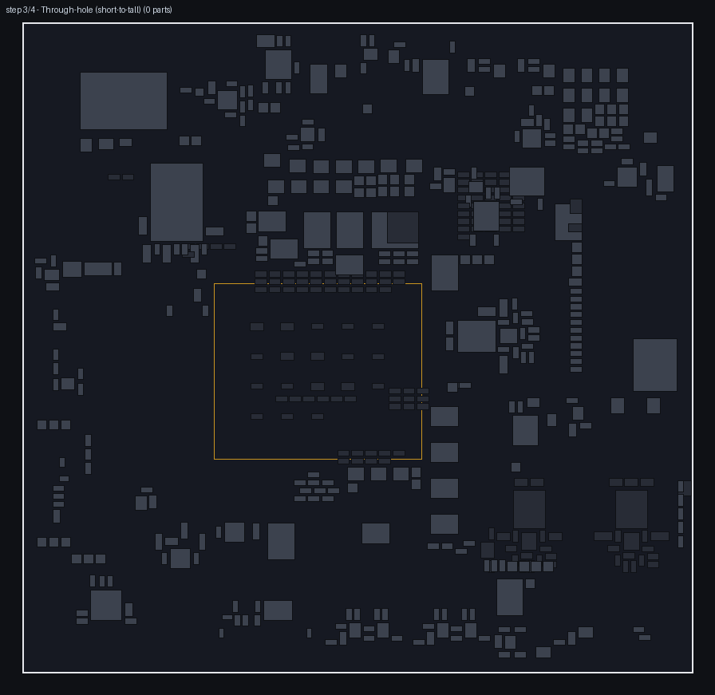

No parts in this step on this board.

### Step 4 — Connectors + mechanical hardware

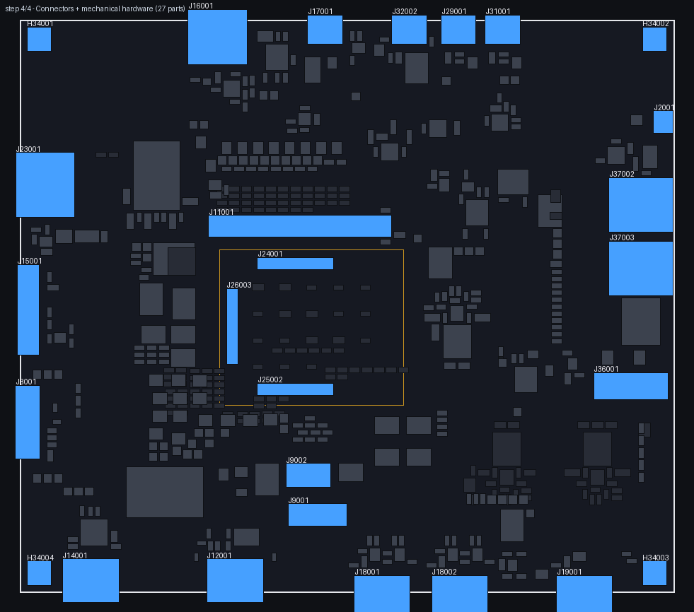

27 parts (27 top / 0 bottom)

| ref | value | package | sheet | joint |
|---|---|---|---|---|
| H34001 | MountingHole_M3 | MountingHole_3.2mm_M3_Pad | mechanical | THT |
| H34002 | MountingHole_M3 | MountingHole_3.2mm_M3_Pad | mechanical | THT |
| H34003 | MountingHole_M3 | MountingHole_3.2mm_M3_Pad | mechanical | THT |
| H34004 | MountingHole_M3 | MountingHole_3.2mm_M3_Pad | mechanical | THT |
| J2001 | ZX-SH1.0-4PWT | ZX-SH1.0-4PWT | board_qwiic | SMD |
| J8001 | SFW15R-1STE1LF | SFW15R-1STE1LF | camera | SMD |
| J9001 | 878311420 | 878311420 | debug_boot | THT |
| J9002 | HX_JN1.27-2x5 | HX_JN1.27-2x5_TP_H4.9 | debug_boot | SMD |
| J11001 | Header_2x20_2.54mm | PinHeader_2x20_P2.54mm_Vertical | fmc | THT |
| J12001 | HDMI-019S | HDMI-019S | hdmi_rx | SMD |
| J14001 | HDMI-019S | HDMI-019S | hdmi_tx | SMD |
| J15001 | AFC07-S40FCA-00 | AFC07-S40FCA-00 | lcd | SMD |
| J16001 | TF-01A | TF-01A | microsd | SMD |
| J17001 | TYPE-C-31-M-12 | TYPE-C-31-M-12 | pd_input | SMD |
| J18001 | DS1024-2x6R2 | DS1024-2x6R2 | pmod | THT |
| J18002 | DS1024-2x6R2 | DS1024-2x6R2 | pmod | THT |
| J19001 | DS1024-2x6R2 | DS1024-2x6R2 | pmod_expansion | THT |
| J23001 | KH-5224-8P8C-D | KH-5224-8P8C-D | rj45_connector | THT |
| J24001 | DF40C-100DP-0.4V(51) | DF40C-100DP-0.4V_51 | som_j1 | SMD |
| J25002 | DF40C-100DP-0.4V(51) | DF40C-100DP-0.4V_51 | som_j2 | SMD |
| J26003 | DF40C-100DP-0.4V(51) | DF40C-100DP-0.4V_51 | som_j3 | SMD |
| J29001 | TYPE-C-31-M-12 | TYPE-C-31-M-12 | usb_jtag_connector | SMD |
| J31001 | TYPE-C-31-M-12 | TYPE-C-31-M-12 | usb_uart_connector | SMD |
| J32002 | TYPE-C-31-M-12 | TYPE-C-31-M-12 | usbc_otg | SMD |
| J36001 | HX PZ2.54-3x8P ZZ | HX_PZ2.54-3x8P_ZZ | motor_pwm | THT |
| J37002 | XT60PW-M | XT60PW-M | motor_sense | THT |
| J37003 | XT60PW-M | XT60PW-M | motor_sense | THT |

NOTES: J2001 ZX-SH1.0-4PWT (QWIIC): mating face toward the E board edge
NOTES: J8001 SFW15R-1STE1LF (CAM): mating face toward the W board edge
NOTES: J12001 HDMI-019S (HDMI RX): mating face toward the S board edge
NOTES: J14001 HDMI-019S (HDMI TX): mating face toward the S board edge
NOTES: J15001 AFC07-S40FCA-00 (LCD): mating face toward the W board edge
NOTES: J16001 TF-01A (microSD): mating face toward the N board edge
NOTES: J17001 TYPE-C-31-M-12 (PWR): mating face toward the N board edge
NOTES: J18001 DS1024-2x6R2 (PMOD): mating face toward the S board edge
NOTES: J18002 DS1024-2x6R2 (PMOD): mating face toward the S board edge
NOTES: J19001 DS1024-2x6R2 (PMOD): mating face toward the S board edge
NOTES: J23001 KH-5224-8P8C-D (ETH): mating face toward the W board edge
NOTES: J29001 TYPE-C-31-M-12 (JTAG): mating face toward the N board edge
NOTES: J31001 TYPE-C-31-M-12 (UART): mating face toward the N board edge
NOTES: J32002 TYPE-C-31-M-12 (USB OTG): mating face toward the N board edge
NOTES: J37002 XT60PW-M (ESC PWR IN): mating face toward the E board edge
NOTES: J37003 XT60PW-M (ESC PWR OUT): mating face toward the E board edge
NOTES: XT60 pair: J37002 (ESC PWR IN) / J37003 (ESC PWR OUT) — IN/OUT per silkscreen label
NOTES: J24001, J25002, J26003: DF40C SoM receptacles — the SoM module mates onto them (bring-up section, mate phase)

