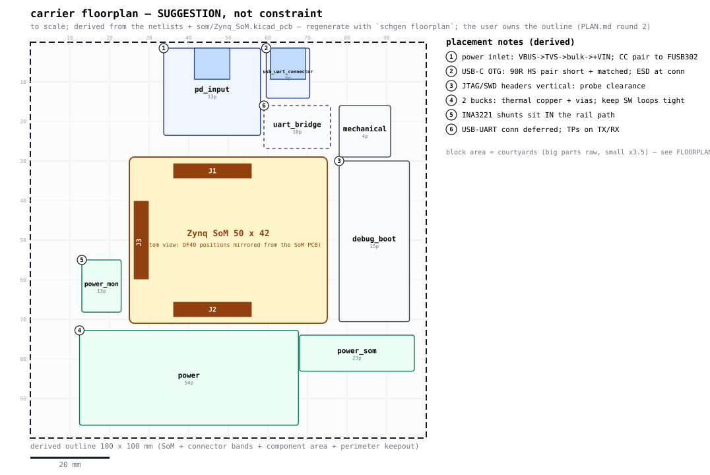

# Carrier floorplan — SUGGESTION, not constraint

Generated by `schgen floorplan` (also by `schgen board`). **The user owns the outline and the placement** — PLAN.md round 2 leaves the form factor free ("connector-driven ~120x100 class expected"). This document is one self-consistent, to-scale starting point whose every number is derived from the design data, so each suggestion can be kept or overruled deliberately. Shuffle blocks freely; the WHY notes say what each move costs.

## Sources (everything derived, nothing invented)

- SoM outline + DF40 positions: `som/Zynq_SoM.kicad_pcb` (Edge.Cuts bbox + J1/J2/J3 footprints, parsed live)
- block sizes: per-part courtyards (`parts/<MPN>/<MPN>.kicad_mod` F.CrtYd; KiCad-standard footprints from the dims in their names), big parts raw + small parts x3.5 routing factor
- edge pinning + zones: connector parts in each sheet netlist + linker J1/J2/J3 bindings (incl. `expect=` deferrals)
- electrical notes: `schgen/constraints.py` (JLC04161H-7628), `schgen/powertree.py` analysis, typed ports (1.8V SDIO)

## Extracted SoM geometry

SoM outline: **50 x 42 mm**. The DF40 mezzanine connectors sit on the SoM's bottom copper; the carrier-top view below mirrors their X coordinate (bottom view). Verify mate orientation against the DF40 datasheet before committing footprints.

| conn | SoM PCB `(at)` | carrier-top view (SoM-rel) | pad extent |
|---|---|---|---|
| J1 | (136.5, 94.5) rot 180 | (21, 3.5) | 19.8 x 3.78 mm |
| J2 | (136.5, 129.5) rot 180 | (21, 38.5) | 19.8 x 3.78 mm |
| J3 | (154.5, 112) rot 90 | (3, 21) | 3.78 x 19.8 mm |

Derived board: **110 x 84 mm**; SoM origin at **(30, 21)** (centered). All coordinates below are board-frame mm, origin top-left, +y down (KiCad convention).

Outline derivation: SoM 50x42 + 7mm halo + 11mm connector band/edge -> core 86x78; component area 1119mm2 / 0.6 fill -> area floor 78x70; + 3mm perimeter keepout -> 95x85 mm (rounded up to 5mm grid); then SMALLEST-AREA search over aspects 1, 1.1, 1.1176, 1.2, 1.3, 1.4 -> 110x84 mm (the smallest board holding the REAL 2-sided packed blocks with the estimated cross-subsystem airwire 1705 <= LAW-5 budget 2307 mm — honest routing headroom, the gate is not relaxed), SoM 50x42 centered.

## Edge connectors (pinned to edges by their mating direction)

| edge | sheet | block (x, y, w x h) | connector(s) | notes |
|---|---|---|---|---|
| N | pd_input | (38.5, 1.5, 24.4554 x 22.0264) | TYPE-C-31-M-12 (USB-C receptacle) | (1) |
| N | usb_uart_connector | (67, 1.5, 10.4501 x 19.1321) | TYPE-C-31-M-12 (USB-C receptacle) | (2) |

## Interior blocks (zone = dominant SoM connector side, or the power cluster)

| sheet | anchor | block (x, y, w x h) | parts | est mm2 | notes |
|---|---|---|---|---|---|
| debug_boot | N | (83, 55, 26.64 x 17.044) | 10 | 454.1 | (3) |
| mechanical | E | (94, 14, 13 x 13) | 4 | 169 |  |
| power | E | (17, 67, 38.35 x 16) | 51 | 613.6 | (4) |
| power_mon | @power_som | (19, 44, 9.14 x 17.172) | 10 | 157 | (5) |
| power_som | E | (84, 30, 12.15 x 22.66) | 23 | 275.3 |  |
| uart_bridge | @usb_uart_connector | (82, 12, 9.2751 x 15.2) | 10 | 141 | (6) |

## Routing constraint classes (JLC04161H-7628 — from constraints.py)

| class | nets | geometry (track/gap mm) | match budget |
|---|---|---|---|
| DP100_DIFF | 8 | 0.2052 / 0.2032 | intra-pair <= 1.27 mm |
| DP90_USB | 6 | 0.2611 / 0.2032 | intra-pair <= 1.27 mm |
| I2C | 2 | - | - |
| SD_1V8 | 6 | - | bus to CLK <= 2.5 mm |

Full per-net table: `carrier/manufacturing/layout_constraints.csv` (+ the `.kicad_dru` rules).

## Power and thermal (worst-case declared draws — powertree analysis)

| regulator | sheet | rail | I out (A) | est dissipation |
|---|---|---|---|---|
| TPS26631PWPR (U1) | pd_input | +VBUS_IN -> +VIN | 0.571 | negligible |
| LM61460AANRJRR (U1) | power | +VIN_SYS -> +5V_REG | 0.053 | negligible |
| LM61460AANRJRR (U2) | power | +5V -> +3V3_REG | 0.067 | negligible |
| AP2112K-1.8 (U3) | power | +3V3 -> +1V8_REG | 0.001 | negligible |
| LM61460AANRJRR (U4) | power_som | +VIN_SYS -> +5V_SOM | 2.154 | ~1.11 W |

Numbers are the power-tree gate's worst-case declared draws (`carrier/reports/power_tree.txt`); regulators above ~0.3 W want copper pours + stitching vias.

## Placement notes (the WHYs)

- **(1) pd_input**: PD power inlet: keep the VBUS path (receptacle -> TVS -> bulk -> +VIN) in one corner so the +VIN plane spreads from a single point; CC1/CC2 route to the FUSB302 (usb_pd block, anchored next to this inlet). PLAN.md round 5: a TPS25940-class eFuse lands between receptacle and bulk — reserve space for it here.
- **(2) usb_uart_connector**: USB-C OTG: the 90R D+/D- pair wants the shortest matched run to its SoM pins; USBLC6-2SC6 ESD array within ~10 mm of the receptacle; VBUS source switch beside the connector.
- **(3) debug_boot**: JTAG (2x7 2 mm) + SWD (2x5 1.27 mm) headers mate vertically — any top-side spot works; keep cable/probe clearance and the boot DIP reachable.
- **(4) power**: Buck thermal (worst-case declared draws): LM61460AANRJRR +5V_REG ~0.03 W; LM61460AANRJRR +3V3_REG ~0.02 W. Pour copper on the SW/PGND side, stitch vias under the packages, keep each SW node loop minimal.
- **(5) power_mon**: Power monitor: the shunt resistors are in series with the rails — the rails must physically route through this block; place it between the regulators and the loads, Kelvin-connect the sense pairs.
- **(6) uart_bridge**: CP2102N UART bridge: its USB connector is an author-declared deferral (expect usb_uart_connector) — the block reserves edge space for it; TX/RX test points stay probe-able.
- **(board)**: 9 test points board-wide (test-point gate): spread them with probe clearance as the blocks settle; none may end up under the SoM.

## Honest limits

- Block rectangles are AREA estimates (courtyards + routing factor), not layouts; their order along an edge is alphabetical, not optimized — shuffle freely.
- The outline is DERIVED (SoM body + connector bands + total component area + perimeter keepout), sized generously for routing headroom; the user still owns it (drawn dashed).
- The mirror convention (bottom view) must be checked against the DF40 mating datasheet before any footprint is placed.
- som_j1/j2/j3 sheets are not blocks: they ARE the three DF40 strips drawn inside the SoM footprint.
