# Assembly order — devkit_mini

Board 105 x 105 mm. 147 placed parts (52 top / 95 bottom); 5 fiducials are bare-copper marks, excluded from every phase and step.
Section A is the staged hand-assembly + bring-up order; section B is the PCBA process order. Every part appears in exactly one phase and exactly one step.

## A. Incremental bring-up order

| phase | section | parts | checkpoint |
|---|---|---|---|
| 1 | power entry (pd_input) | 13 | verify +VBUS_IN at TP3001; verify +VIN at TP3002 |
| 2 | power_mon | 10 | — |
| 3 | power | 51 | verify +5V at TP4001; verify +3V3 at TP4002; verify +1V8 at TP4003 |
| 4 | power_som | 23 | verify +5V_SOM at TP6001 |
| 5 | SoM interface (som_decoupling, som_j1, som_j2, som_j3) | 21 | — |
| 6 | SoM module mate | 0 | boot/debug via debug_boot: J1001, J1002, SW1001, SW1002 |
| 7 | debug_boot | 10 | — |
| 8 | uart_bridge | 10 | — |
| 9 | usb_uart_connector | 5 | — |
| 10 | mechanical hardware (mechanical) | 4 | — |

### Phase 1 — power entry (pd_input)

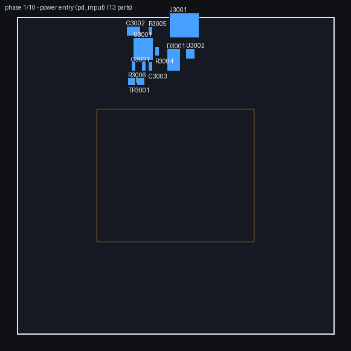

13 parts (12 top / 1 bottom)

| ref | value | package | sheet |
|---|---|---|---|
| C3001 | 100n | C_0603_1608Metric | pd_input |
| C3002 | 10u | C_1210_3225Metric | pd_input |
| C3003 | 47n | C_0603_1608Metric | pd_input |
| D3001 | SMBJ22A | D_SMB | pd_input |
| J3001 | TYPE-C-31-M-12 | TYPE-C-31-M-12 | pd_input |
| R3003 | 100k | R_0603_1608Metric | pd_input |
| R3004 | 5.49k | R_0603_1608Metric | pd_input |
| R3005 | 5.1k | R_0603_1608Metric | pd_input |
| R3006 | 100k | R_0603_1608Metric | pd_input |
| TP3001 | +VBUS_IN | TestPoint_Pad_D1.5mm | pd_input |
| TP3002 | +VIN | TestPoint_Pad_D1.5mm | pd_input |
| U3001 | TPS26631PWPR | TPS26631PWPR | pd_input |
| U3002 | USBLC6-2SC6 | USBLC6-2SC6 | pd_input |

CHECKPOINT: verify +VBUS_IN at TP3001
CHECKPOINT: verify +VIN at TP3002

### Phase 2 — power_mon

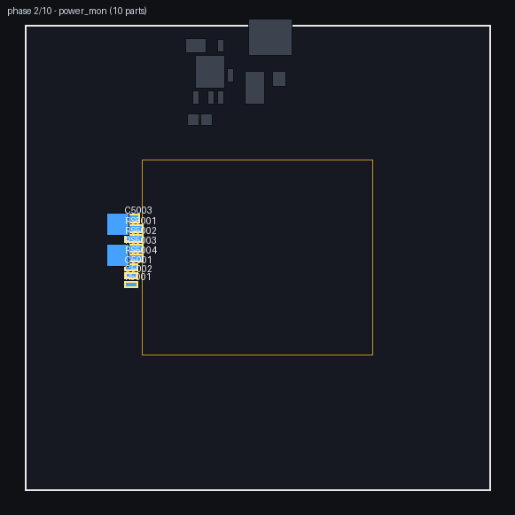

10 parts (2 top / 8 bottom)

| ref | value | package | sheet |
|---|---|---|---|
| C5001 | 100n | C_0603_1608Metric | power_mon |
| C5002 | 100n | C_0603_1608Metric | power_mon |
| C5003 | 10u | C_0805_2012Metric | power_mon |
| R5001 | 10k | R_0603_1608Metric | power_mon |
| RS5001 | 10mR | RLM12FTCMR010 | power_mon |
| RS5002 | 10mR | RLM12FTCMR010 | power_mon |
| RS5003 | 10mR | RLM12FTCMR010 | power_mon |
| RS5004 | 20mR | RLM12FTCMR020 | power_mon |
| U5001 | INA3221AIRGVR | INA3221AIRGVR | power_mon |
| U5002 | INA3221AIRGVR | INA3221AIRGVR | power_mon |

### Phase 3 — power

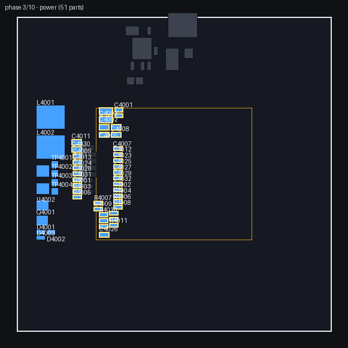

51 parts (13 top / 38 bottom)

| ref | value | package | sheet |
|---|---|---|---|
| C4001 | 100n | C_0603_1608Metric | power |
| C4002 | 10u | C_1206_3216Metric | power |
| C4003 | 10u | C_1206_3216Metric | power |
| C4004 | 100n | C_0603_1608Metric | power |
| C4005 | 22u | C_0805_2012Metric | power |
| C4006 | 22u | C_0805_2012Metric | power |
| C4007 | 100n | C_0603_1608Metric | power |
| C4008 | 22u | C_0805_2012Metric | power |
| C4009 | 100n | C_0603_1608Metric | power |
| C4010 | 22u | C_0805_2012Metric | power |
| C4011 | 22u | C_0805_2012Metric | power |
| C4012 | 1u | C_0603_1608Metric | power |
| C4013 | 1u | C_0603_1608Metric | power |
| C4023 | 22p | C_0603_1608Metric | power |
| C4024 | 1u | C_0603_1608Metric | power |
| C4025 | 100n | C_0603_1608Metric | power |
| C4026 | 22u | C_0805_2012Metric | power |
| C4027 | 22p | C_0603_1608Metric | power |
| C4028 | 1u | C_0603_1608Metric | power |
| C4029 | 100n | C_0603_1608Metric | power |
| C4030 | 22u | C_0805_2012Metric | power |
| C4031 | 1u | C_0603_1608Metric | power |
| C4032 | 1u | C_0603_1608Metric | power |
| D4001 | red | LED_0603_1608Metric | power |
| D4002 | red | LED_0603_1608Metric | power |
| D4003 | red | LED_0603_1608Metric | power |
| L4001 | 10uH | SWPA8040S100MT | power |
| L4002 | 10uH | SWPA8040S100MT | power |
| Q4001 | AO3400A | SOT-23 | power |
| R4001 | 40.2k | R_0603_1608Metric | power |
| R4002 | 10k | R_0603_1608Metric | power |
| R4003 | 1k | R_0603_1608Metric | power |
| R4004 | 23.2k | R_0603_1608Metric | power |
| R4005 | 10k | R_0603_1608Metric | power |
| R4006 | 330R | R_0603_1608Metric | power |
| R4007 | 1k | R_0603_1608Metric | power |
| R4008 | 100k | R_0603_1608Metric | power |
| R4009 | 330R | R_0603_1608Metric | power |
| R4010 | 22k | R_0603_1608Metric | power |
| R4011 | 10R | R_0603_1608Metric | power |
| R4012 | 1k | R_0603_1608Metric | power |
| R4013 | 10R | R_0603_1608Metric | power |
| R4014 | 22k | R_0603_1608Metric | power |
| R4015 | 1k | R_0603_1608Metric | power |
| TP4001 | +5V | TestPoint_Pad_D1.5mm | power |
| TP4002 | +3V3 | TestPoint_Pad_D1.5mm | power |
| TP4003 | +1V8 | TestPoint_Pad_D1.5mm | power |
| TP4004 | GND | TestPoint_Pad_D1.5mm | power |
| U4001 | LM61460AANRJRR | LM61460AANRJRR | power |
| U4002 | LM61460AANRJRR | LM61460AANRJRR | power |
| U4003 | AP2112K-1.8 | SOT-23-5 | power |

CHECKPOINT: verify +5V at TP4001
CHECKPOINT: verify +3V3 at TP4002
CHECKPOINT: verify +1V8 at TP4003

### Phase 4 — power_som

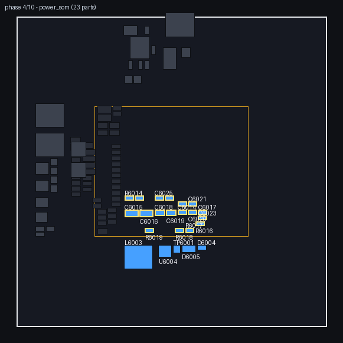

23 parts (5 top / 18 bottom)

| ref | value | package | sheet |
|---|---|---|---|
| C6014 | 100n | C_0603_1608Metric | power_som |
| C6015 | 10u | C_1206_3216Metric | power_som |
| C6016 | 10u | C_1206_3216Metric | power_som |
| C6017 | 100n | C_0603_1608Metric | power_som |
| C6018 | 22u | C_0805_2012Metric | power_som |
| C6019 | 22u | C_0805_2012Metric | power_som |
| C6020 | 100n | C_0603_1608Metric | power_som |
| C6021 | 22p | C_0603_1608Metric | power_som |
| C6022 | 1u | C_0603_1608Metric | power_som |
| C6023 | 1u | C_0603_1608Metric | power_som |
| C6025 | 100n | C_0603_1608Metric | power_som |
| D6004 | red | LED_0603_1608Metric | power_som |
| D6005 | MMSZ5231B | D_SOD-123 | power_som |
| L6003 | 10uH | SWPA8040S100MT | power_som |
| R6012 | 10k | R_0603_1608Metric | power_som |
| R6014 | 47.5k | R_0603_1608Metric | power_som |
| R6015 | 13k | R_0603_1608Metric | power_som |
| R6016 | 1k | R_0603_1608Metric | power_som |
| R6017 | 10R | R_0603_1608Metric | power_som |
| R6018 | 22k | R_0603_1608Metric | power_som |
| R6019 | 1k | R_0603_1608Metric | power_som |
| TP6001 | +5V_SOM | TestPoint_Pad_D1.5mm | power_som |
| U6004 | LM61460AANRJRR | LM61460AANRJRR | power_som |

CHECKPOINT: verify +5V_SOM at TP6001

### Phase 5 — SoM interface (som_decoupling, som_j1, som_j2, som_j3)

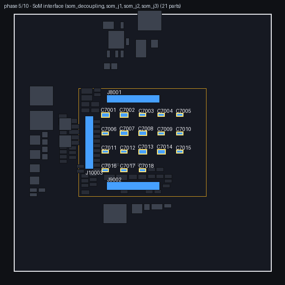

21 parts (3 top / 18 bottom)

| ref | value | package | sheet |
|---|---|---|---|
| C7001 | 22u | C_0805_2012Metric | som_decoupling |
| C7002 | 22u | C_0805_2012Metric | som_decoupling |
| C7003 | 100n | C_0603_1608Metric | som_decoupling |
| C7004 | 100n | C_0603_1608Metric | som_decoupling |
| C7005 | 100n | C_0603_1608Metric | som_decoupling |
| C7006 | 100n | C_0603_1608Metric | som_decoupling |
| C7007 | 22u | C_0805_2012Metric | som_decoupling |
| C7008 | 22u | C_0805_2012Metric | som_decoupling |
| C7009 | 100n | C_0603_1608Metric | som_decoupling |
| C7010 | 100n | C_0603_1608Metric | som_decoupling |
| C7011 | 100n | C_0603_1608Metric | som_decoupling |
| C7012 | 100n | C_0603_1608Metric | som_decoupling |
| C7013 | 22u | C_0805_2012Metric | som_decoupling |
| C7014 | 22u | C_0805_2012Metric | som_decoupling |
| C7015 | 100n | C_0603_1608Metric | som_decoupling |
| C7016 | 100n | C_0603_1608Metric | som_decoupling |
| C7017 | 100n | C_0603_1608Metric | som_decoupling |
| C7018 | 100n | C_0603_1608Metric | som_decoupling |
| J8001 | DF40C-100DP-0.4V(51) | DF40C-100DP-0.4V_51 | som_j1 |
| J9002 | DF40C-100DP-0.4V(51) | DF40C-100DP-0.4V_51 | som_j2 |
| J10003 | DF40C-100DP-0.4V(51) | DF40C-100DP-0.4V_51 | som_j3 |

### Phase 6 — SoM module mate

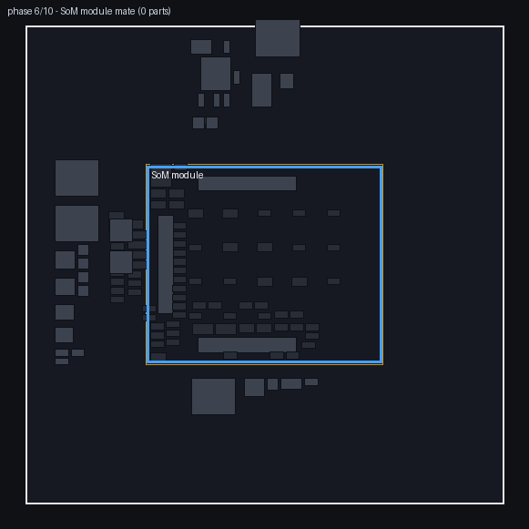

No solder parts. Mate the SoM module onto J8001, J9002, J10003 after the rail checkpoints above.

CHECKPOINT: boot/debug via debug_boot: J1001, J1002, SW1001, SW1002

### Phase 7 — debug_boot

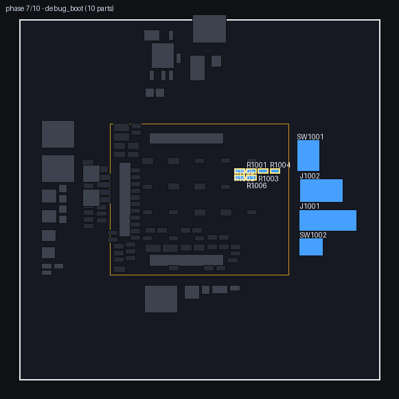

10 parts (4 top / 6 bottom)

| ref | value | package | sheet |
|---|---|---|---|
| J1001 | 878311420 | 878311420 | debug_boot |
| J1002 | HX_JN1.27-2x5 | HX_JN1.27-2x5_TP_H4.9 | debug_boot |
| R1001 | 4k7 | R_0603_1608Metric | debug_boot |
| R1002 | 4k7 | R_0603_1608Metric | debug_boot |
| R1003 | 100R | R_0603_1608Metric | debug_boot |
| R1004 | 10k | R_0603_1608Metric | debug_boot |
| R1005 | 10k | R_0603_1608Metric | debug_boot |
| R1006 | 10k | R_0603_1608Metric | debug_boot |
| SW1001 | DIP-4 | DSHP04TSGER | debug_boot |
| SW1002 | RESET | TS-1187A-B-A-B | debug_boot |

### Phase 8 — uart_bridge

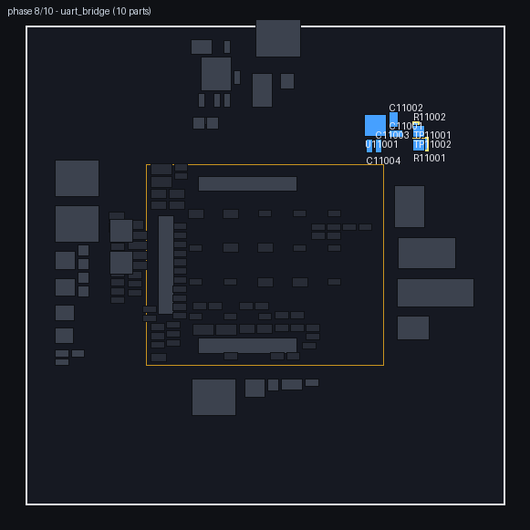

10 parts (7 top / 3 bottom)

| ref | value | package | sheet |
|---|---|---|---|
| C11001 | 100n | C_0603_1608Metric | uart_bridge |
| C11002 | 10u | C_0805_2012Metric | uart_bridge |
| C11003 | 100n | C_0603_1608Metric | uart_bridge |
| C11004 | 100n | C_0603_1608Metric | uart_bridge |
| R11001 | 1k | R_0603_1608Metric | uart_bridge |
| R11002 | 22k1 | R_0603_1608Metric | uart_bridge |
| R11003 | 47k5 | R_0603_1608Metric | uart_bridge |
| TP11001 | ZYNQ_PS_UART0_TXD | TestPoint_Pad_D1.5mm | uart_bridge |
| TP11002 | ZYNQ_PS_UART0_RXD | TestPoint_Pad_D1.5mm | uart_bridge |
| U11001 | CP2102N-A02 | CP2102N-A02-GQFN24R | uart_bridge |

### Phase 9 — usb_uart_connector

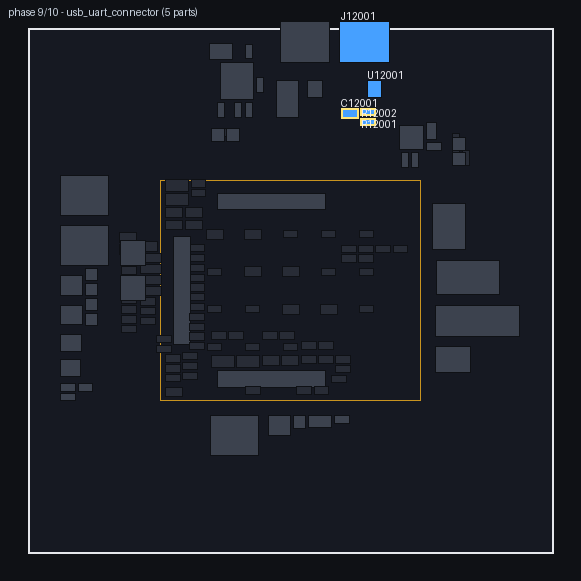

5 parts (2 top / 3 bottom)

| ref | value | package | sheet |
|---|---|---|---|
| C12001 | 10u | C_0805_2012Metric | usb_uart_connector |
| J12001 | TYPE-C-31-M-12 | TYPE-C-31-M-12 | usb_uart_connector |
| R12001 | 5.1k | R_0603_1608Metric | usb_uart_connector |
| R12002 | 5.1k | R_0603_1608Metric | usb_uart_connector |
| U12001 | USBLC6-2SC6 | USBLC6-2SC6 | usb_uart_connector |

### Phase 10 — mechanical hardware (mechanical)

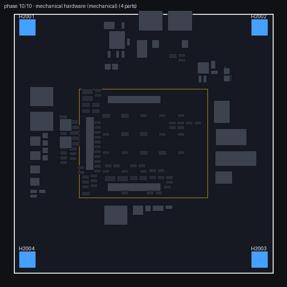

4 parts (4 top / 0 bottom)

| ref | value | package | sheet |
|---|---|---|---|
| H2001 | MountingHole_M3 | MountingHole_3.2mm_M3_Pad | mechanical |
| H2002 | MountingHole_M3 | MountingHole_3.2mm_M3_Pad | mechanical |
| H2003 | MountingHole_M3 | MountingHole_3.2mm_M3_Pad | mechanical |
| H2004 | MountingHole_M3 | MountingHole_3.2mm_M3_Pad | mechanical |

## B. Production process order

### Step 1 — Bottom-side SMD (paste + reflow)

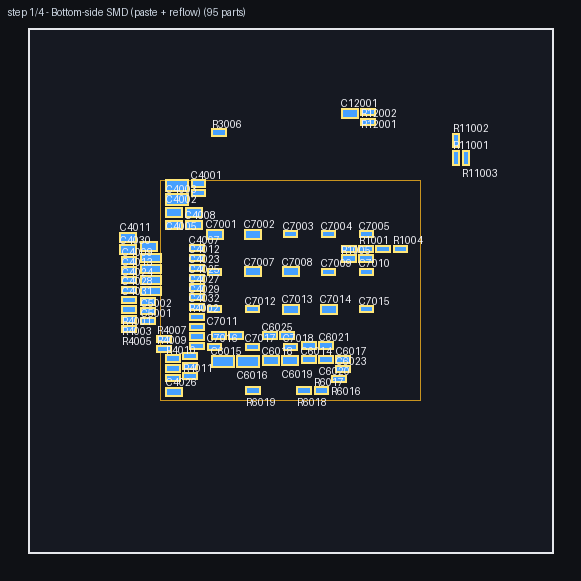

95 parts (0 top / 95 bottom)

| ref | value | package | sheet |
|---|---|---|---|
| C4001 | 100n | C_0603_1608Metric | power |
| C4002 | 10u | C_1206_3216Metric | power |
| C4003 | 10u | C_1206_3216Metric | power |
| C4004 | 100n | C_0603_1608Metric | power |
| C4005 | 22u | C_0805_2012Metric | power |
| C4006 | 22u | C_0805_2012Metric | power |
| C4007 | 100n | C_0603_1608Metric | power |
| C4008 | 22u | C_0805_2012Metric | power |
| C4009 | 100n | C_0603_1608Metric | power |
| C4010 | 22u | C_0805_2012Metric | power |
| C4011 | 22u | C_0805_2012Metric | power |
| C4012 | 1u | C_0603_1608Metric | power |
| C4013 | 1u | C_0603_1608Metric | power |
| C4023 | 22p | C_0603_1608Metric | power |
| C4024 | 1u | C_0603_1608Metric | power |
| C4025 | 100n | C_0603_1608Metric | power |
| C4026 | 22u | C_0805_2012Metric | power |
| C4027 | 22p | C_0603_1608Metric | power |
| C4028 | 1u | C_0603_1608Metric | power |
| C4029 | 100n | C_0603_1608Metric | power |
| C4030 | 22u | C_0805_2012Metric | power |
| C4031 | 1u | C_0603_1608Metric | power |
| C4032 | 1u | C_0603_1608Metric | power |
| C5001 | 100n | C_0603_1608Metric | power_mon |
| C5002 | 100n | C_0603_1608Metric | power_mon |
| C5003 | 10u | C_0805_2012Metric | power_mon |
| C6014 | 100n | C_0603_1608Metric | power_som |
| C6015 | 10u | C_1206_3216Metric | power_som |
| C6016 | 10u | C_1206_3216Metric | power_som |
| C6017 | 100n | C_0603_1608Metric | power_som |
| C6018 | 22u | C_0805_2012Metric | power_som |
| C6019 | 22u | C_0805_2012Metric | power_som |
| C6020 | 100n | C_0603_1608Metric | power_som |
| C6021 | 22p | C_0603_1608Metric | power_som |
| C6022 | 1u | C_0603_1608Metric | power_som |
| C6023 | 1u | C_0603_1608Metric | power_som |
| C6025 | 100n | C_0603_1608Metric | power_som |
| C7001 | 22u | C_0805_2012Metric | som_decoupling |
| C7002 | 22u | C_0805_2012Metric | som_decoupling |
| C7003 | 100n | C_0603_1608Metric | som_decoupling |
| C7004 | 100n | C_0603_1608Metric | som_decoupling |
| C7005 | 100n | C_0603_1608Metric | som_decoupling |
| C7006 | 100n | C_0603_1608Metric | som_decoupling |
| C7007 | 22u | C_0805_2012Metric | som_decoupling |
| C7008 | 22u | C_0805_2012Metric | som_decoupling |
| C7009 | 100n | C_0603_1608Metric | som_decoupling |
| C7010 | 100n | C_0603_1608Metric | som_decoupling |
| C7011 | 100n | C_0603_1608Metric | som_decoupling |
| C7012 | 100n | C_0603_1608Metric | som_decoupling |
| C7013 | 22u | C_0805_2012Metric | som_decoupling |
| C7014 | 22u | C_0805_2012Metric | som_decoupling |
| C7015 | 100n | C_0603_1608Metric | som_decoupling |
| C7016 | 100n | C_0603_1608Metric | som_decoupling |
| C7017 | 100n | C_0603_1608Metric | som_decoupling |
| C7018 | 100n | C_0603_1608Metric | som_decoupling |
| C12001 | 10u | C_0805_2012Metric | usb_uart_connector |
| R1001 | 4k7 | R_0603_1608Metric | debug_boot |
| R1002 | 4k7 | R_0603_1608Metric | debug_boot |
| R1003 | 100R | R_0603_1608Metric | debug_boot |
| R1004 | 10k | R_0603_1608Metric | debug_boot |
| R1005 | 10k | R_0603_1608Metric | debug_boot |
| R1006 | 10k | R_0603_1608Metric | debug_boot |
| R3006 | 100k | R_0603_1608Metric | pd_input |
| R4001 | 40.2k | R_0603_1608Metric | power |
| R4002 | 10k | R_0603_1608Metric | power |
| R4003 | 1k | R_0603_1608Metric | power |
| R4004 | 23.2k | R_0603_1608Metric | power |
| R4005 | 10k | R_0603_1608Metric | power |
| R4006 | 330R | R_0603_1608Metric | power |
| R4007 | 1k | R_0603_1608Metric | power |
| R4008 | 100k | R_0603_1608Metric | power |
| R4009 | 330R | R_0603_1608Metric | power |
| R4010 | 22k | R_0603_1608Metric | power |
| R4011 | 10R | R_0603_1608Metric | power |
| R4012 | 1k | R_0603_1608Metric | power |
| R4013 | 10R | R_0603_1608Metric | power |
| R4014 | 22k | R_0603_1608Metric | power |
| R4015 | 1k | R_0603_1608Metric | power |
| R5001 | 10k | R_0603_1608Metric | power_mon |
| R6012 | 10k | R_0603_1608Metric | power_som |
| R6014 | 47.5k | R_0603_1608Metric | power_som |
| R6015 | 13k | R_0603_1608Metric | power_som |
| R6016 | 1k | R_0603_1608Metric | power_som |
| R6017 | 10R | R_0603_1608Metric | power_som |
| R6018 | 22k | R_0603_1608Metric | power_som |
| R6019 | 1k | R_0603_1608Metric | power_som |
| R11001 | 1k | R_0603_1608Metric | uart_bridge |
| R11002 | 22k1 | R_0603_1608Metric | uart_bridge |
| R11003 | 47k5 | R_0603_1608Metric | uart_bridge |
| R12001 | 5.1k | R_0603_1608Metric | usb_uart_connector |
| R12002 | 5.1k | R_0603_1608Metric | usb_uart_connector |
| RS5001 | 10mR | RLM12FTCMR010 | power_mon |
| RS5002 | 10mR | RLM12FTCMR010 | power_mon |
| RS5003 | 10mR | RLM12FTCMR010 | power_mon |
| RS5004 | 20mR | RLM12FTCMR020 | power_mon |

### Step 2 — Top-side SMD (paste + reflow)

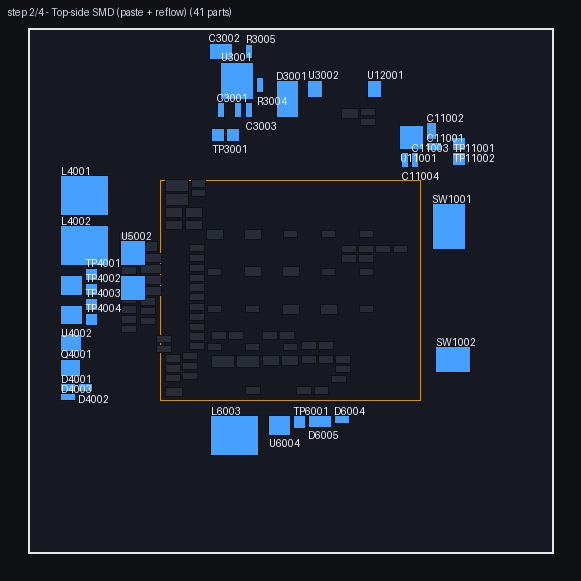

41 parts (41 top / 0 bottom)

| ref | value | package | sheet |
|---|---|---|---|
| C3001 | 100n | C_0603_1608Metric | pd_input |
| C3002 | 10u | C_1210_3225Metric | pd_input |
| C3003 | 47n | C_0603_1608Metric | pd_input |
| C11001 | 100n | C_0603_1608Metric | uart_bridge |
| C11002 | 10u | C_0805_2012Metric | uart_bridge |
| C11003 | 100n | C_0603_1608Metric | uart_bridge |
| C11004 | 100n | C_0603_1608Metric | uart_bridge |
| D3001 | SMBJ22A | D_SMB | pd_input |
| D4001 | red | LED_0603_1608Metric | power |
| D4002 | red | LED_0603_1608Metric | power |
| D4003 | red | LED_0603_1608Metric | power |
| D6004 | red | LED_0603_1608Metric | power_som |
| D6005 | MMSZ5231B | D_SOD-123 | power_som |
| L4001 | 10uH | SWPA8040S100MT | power |
| L4002 | 10uH | SWPA8040S100MT | power |
| L6003 | 10uH | SWPA8040S100MT | power_som |
| Q4001 | AO3400A | SOT-23 | power |
| R3003 | 100k | R_0603_1608Metric | pd_input |
| R3004 | 5.49k | R_0603_1608Metric | pd_input |
| R3005 | 5.1k | R_0603_1608Metric | pd_input |
| SW1001 | DIP-4 | DSHP04TSGER | debug_boot |
| SW1002 | RESET | TS-1187A-B-A-B | debug_boot |
| TP3001 | +VBUS_IN | TestPoint_Pad_D1.5mm | pd_input |
| TP3002 | +VIN | TestPoint_Pad_D1.5mm | pd_input |
| TP4001 | +5V | TestPoint_Pad_D1.5mm | power |
| TP4002 | +3V3 | TestPoint_Pad_D1.5mm | power |
| TP4003 | +1V8 | TestPoint_Pad_D1.5mm | power |
| TP4004 | GND | TestPoint_Pad_D1.5mm | power |
| TP6001 | +5V_SOM | TestPoint_Pad_D1.5mm | power_som |
| TP11001 | ZYNQ_PS_UART0_TXD | TestPoint_Pad_D1.5mm | uart_bridge |
| TP11002 | ZYNQ_PS_UART0_RXD | TestPoint_Pad_D1.5mm | uart_bridge |
| U3001 | TPS26631PWPR | TPS26631PWPR | pd_input |
| U3002 | USBLC6-2SC6 | USBLC6-2SC6 | pd_input |
| U4001 | LM61460AANRJRR | LM61460AANRJRR | power |
| U4002 | LM61460AANRJRR | LM61460AANRJRR | power |
| U4003 | AP2112K-1.8 | SOT-23-5 | power |
| U5001 | INA3221AIRGVR | INA3221AIRGVR | power_mon |
| U5002 | INA3221AIRGVR | INA3221AIRGVR | power_mon |
| U6004 | LM61460AANRJRR | LM61460AANRJRR | power_som |
| U11001 | CP2102N-A02 | CP2102N-A02-GQFN24R | uart_bridge |
| U12001 | USBLC6-2SC6 | USBLC6-2SC6 | usb_uart_connector |

NOTES: diode polarity (D3001, D4001, D4002, D4003, D6004, D6005): cathode per silkscreen
NOTES: pin-1 orientation (11 parts, U/Q refs): dot per silkscreen

### Step 3 — Through-hole (short-to-tall)

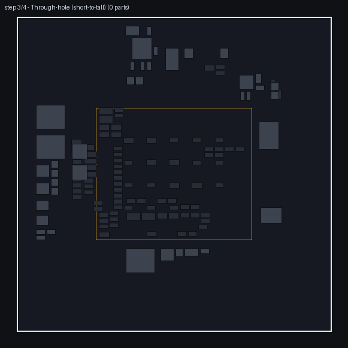

No parts in this step on this board.

### Step 4 — Connectors + mechanical hardware

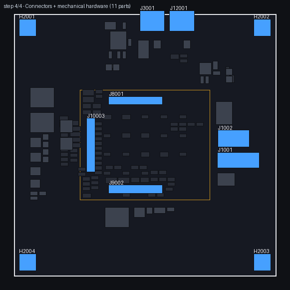

11 parts (11 top / 0 bottom)

| ref | value | package | sheet | joint |
|---|---|---|---|---|
| H2001 | MountingHole_M3 | MountingHole_3.2mm_M3_Pad | mechanical | THT |
| H2002 | MountingHole_M3 | MountingHole_3.2mm_M3_Pad | mechanical | THT |
| H2003 | MountingHole_M3 | MountingHole_3.2mm_M3_Pad | mechanical | THT |
| H2004 | MountingHole_M3 | MountingHole_3.2mm_M3_Pad | mechanical | THT |
| J1001 | 878311420 | 878311420 | debug_boot | THT |
| J1002 | HX_JN1.27-2x5 | HX_JN1.27-2x5_TP_H4.9 | debug_boot | SMD |
| J3001 | TYPE-C-31-M-12 | TYPE-C-31-M-12 | pd_input | SMD |
| J8001 | DF40C-100DP-0.4V(51) | DF40C-100DP-0.4V_51 | som_j1 | SMD |
| J9002 | DF40C-100DP-0.4V(51) | DF40C-100DP-0.4V_51 | som_j2 | SMD |
| J10003 | DF40C-100DP-0.4V(51) | DF40C-100DP-0.4V_51 | som_j3 | SMD |
| J12001 | TYPE-C-31-M-12 | TYPE-C-31-M-12 | usb_uart_connector | SMD |

NOTES: J3001 TYPE-C-31-M-12 (PWR): mating face toward the N board edge
NOTES: J12001 TYPE-C-31-M-12 (UART): mating face toward the N board edge
NOTES: J8001, J9002, J10003: DF40C SoM receptacles — the SoM module mates onto them (bring-up section, mate phase)

